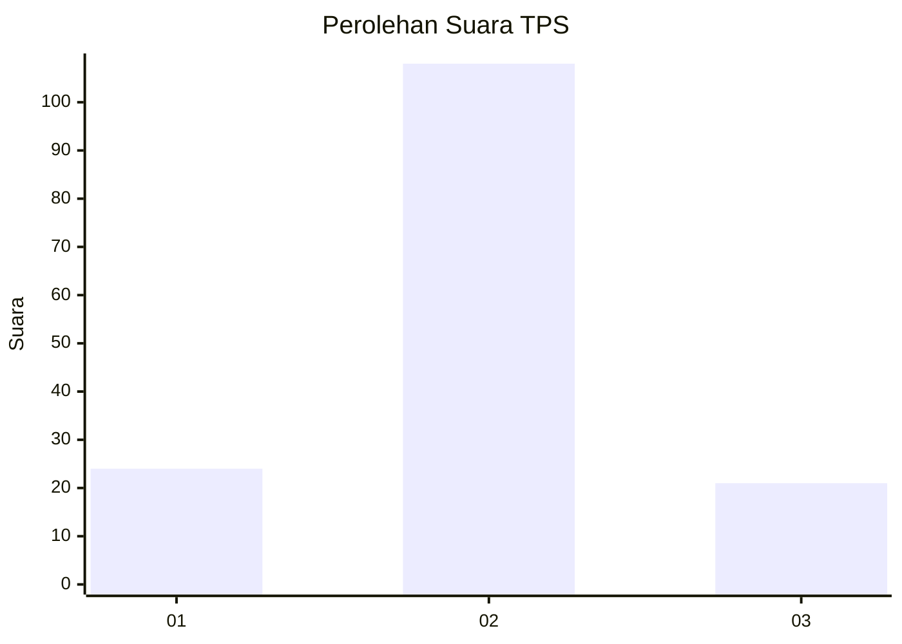

# Hasil

## Grafik

## Tabel

| No. | Nama Paslon    | Suara | Suara (raw) | Persentase |
|:--- |:-------------- | -----:| -----------:| ----------:|
| 1   | ANIES MUHAIMIN | 24    | [24][p-1]   | 15,69      |
| 2   | PRABOWO GIBRAN | 108   | [108][p-2]  | 70,59      |
| 3   | GANJAR MAHFUD  | 21    | [21][p-3]   | 13,73      |

[p-1]: https://github.com/gigit-pemilu/pemilu-2024-35-jawa-timur/blob/main/pilpres/hitung-suara/sub/35-jawa-timur/sub/19-madiun/sub/06-gemarang/sub/2007-nampu/sub/002-tps/sub/paslon-1.txt
[p-2]: https://github.com/gigit-pemilu/pemilu-2024-35-jawa-timur/blob/main/pilpres/hitung-suara/sub/35-jawa-timur/sub/19-madiun/sub/06-gemarang/sub/2007-nampu/sub/002-tps/sub/paslon-2.txt
[p-3]: https://github.com/gigit-pemilu/pemilu-2024-35-jawa-timur/blob/main/pilpres/hitung-suara/sub/35-jawa-timur/sub/19-madiun/sub/06-gemarang/sub/2007-nampu/sub/002-tps/sub/paslon-3.txt

## Foto C Plano

https://sirekap-obj-formc.kpu.go.id/efe3/pemilu/ppwp/35/19/06/20/07/3519062007002-20240215-011732--2c5afb5d-6c6b-4a99-907a-6b9f5cc6359c.jpg

https://sirekap-obj-formc.kpu.go.id/efe3/pemilu/ppwp/35/19/06/20/07/3519062007002-20240215-012502--e8c5876b-505a-4b48-9f5d-a04717323d89.jpg

https://sirekap-obj-formc.kpu.go.id/efe3/pemilu/ppwp/35/19/06/20/07/3519062007002-20240215-012826--5c78e29a-615a-4829-9abd-49a7bd8da56e.jpg

## Metadata

| Key        | Value               |
| ---------- | ------------------- |
| Time Stamp | 2024-02-21 16:00:00 |

