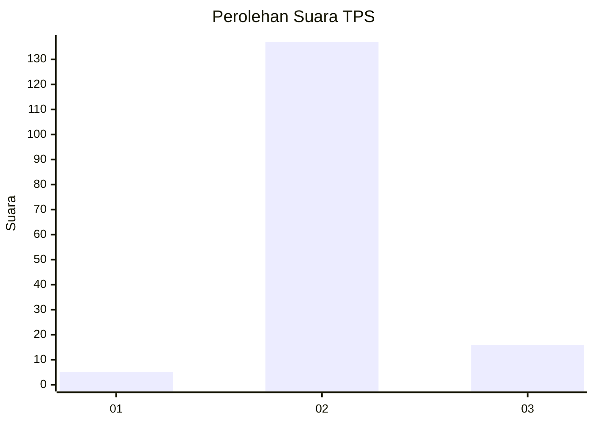
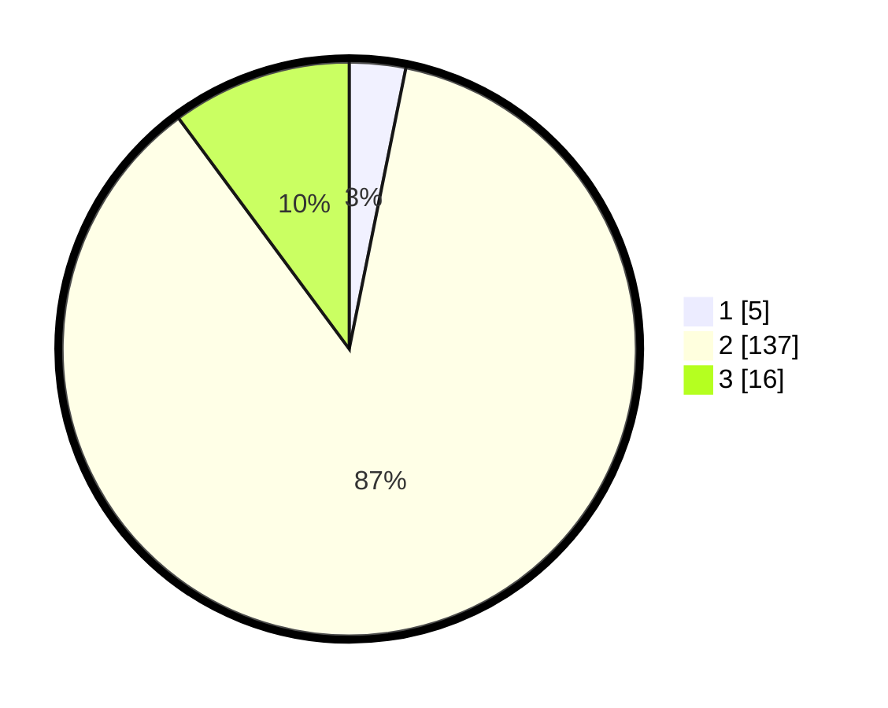

# Hasil

## Grafik

## Tabel

| No. | Nama Paslon    | Suara | Suara (raw) | Persentase |
|:--- |:-------------- | -----:| -----------:| ----------:|
| 1   | ANIES MUHAIMIN | 5     | [5][p-1]    | 3,16       |
| 2   | PRABOWO GIBRAN | 137   | [137][p-2]  | 86,71      |
| 3   | GANJAR MAHFUD  | 16    | [16][p-3]   | 10,13      |

[p-1]: https://github.com/gigit-pemilu/pemilu-2024-35-jawa-timur/blob/main/pilpres/hitung-suara/sub/35-jawa-timur/sub/19-madiun/sub/06-gemarang/sub/2007-nampu/sub/008-tps/sub/paslon-1.txt
[p-2]: https://github.com/gigit-pemilu/pemilu-2024-35-jawa-timur/blob/main/pilpres/hitung-suara/sub/35-jawa-timur/sub/19-madiun/sub/06-gemarang/sub/2007-nampu/sub/008-tps/sub/paslon-2.txt
[p-3]: https://github.com/gigit-pemilu/pemilu-2024-35-jawa-timur/blob/main/pilpres/hitung-suara/sub/35-jawa-timur/sub/19-madiun/sub/06-gemarang/sub/2007-nampu/sub/008-tps/sub/paslon-3.txt

## Foto C Plano

https://sirekap-obj-formc.kpu.go.id/df25/pemilu/ppwp/35/19/06/20/07/3519062007008-20240214-210346--61b17733-d456-4b02-bfb7-9267a90ecab0.jpg

https://sirekap-obj-formc.kpu.go.id/df25/pemilu/ppwp/35/19/06/20/07/3519062007008-20240214-210459--3bc46ee2-b1f4-47f2-82c7-a3c1ed00a78c.jpg

https://sirekap-obj-formc.kpu.go.id/df25/pemilu/ppwp/35/19/06/20/07/3519062007008-20240214-210627--c2bd50c0-bc80-4a65-8078-571dbbde5fca.jpg

## Metadata

| Key        | Value               |
| ---------- | ------------------- |
| Time Stamp | 2024-02-16 12:51:22 |

