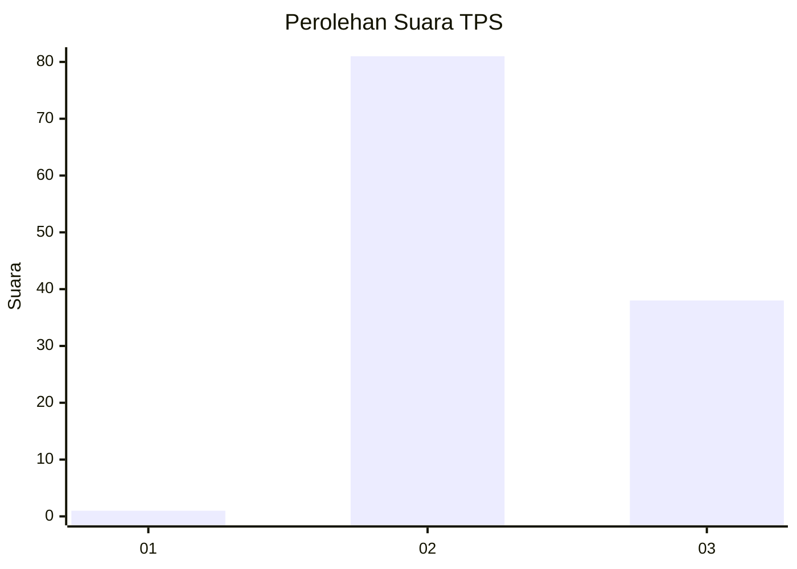
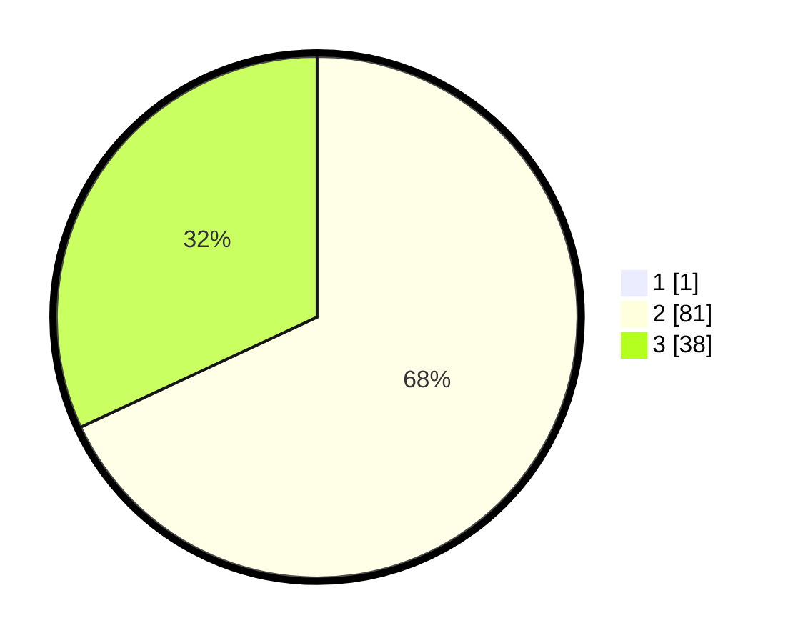

# Hasil

## Grafik

## Tabel

| No. | Nama Paslon    | Suara | Suara (raw) | Persentase |
|:--- |:-------------- | -----:| -----------:| ----------:|
| 1   | ANIES MUHAIMIN | 1     | [1][p-1]    | 0,83       |
| 2   | PRABOWO GIBRAN | 81    | [81][p-2]   | 67,50      |
| 3   | GANJAR MAHFUD  | 38    | [38][p-3]   | 31,67      |

[p-1]: https://github.com/gigit-pemilu/pemilu-2024-35-jawa-timur/blob/main/pilpres/hitung-suara/sub/35-jawa-timur/sub/19-madiun/sub/06-gemarang/sub/2007-nampu/sub/014-tps/sub/paslon-1.txt
[p-2]: https://github.com/gigit-pemilu/pemilu-2024-35-jawa-timur/blob/main/pilpres/hitung-suara/sub/35-jawa-timur/sub/19-madiun/sub/06-gemarang/sub/2007-nampu/sub/014-tps/sub/paslon-2.txt
[p-3]: https://github.com/gigit-pemilu/pemilu-2024-35-jawa-timur/blob/main/pilpres/hitung-suara/sub/35-jawa-timur/sub/19-madiun/sub/06-gemarang/sub/2007-nampu/sub/014-tps/sub/paslon-3.txt

## Foto C Plano

https://sirekap-obj-formc.kpu.go.id/958d/pemilu/ppwp/35/19/06/20/07/3519062007014-20240214-140938--5cda8599-2d4e-4428-85f2-d54c65af3fe7.jpg

https://sirekap-obj-formc.kpu.go.id/958d/pemilu/ppwp/35/19/06/20/07/3519062007014-20240214-141348--f9d0c710-ae23-468a-9623-6ce90ab217e4.jpg

https://sirekap-obj-formc.kpu.go.id/958d/pemilu/ppwp/35/19/06/20/07/3519062007014-20240214-141519--cfc19dd2-2f14-4126-ae44-b5a879c823df.jpg

## Metadata

| Key        | Value               |
| ---------- | ------------------- |
| Time Stamp | 2024-02-21 16:00:00 |

