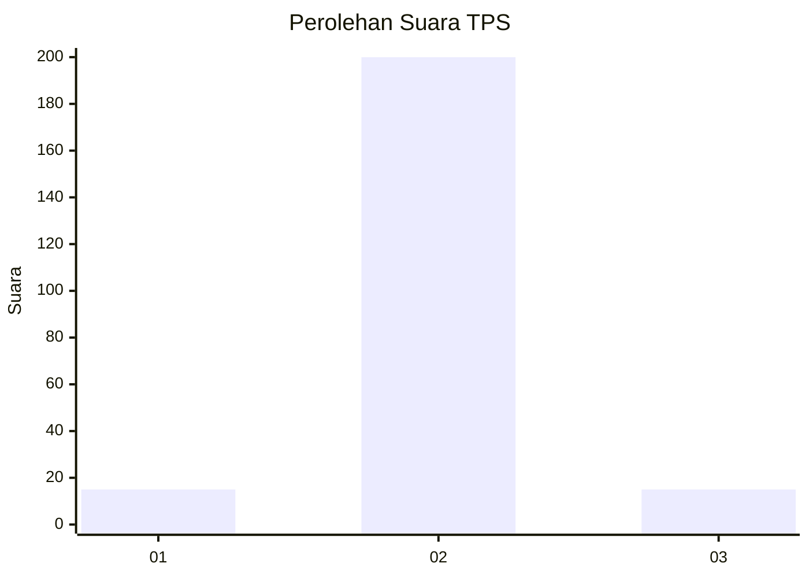
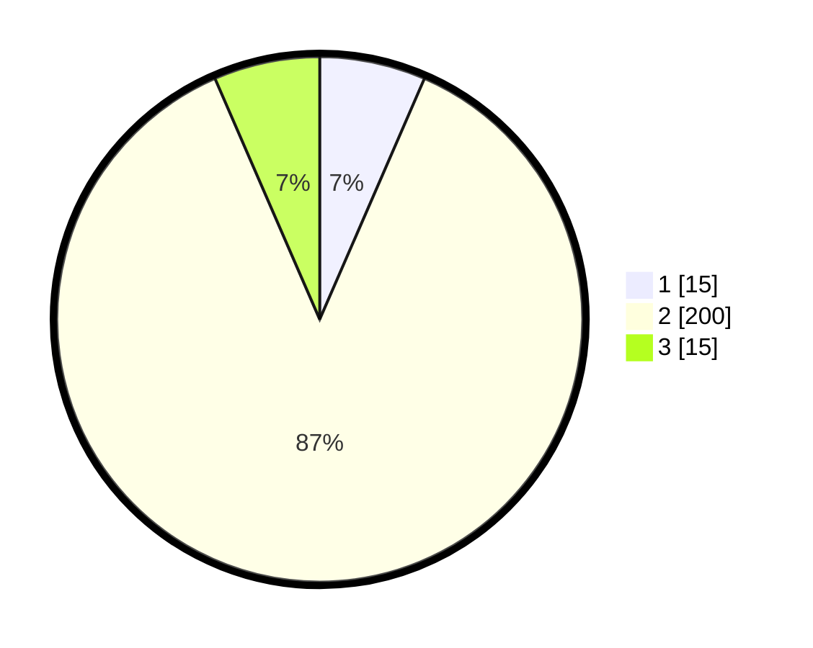

# Hasil

## Grafik

## Tabel

| No. | Nama Paslon    | Suara | Suara (raw) | Persentase |
|:--- |:-------------- | -----:| -----------:| ----------:|
| 1   | ANIES MUHAIMIN | 15    | [15][p-1]   | 6,52       |
| 2   | PRABOWO GIBRAN | 200   | [200][p-2]  | 86,96      |
| 3   | GANJAR MAHFUD  | 15    | [15][p-3]   | 6,52       |

[p-1]: https://github.com/gigit-pemilu/pemilu-2024/blob/main/pilpres/hitung-suara/sub/35-jawa-timur/sub/19-madiun/sub/10-balerejo/sub/2017-kuwu/sub/001-tps/sub/paslon-1.txt
[p-2]: https://github.com/gigit-pemilu/pemilu-2024/blob/main/pilpres/hitung-suara/sub/35-jawa-timur/sub/19-madiun/sub/10-balerejo/sub/2017-kuwu/sub/001-tps/sub/paslon-2.txt
[p-3]: https://github.com/gigit-pemilu/pemilu-2024/blob/main/pilpres/hitung-suara/sub/35-jawa-timur/sub/19-madiun/sub/10-balerejo/sub/2017-kuwu/sub/001-tps/sub/paslon-3.txt

## Foto C Plano

https://sirekap-obj-formc.kpu.go.id/8ce8/pemilu/ppwp/35/19/10/20/17/3519102017001-20240215-010513--f3cc4cb3-5acd-4b80-ac97-6569f4eaabb3.jpg

https://sirekap-obj-formc.kpu.go.id/8ce8/pemilu/ppwp/35/19/10/20/17/3519102017001-20240215-010744--ec776bc0-6480-4c0f-81ba-907e046ed643.jpg

https://sirekap-obj-formc.kpu.go.id/8ce8/pemilu/ppwp/35/19/10/20/17/3519102017001-20240215-010941--8f3f9bae-eb58-441f-b495-495646885f16.jpg

## Metadata

| Key        | Value               |
| ---------- | ------------------- |
| Time Stamp | 2024-02-15 21:30:27 |

