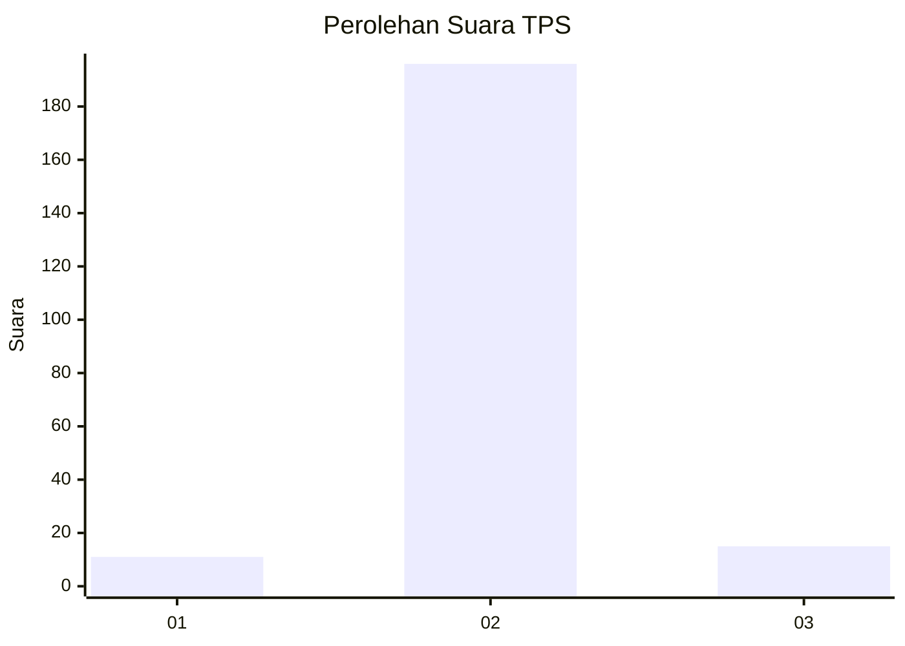
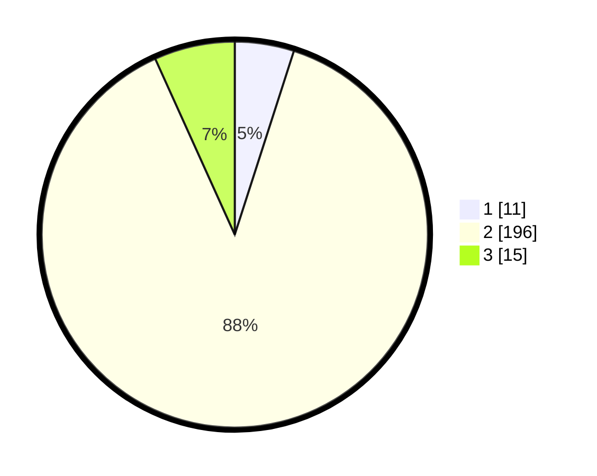

# Hasil

## Grafik

## Tabel

| No. | Nama Paslon    | Suara | Suara (raw) | Persentase |
|:--- |:-------------- | -----:| -----------:| ----------:|
| 1   | ANIES MUHAIMIN | 11    | [11][p-1]   | 4,95       |
| 2   | PRABOWO GIBRAN | 196   | [196][p-2]  | 88,29      |
| 3   | GANJAR MAHFUD  | 15    | [15][p-3]   | 6,76       |

[p-1]: https://github.com/gigit-pemilu/pemilu-2024-35-jawa-timur/blob/main/pilpres/hitung-suara/sub/35-jawa-timur/sub/19-madiun/sub/10-balerejo/sub/2018-simo/sub/002-tps/sub/paslon-1.txt
[p-2]: https://github.com/gigit-pemilu/pemilu-2024-35-jawa-timur/blob/main/pilpres/hitung-suara/sub/35-jawa-timur/sub/19-madiun/sub/10-balerejo/sub/2018-simo/sub/002-tps/sub/paslon-2.txt
[p-3]: https://github.com/gigit-pemilu/pemilu-2024-35-jawa-timur/blob/main/pilpres/hitung-suara/sub/35-jawa-timur/sub/19-madiun/sub/10-balerejo/sub/2018-simo/sub/002-tps/sub/paslon-3.txt

## Foto C Plano

https://sirekap-obj-formc.kpu.go.id/876c/pemilu/ppwp/35/19/10/20/18/3519102018002-20240214-235619--89564bdb-1e2b-44bf-8fc8-57b149b6bee1.jpg

https://sirekap-obj-formc.kpu.go.id/876c/pemilu/ppwp/35/19/10/20/18/3519102018002-20240214-235925--a66248c5-4ec1-47de-9681-d6f98c8c6fb2.jpg

https://sirekap-obj-formc.kpu.go.id/876c/pemilu/ppwp/35/19/10/20/18/3519102018002-20240215-000011--c9b8d186-28ce-41da-9796-a7c82b4c5f27.jpg

## Metadata

| Key        | Value               |
| ---------- | ------------------- |
| Time Stamp | 2024-02-15 09:00:24 |

