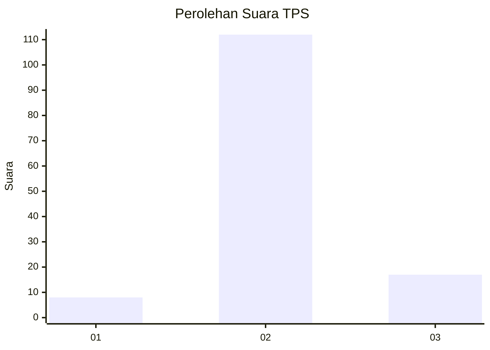
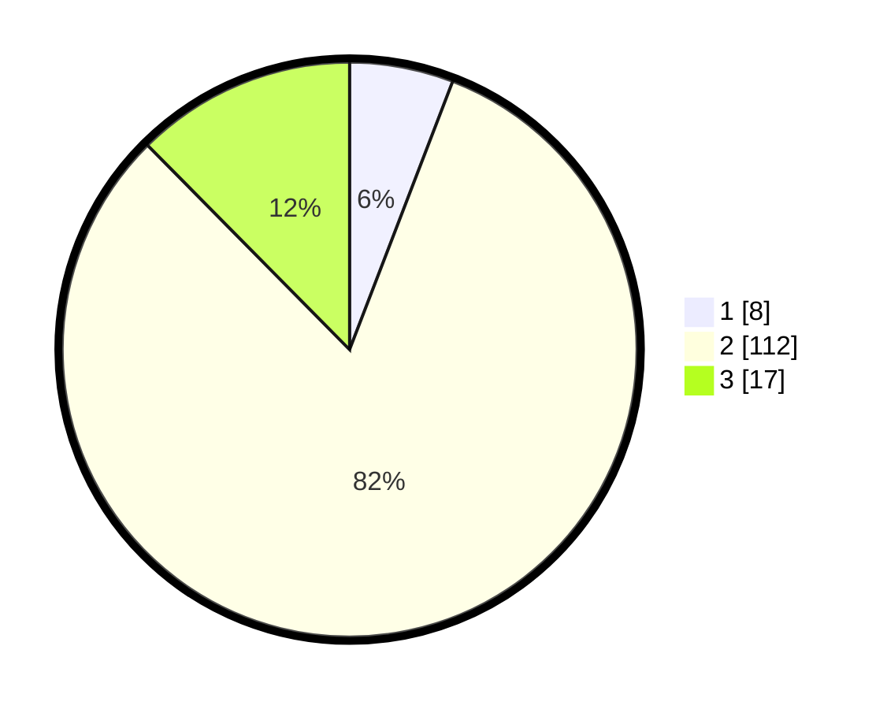

# Hasil

## Grafik

## Tabel

| No. | Nama Paslon    | Suara | Suara (raw) | Persentase |
|:--- |:-------------- | -----:| -----------:| ----------:|
| 1   | ANIES MUHAIMIN | 8     | [8][p-1]    | 5,84       |
| 2   | PRABOWO GIBRAN | 112   | [112][p-2]  | 81,75      |
| 3   | GANJAR MAHFUD  | 17    | [17][p-3]   | 12,41      |

[p-1]: https://github.com/gigit-pemilu/pemilu-2024-35-jawa-timur/blob/main/pilpres/hitung-suara/sub/35-jawa-timur/sub/19-madiun/sub/10-balerejo/sub/2018-simo/sub/009-tps/sub/paslon-1.txt
[p-2]: https://github.com/gigit-pemilu/pemilu-2024-35-jawa-timur/blob/main/pilpres/hitung-suara/sub/35-jawa-timur/sub/19-madiun/sub/10-balerejo/sub/2018-simo/sub/009-tps/sub/paslon-2.txt
[p-3]: https://github.com/gigit-pemilu/pemilu-2024-35-jawa-timur/blob/main/pilpres/hitung-suara/sub/35-jawa-timur/sub/19-madiun/sub/10-balerejo/sub/2018-simo/sub/009-tps/sub/paslon-3.txt

## Foto C Plano

https://sirekap-obj-formc.kpu.go.id/caa3/pemilu/ppwp/35/19/10/20/18/3519102018009-20240214-141813--17a2ddab-197b-46ef-9f50-b4e403ae8689.jpg

https://sirekap-obj-formc.kpu.go.id/caa3/pemilu/ppwp/35/19/10/20/18/3519102018009-20240214-141833--e7932e16-1f86-429f-ba31-e1b325155504.jpg

https://sirekap-obj-formc.kpu.go.id/caa3/pemilu/ppwp/35/19/10/20/18/3519102018009-20240214-141848--c779b7a3-9f4d-48ba-8ec7-5b9c5dbc2de4.jpg

## Metadata

| Key        | Value               |
| ---------- | ------------------- |
| Time Stamp | 2024-02-17 11:30:03 |

