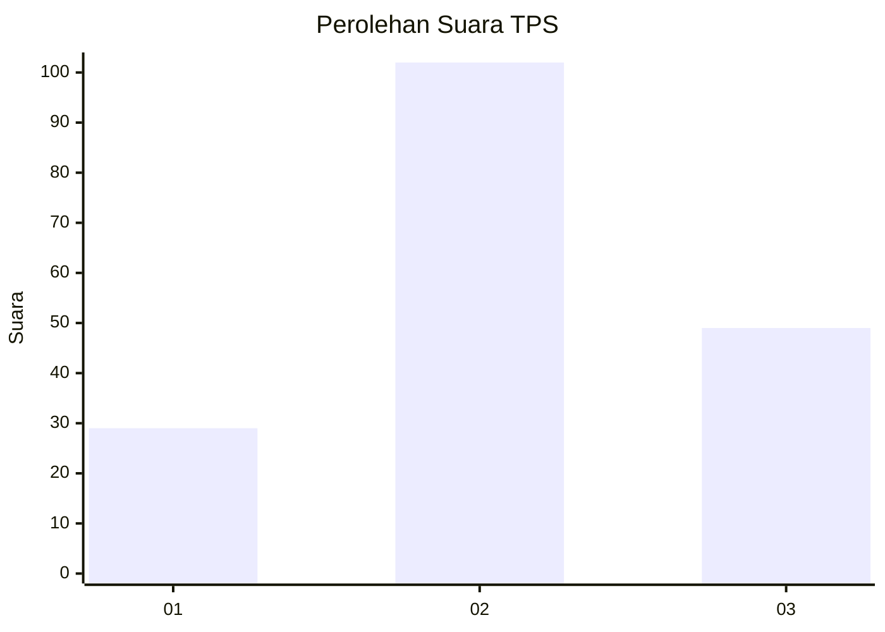
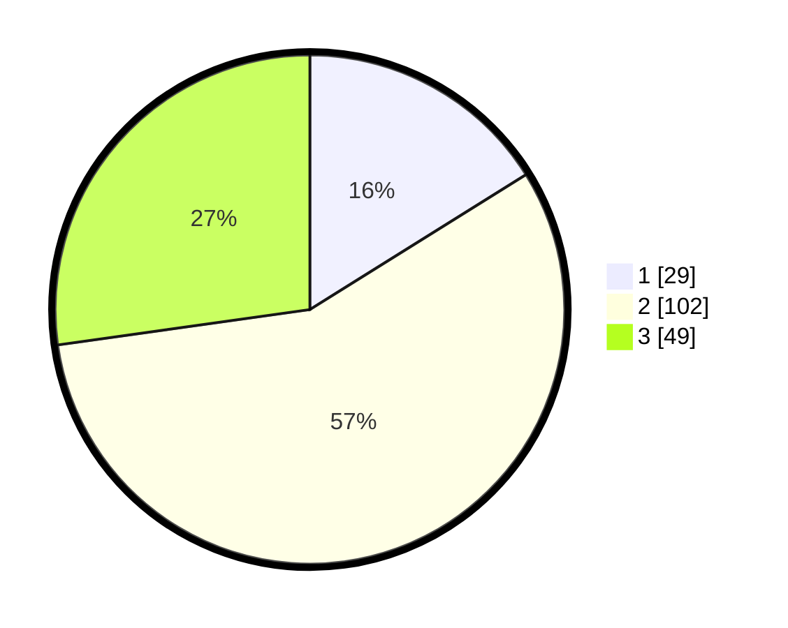

# Hasil

## Grafik

## Tabel

| No. | Nama Paslon    | Suara | Suara (raw) | Persentase |
|:--- |:-------------- | -----:| -----------:| ----------:|
| 1   | ANIES MUHAIMIN | 29    | [29][p-1]   | 16,11      |
| 2   | PRABOWO GIBRAN | 102   | [102][p-2]  | 56,67      |
| 3   | GANJAR MAHFUD  | 49    | [49][p-3]   | 27,22      |

[p-1]: https://github.com/gigit-pemilu/pemilu-2024-35-jawa-timur/blob/main/pilpres/hitung-suara/sub/35-jawa-timur/sub/19-madiun/sub/11-mejayan/sub/1012-bangunsari/sub/001-tps/sub/paslon-1.txt
[p-2]: https://github.com/gigit-pemilu/pemilu-2024-35-jawa-timur/blob/main/pilpres/hitung-suara/sub/35-jawa-timur/sub/19-madiun/sub/11-mejayan/sub/1012-bangunsari/sub/001-tps/sub/paslon-2.txt
[p-3]: https://github.com/gigit-pemilu/pemilu-2024-35-jawa-timur/blob/main/pilpres/hitung-suara/sub/35-jawa-timur/sub/19-madiun/sub/11-mejayan/sub/1012-bangunsari/sub/001-tps/sub/paslon-3.txt

## Foto C Plano

https://sirekap-obj-formc.kpu.go.id/1c01/pemilu/ppwp/35/19/11/10/12/3519111012001-20240215-000656--ab40b836-912c-423f-9bf5-c329f11ec882.jpg

https://sirekap-obj-formc.kpu.go.id/1c01/pemilu/ppwp/35/19/11/10/12/3519111012001-20240215-001331--4504aa84-0b9e-4d86-a350-8af414c4450c.jpg

https://sirekap-obj-formc.kpu.go.id/1c01/pemilu/ppwp/35/19/11/10/12/3519111012001-20240215-001512--79554811-acc1-4e19-9911-7534159963e9.jpg

## Metadata

| Key        | Value               |
| ---------- | ------------------- |
| Time Stamp | 2024-02-15 20:30:46 |

