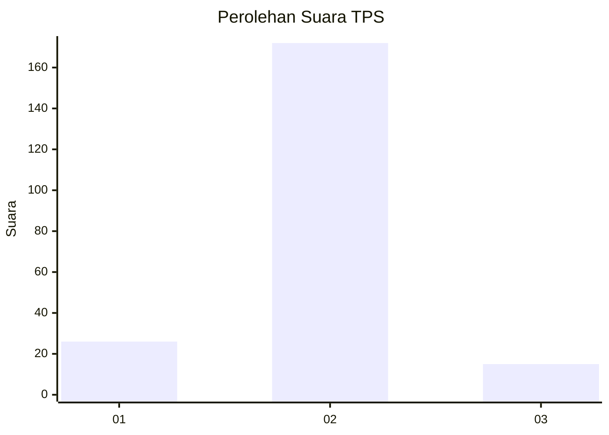
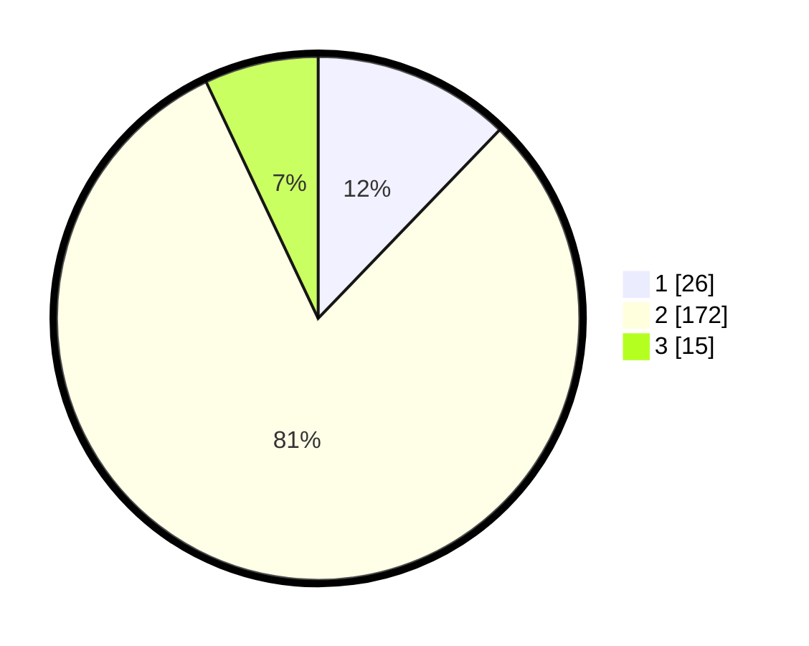

# Hasil

## Grafik

## Tabel

| No. | Nama Paslon    | Suara | Suara (raw) | Persentase |
|:--- |:-------------- | -----:| -----------:| ----------:|
| 1   | ANIES MUHAIMIN | 26    | [26][p-1]   | 12,21      |
| 2   | PRABOWO GIBRAN | 172   | [172][p-2]  | 80,75      |
| 3   | GANJAR MAHFUD  | 15    | [15][p-3]   | 7,04       |

[p-1]: https://github.com/gigit-pemilu/pemilu-2024-35-jawa-timur/blob/main/pilpres/hitung-suara/sub/35-jawa-timur/sub/20-magetan/sub/01-poncol/sub/1005-alastuwo/sub/007-tps/sub/paslon-1.txt
[p-2]: https://github.com/gigit-pemilu/pemilu-2024-35-jawa-timur/blob/main/pilpres/hitung-suara/sub/35-jawa-timur/sub/20-magetan/sub/01-poncol/sub/1005-alastuwo/sub/007-tps/sub/paslon-2.txt
[p-3]: https://github.com/gigit-pemilu/pemilu-2024-35-jawa-timur/blob/main/pilpres/hitung-suara/sub/35-jawa-timur/sub/20-magetan/sub/01-poncol/sub/1005-alastuwo/sub/007-tps/sub/paslon-3.txt

## Foto C Plano

https://sirekap-obj-formc.kpu.go.id/c8b3/pemilu/ppwp/35/20/01/10/05/3520011005007-20240217-170255--95a93ee6-dd06-4490-be5e-5dc5882b83ba.jpg

https://sirekap-obj-formc.kpu.go.id/c8b3/pemilu/ppwp/35/20/01/10/05/3520011005007-20240214-221357--efa8a8bc-32d2-4420-8908-ffd94045ee25.jpg

https://sirekap-obj-formc.kpu.go.id/c8b3/pemilu/ppwp/35/20/01/10/05/3520011005007-20240214-221420--6d0a3666-282e-425a-b0ce-80d3a762d3b9.jpg

## Metadata

| Key        | Value               |
| ---------- | ------------------- |
| Time Stamp | 2024-02-17 17:30:00 |

