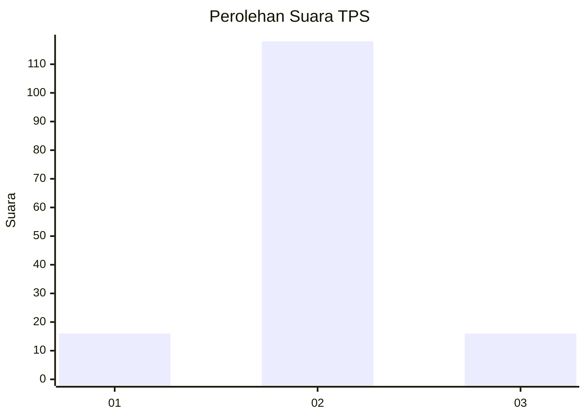
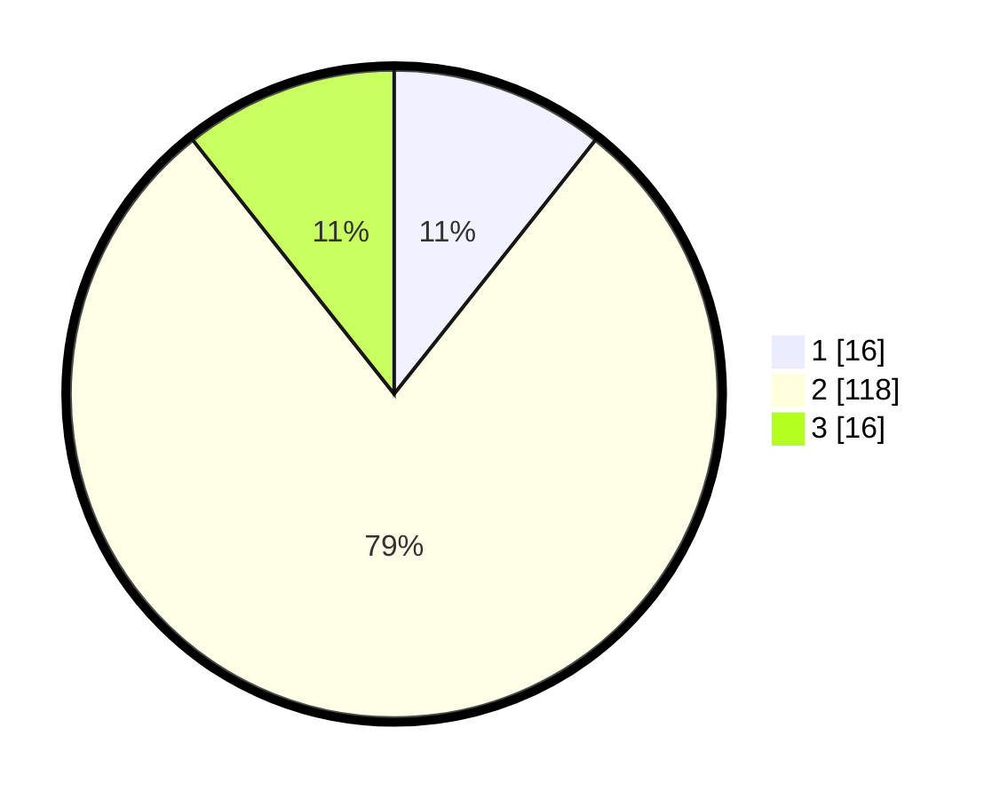

# Hasil

## Grafik

## Tabel

| No. | Nama Paslon    | Suara | Suara (raw) | Persentase |
|:--- |:-------------- | -----:| -----------:| ----------:|
| 1   | ANIES MUHAIMIN | 16    | [16][p-1]   | 10,67      |
| 2   | PRABOWO GIBRAN | 118   | [118][p-2]  | 78,67      |
| 3   | GANJAR MAHFUD  | 16    | [16][p-3]   | 10,67      |

[p-1]: https://github.com/gigit-pemilu/pemilu-2024-35-jawa-timur/blob/main/pilpres/hitung-suara/sub/35-jawa-timur/sub/20-magetan/sub/01-poncol/sub/2002-gonggang/sub/004-tps/sub/paslon-1.txt
[p-2]: https://github.com/gigit-pemilu/pemilu-2024-35-jawa-timur/blob/main/pilpres/hitung-suara/sub/35-jawa-timur/sub/20-magetan/sub/01-poncol/sub/2002-gonggang/sub/004-tps/sub/paslon-2.txt
[p-3]: https://github.com/gigit-pemilu/pemilu-2024-35-jawa-timur/blob/main/pilpres/hitung-suara/sub/35-jawa-timur/sub/20-magetan/sub/01-poncol/sub/2002-gonggang/sub/004-tps/sub/paslon-3.txt

## Foto C Plano

https://sirekap-obj-formc.kpu.go.id/702a/pemilu/ppwp/35/20/01/20/02/3520012002004-20240215-012326--46143a79-8a0f-48e6-bb57-a416809bdb04.jpg

https://sirekap-obj-formc.kpu.go.id/702a/pemilu/ppwp/35/20/01/20/02/3520012002004-20240214-141621--1cbab57f-ae8d-4116-853d-704536566154.jpg

https://sirekap-obj-formc.kpu.go.id/702a/pemilu/ppwp/35/20/01/20/02/3520012002004-20240214-141335--7230a7ea-e52e-45d2-91db-8dab95b076f6.jpg

## Metadata

| Key        | Value               |
| ---------- | ------------------- |
| Time Stamp | 2024-02-15 18:00:26 |

