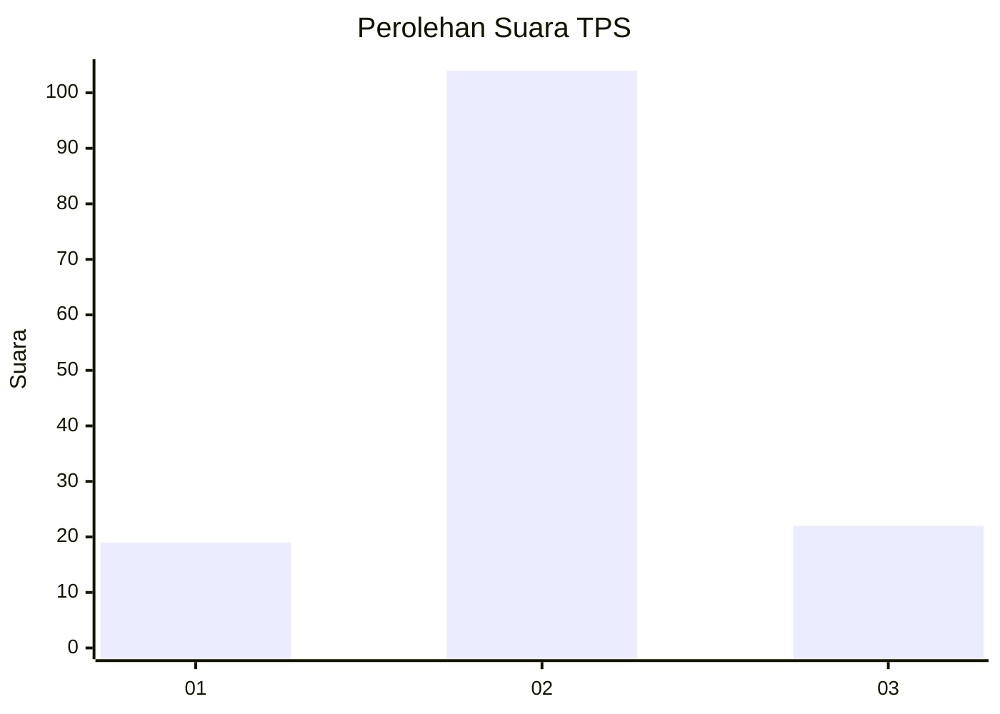

# Hasil

## Grafik

## Tabel

| No. | Nama Paslon    | Suara | Suara (raw) | Persentase |
|:--- |:-------------- | -----:| -----------:| ----------:|
| 1   | ANIES MUHAIMIN | 19    | [19][p-1]   | 13,10      |
| 2   | PRABOWO GIBRAN | 104   | [104][p-2]  | 71,72      |
| 3   | GANJAR MAHFUD  | 22    | [22][p-3]   | 15,17      |

[p-1]: https://github.com/gigit-pemilu/pemilu-2024/blob/main/pilpres/hitung-suara/sub/35-jawa-timur/sub/20-magetan/sub/01-poncol/sub/2006-plangkrongan/sub/008-tps/sub/paslon-1.txt
[p-2]: https://github.com/gigit-pemilu/pemilu-2024/blob/main/pilpres/hitung-suara/sub/35-jawa-timur/sub/20-magetan/sub/01-poncol/sub/2006-plangkrongan/sub/008-tps/sub/paslon-2.txt
[p-3]: https://github.com/gigit-pemilu/pemilu-2024/blob/main/pilpres/hitung-suara/sub/35-jawa-timur/sub/20-magetan/sub/01-poncol/sub/2006-plangkrongan/sub/008-tps/sub/paslon-3.txt

## Foto C Plano

https://sirekap-obj-formc.kpu.go.id/b8f5/pemilu/ppwp/35/20/01/20/06/3520012006008-20240215-180738--21e730a1-b2d6-47c9-9ecb-e662fb80ddf3.jpg

https://sirekap-obj-formc.kpu.go.id/b8f5/pemilu/ppwp/35/20/01/20/06/3520012006008-20240215-180748--8dfee722-942d-4f66-8382-0c28e747984e.jpg

https://sirekap-obj-formc.kpu.go.id/b8f5/pemilu/ppwp/35/20/01/20/06/3520012006008-20240215-180753--4587b158-5b30-41a8-90b9-a51eea7f6fee.jpg

## Metadata

| Key        | Value               |
| ---------- | ------------------- |
| Time Stamp | 2024-02-16 10:00:28 |

