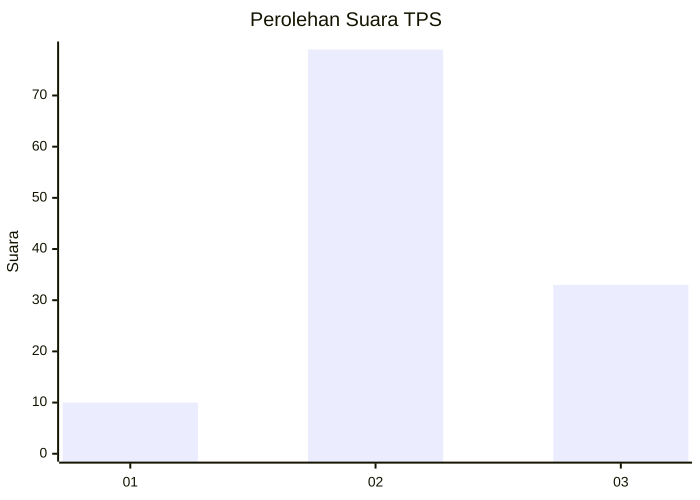
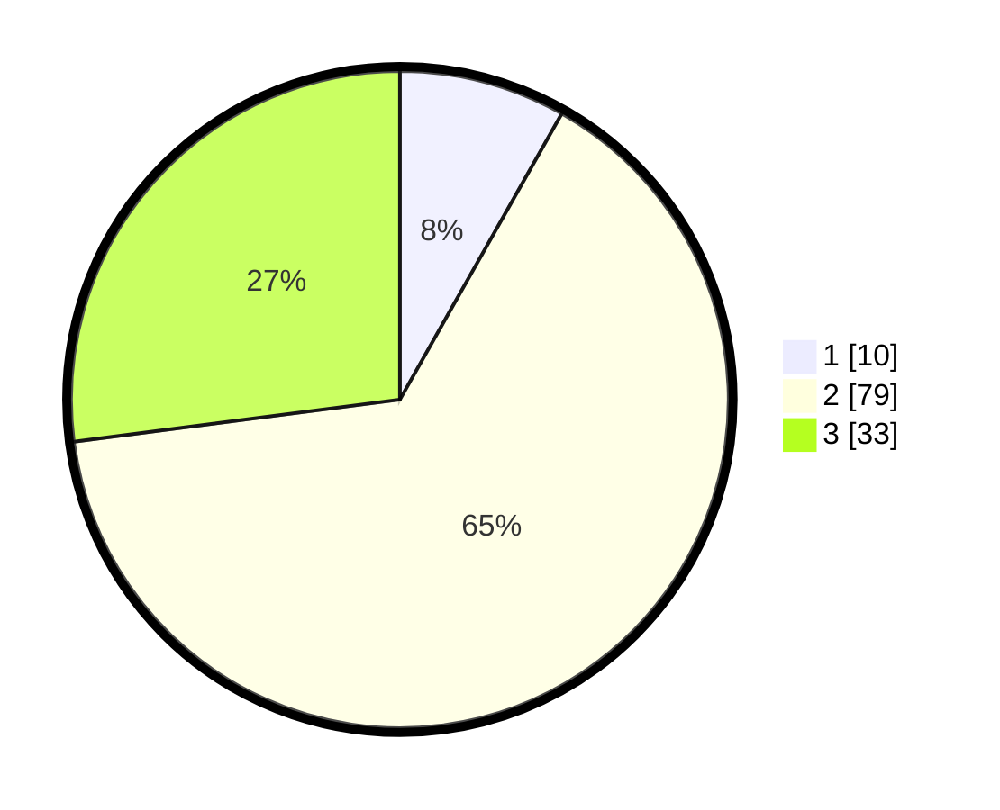

# Hasil

## Grafik

## Tabel

| No. | Nama Paslon    | Suara | Suara (raw) | Persentase |
|:--- |:-------------- | -----:| -----------:| ----------:|
| 1   | ANIES MUHAIMIN | 10    | [10][p-1]   | 8,20       |
| 2   | PRABOWO GIBRAN | 79    | [79][p-2]   | 64,75      |
| 3   | GANJAR MAHFUD  | 33    | [33][p-3]   | 27,05      |

[p-1]: https://github.com/gigit-pemilu/pemilu-2024/blob/main/pilpres/hitung-suara/sub/35-jawa-timur/sub/20-magetan/sub/01-poncol/sub/2006-plangkrongan/sub/016-tps/sub/paslon-1.txt
[p-2]: https://github.com/gigit-pemilu/pemilu-2024/blob/main/pilpres/hitung-suara/sub/35-jawa-timur/sub/20-magetan/sub/01-poncol/sub/2006-plangkrongan/sub/016-tps/sub/paslon-2.txt
[p-3]: https://github.com/gigit-pemilu/pemilu-2024/blob/main/pilpres/hitung-suara/sub/35-jawa-timur/sub/20-magetan/sub/01-poncol/sub/2006-plangkrongan/sub/016-tps/sub/paslon-3.txt

## Foto C Plano

https://sirekap-obj-formc.kpu.go.id/8f33/pemilu/ppwp/35/20/01/20/06/3520012006016-20240214-223531--f66abc8f-4a4e-479a-9f1b-7b9cf35e4c48.jpg

https://sirekap-obj-formc.kpu.go.id/8f33/pemilu/ppwp/35/20/01/20/06/3520012006016-20240215-035357--ca756562-bd27-4286-8c9e-bb01faa13b21.jpg

https://sirekap-obj-formc.kpu.go.id/8f33/pemilu/ppwp/35/20/01/20/06/3520012006016-20240214-223742--5fc83be8-08c7-491f-affc-4f8073f41d46.jpg

## Metadata

| Key        | Value               |
| ---------- | ------------------- |
| Time Stamp | 2024-02-22 11:00:00 |

