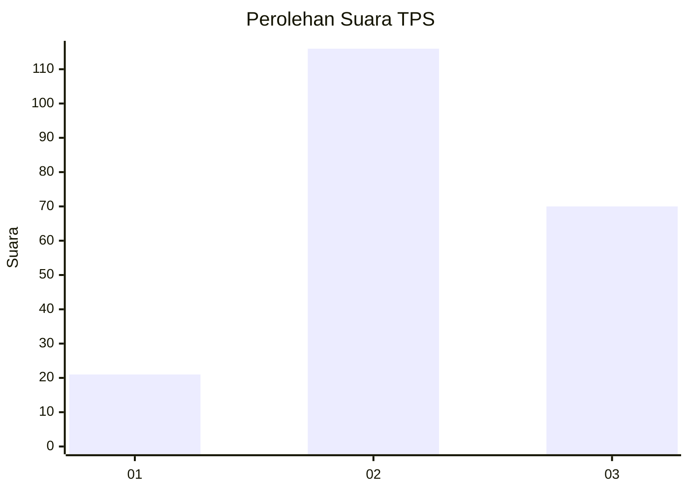
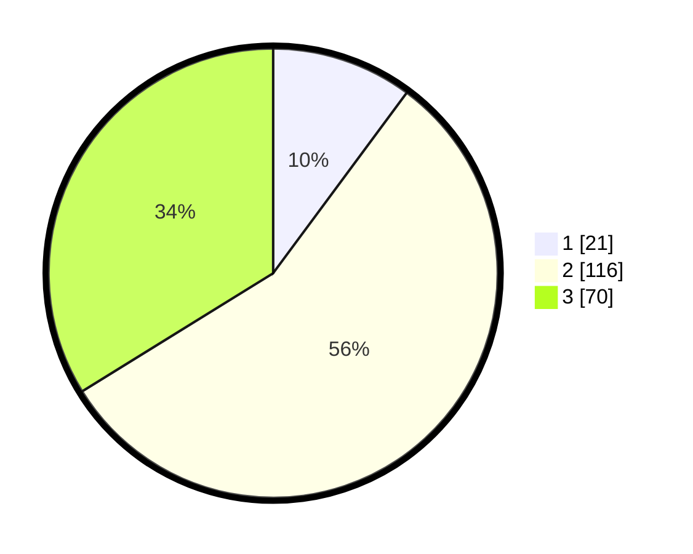

# Hasil

## Grafik

## Tabel

| No. | Nama Paslon    | Suara | Suara (raw) | Persentase |
|:--- |:-------------- | -----:| -----------:| ----------:|
| 1   | ANIES MUHAIMIN | 21    | [21][p-1]   | 10,14      |
| 2   | PRABOWO GIBRAN | 116   | [116][p-2]  | 56,04      |
| 3   | GANJAR MAHFUD  | 70    | [70][p-3]   | 33,82      |

[p-1]: https://github.com/gigit-pemilu/pemilu-2024/blob/main/pilpres/hitung-suara/sub/35-jawa-timur/sub/20-magetan/sub/01-poncol/sub/2007-cileng/sub/007-tps/sub/paslon-1.txt
[p-2]: https://github.com/gigit-pemilu/pemilu-2024/blob/main/pilpres/hitung-suara/sub/35-jawa-timur/sub/20-magetan/sub/01-poncol/sub/2007-cileng/sub/007-tps/sub/paslon-2.txt
[p-3]: https://github.com/gigit-pemilu/pemilu-2024/blob/main/pilpres/hitung-suara/sub/35-jawa-timur/sub/20-magetan/sub/01-poncol/sub/2007-cileng/sub/007-tps/sub/paslon-3.txt

## Foto C Plano

https://sirekap-obj-formc.kpu.go.id/7b2c/pemilu/ppwp/35/20/01/20/07/3520012007007-20240214-205230--8c35ef5d-31c4-48f4-87d6-7a3114485205.jpg

https://sirekap-obj-formc.kpu.go.id/7b2c/pemilu/ppwp/35/20/01/20/07/3520012007007-20240214-205327--58c7710c-9b45-4c1a-ab75-f6474ee7304a.jpg

https://sirekap-obj-formc.kpu.go.id/7b2c/pemilu/ppwp/35/20/01/20/07/3520012007007-20240214-205414--c08c8cb2-cb6c-4622-81d3-c130ac0b1175.jpg

## Metadata

| Key        | Value               |
| ---------- | ------------------- |
| Time Stamp | 2024-02-16 10:00:28 |

