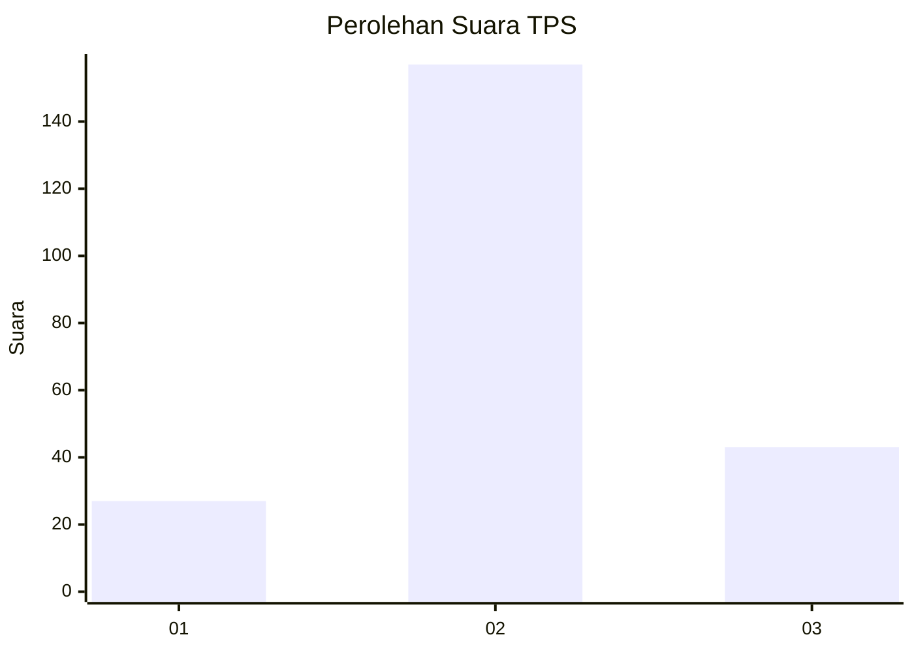
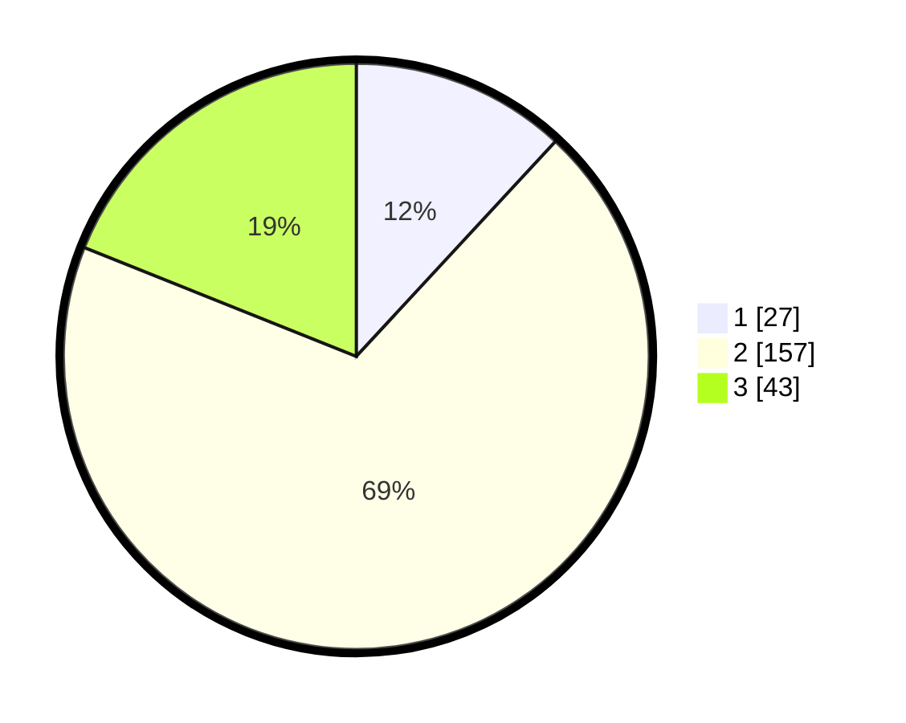

# Hasil

## Grafik

## Tabel

| No. | Nama Paslon    | Suara | Suara (raw) | Persentase |
|:--- |:-------------- | -----:| -----------:| ----------:|
| 1   | ANIES MUHAIMIN | 27    | [27][p-1]   | 11,89      |
| 2   | PRABOWO GIBRAN | 157   | [157][p-2]  | 69,16      |
| 3   | GANJAR MAHFUD  | 43    | [43][p-3]   | 18,94      |

[p-1]: https://github.com/gigit-pemilu/pemilu-2024-35-jawa-timur/blob/main/pilpres/hitung-suara/sub/35-jawa-timur/sub/20-magetan/sub/02-parang/sub/1008-parang/sub/001-tps/sub/paslon-1.txt
[p-2]: https://github.com/gigit-pemilu/pemilu-2024-35-jawa-timur/blob/main/pilpres/hitung-suara/sub/35-jawa-timur/sub/20-magetan/sub/02-parang/sub/1008-parang/sub/001-tps/sub/paslon-2.txt
[p-3]: https://github.com/gigit-pemilu/pemilu-2024-35-jawa-timur/blob/main/pilpres/hitung-suara/sub/35-jawa-timur/sub/20-magetan/sub/02-parang/sub/1008-parang/sub/001-tps/sub/paslon-3.txt

## Foto C Plano

https://sirekap-obj-formc.kpu.go.id/ddb1/pemilu/ppwp/35/20/02/10/08/3520021008001-20240224-164316--f40b73c4-8f2f-4314-8ef8-4ad21b4184bf.jpg

https://sirekap-obj-formc.kpu.go.id/ddb1/pemilu/ppwp/35/20/02/10/08/3520021008001-20240224-164322--0d98c466-b30c-4495-87b9-9f3bd54905c7.jpg

https://sirekap-obj-formc.kpu.go.id/ddb1/pemilu/ppwp/35/20/02/10/08/3520021008001-20240224-164327--883a4bde-5339-4b92-b980-0b78687e4287.jpg

## Metadata

| Key        | Value               |
| ---------- | ------------------- |
| Time Stamp | 2024-02-25 13:00:00 |

