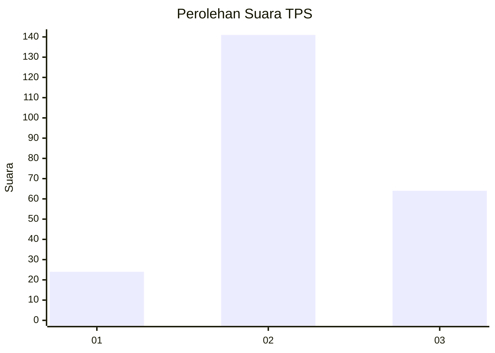
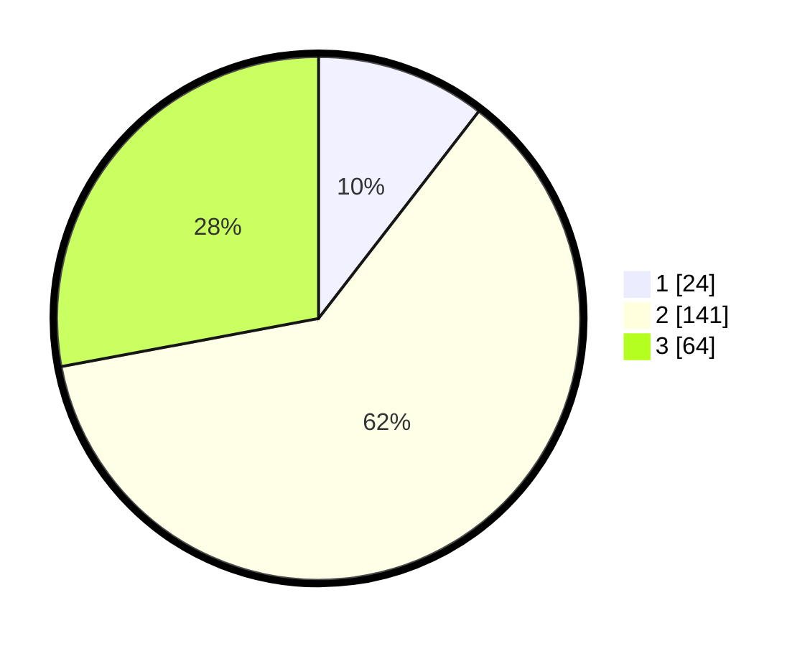

# Hasil

## Grafik

## Tabel

| No. | Nama Paslon    | Suara | Suara (raw) | Persentase |
|:--- |:-------------- | -----:| -----------:| ----------:|
| 1   | ANIES MUHAIMIN | 24    | [24][p-1]   | 10,48      |
| 2   | PRABOWO GIBRAN | 141   | [141][p-2]  | 61,57      |
| 3   | GANJAR MAHFUD  | 64    | [64][p-3]   | 27,95      |

[p-1]: https://github.com/gigit-pemilu/pemilu-2024/blob/main/pilpres/hitung-suara/sub/35-jawa-timur/sub/20-magetan/sub/02-parang/sub/1008-parang/sub/002-tps/sub/paslon-1.txt
[p-2]: https://github.com/gigit-pemilu/pemilu-2024/blob/main/pilpres/hitung-suara/sub/35-jawa-timur/sub/20-magetan/sub/02-parang/sub/1008-parang/sub/002-tps/sub/paslon-2.txt
[p-3]: https://github.com/gigit-pemilu/pemilu-2024/blob/main/pilpres/hitung-suara/sub/35-jawa-timur/sub/20-magetan/sub/02-parang/sub/1008-parang/sub/002-tps/sub/paslon-3.txt

## Foto C Plano

https://sirekap-obj-formc.kpu.go.id/6086/pemilu/ppwp/35/20/02/10/08/3520021008002-20240224-164502--655d0aec-4733-44d8-bb46-25bbb97fb567.jpg

https://sirekap-obj-formc.kpu.go.id/6086/pemilu/ppwp/35/20/02/10/08/3520021008002-20240224-164510--9565d7c2-432a-48fa-ad6f-09727ef8d26f.jpg

https://sirekap-obj-formc.kpu.go.id/6086/pemilu/ppwp/35/20/02/10/08/3520021008002-20240224-164516--016ab8f2-4aa2-467c-b153-31738fa46b36.jpg

## Metadata

| Key        | Value               |
| ---------- | ------------------- |
| Time Stamp | 2024-02-25 13:00:00 |

