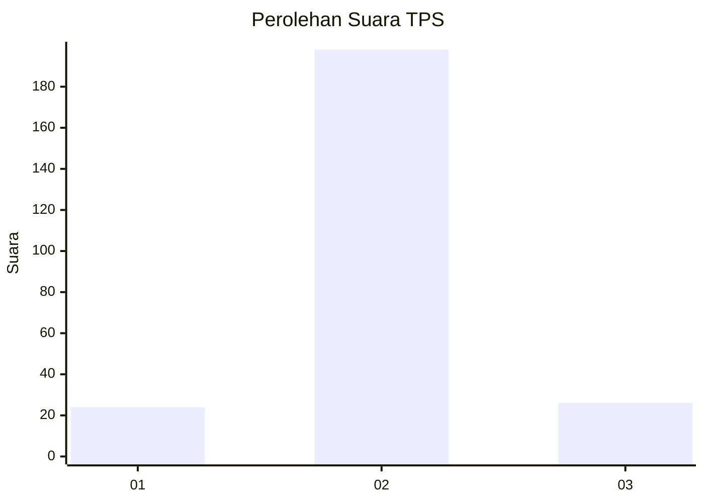
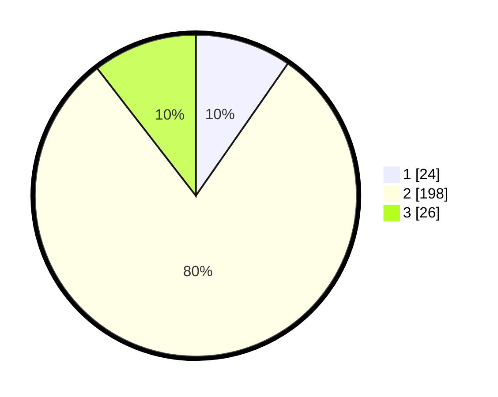

# Hasil

## Grafik

## Tabel

| No. | Nama Paslon    | Suara | Suara (raw) | Persentase |
|:--- |:-------------- | -----:| -----------:| ----------:|
| 1   | ANIES MUHAIMIN | 24    | [24][p-1]   | 9,68       |
| 2   | PRABOWO GIBRAN | 198   | [198][p-2]  | 79,84      |
| 3   | GANJAR MAHFUD  | 26    | [26][p-3]   | 10,48      |

[p-1]: https://github.com/gigit-pemilu/pemilu-2024/blob/main/pilpres/hitung-suara/sub/35-jawa-timur/sub/20-magetan/sub/02-parang/sub/1008-parang/sub/004-tps/sub/paslon-1.txt
[p-2]: https://github.com/gigit-pemilu/pemilu-2024/blob/main/pilpres/hitung-suara/sub/35-jawa-timur/sub/20-magetan/sub/02-parang/sub/1008-parang/sub/004-tps/sub/paslon-2.txt
[p-3]: https://github.com/gigit-pemilu/pemilu-2024/blob/main/pilpres/hitung-suara/sub/35-jawa-timur/sub/20-magetan/sub/02-parang/sub/1008-parang/sub/004-tps/sub/paslon-3.txt

## Foto C Plano

https://sirekap-obj-formc.kpu.go.id/4ab2/pemilu/ppwp/35/20/02/10/08/3520021008004-20240224-170000--e3888fe1-7f46-443d-bfb0-7f0a629d76d8.jpg

https://sirekap-obj-formc.kpu.go.id/4ab2/pemilu/ppwp/35/20/02/10/08/3520021008004-20240224-170007--4e77db73-f7b9-4bb4-9978-e39333c03d8b.jpg

https://sirekap-obj-formc.kpu.go.id/4ab2/pemilu/ppwp/35/20/02/10/08/3520021008004-20240224-170015--1b786953-29f1-4191-b5db-021bc5a88a48.jpg

## Metadata

| Key        | Value               |
| ---------- | ------------------- |
| Time Stamp | 2024-02-25 14:00:00 |

