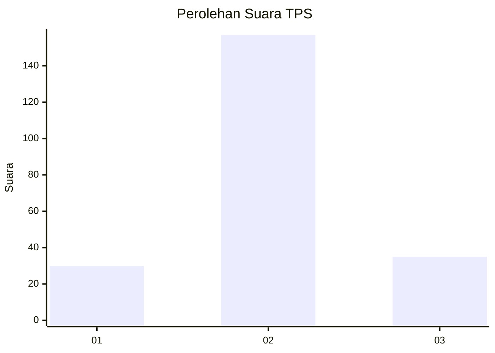

# Hasil

## Grafik

## Tabel

| No. | Nama Paslon    | Suara | Suara (raw) | Persentase |
|:--- |:-------------- | -----:| -----------:| ----------:|
| 1   | ANIES MUHAIMIN | 30    | [30][p-1]   | 13,51      |
| 2   | PRABOWO GIBRAN | 157   | [157][p-2]  | 70,72      |
| 3   | GANJAR MAHFUD  | 35    | [35][p-3]   | 15,77      |

[p-1]: https://github.com/gigit-pemilu/pemilu-2024/blob/main/pilpres/hitung-suara/sub/35-jawa-timur/sub/20-magetan/sub/02-parang/sub/1008-parang/sub/005-tps/sub/paslon-1.txt
[p-2]: https://github.com/gigit-pemilu/pemilu-2024/blob/main/pilpres/hitung-suara/sub/35-jawa-timur/sub/20-magetan/sub/02-parang/sub/1008-parang/sub/005-tps/sub/paslon-2.txt
[p-3]: https://github.com/gigit-pemilu/pemilu-2024/blob/main/pilpres/hitung-suara/sub/35-jawa-timur/sub/20-magetan/sub/02-parang/sub/1008-parang/sub/005-tps/sub/paslon-3.txt

## Foto C Plano

https://sirekap-obj-formc.kpu.go.id/a9d9/pemilu/ppwp/35/20/02/10/08/3520021008005-20240224-164653--4898cdfd-defa-410e-9ec8-0611da2ffbd3.jpg

https://sirekap-obj-formc.kpu.go.id/a9d9/pemilu/ppwp/35/20/02/10/08/3520021008005-20240224-164701--2e490ceb-9be3-4ae4-a960-2418b26dad0c.jpg

https://sirekap-obj-formc.kpu.go.id/a9d9/pemilu/ppwp/35/20/02/10/08/3520021008005-20240224-164709--a84ce7b9-4286-4659-934a-f58af30aa536.jpg

## Metadata

| Key        | Value               |
| ---------- | ------------------- |
| Time Stamp | 2024-02-25 13:00:00 |

