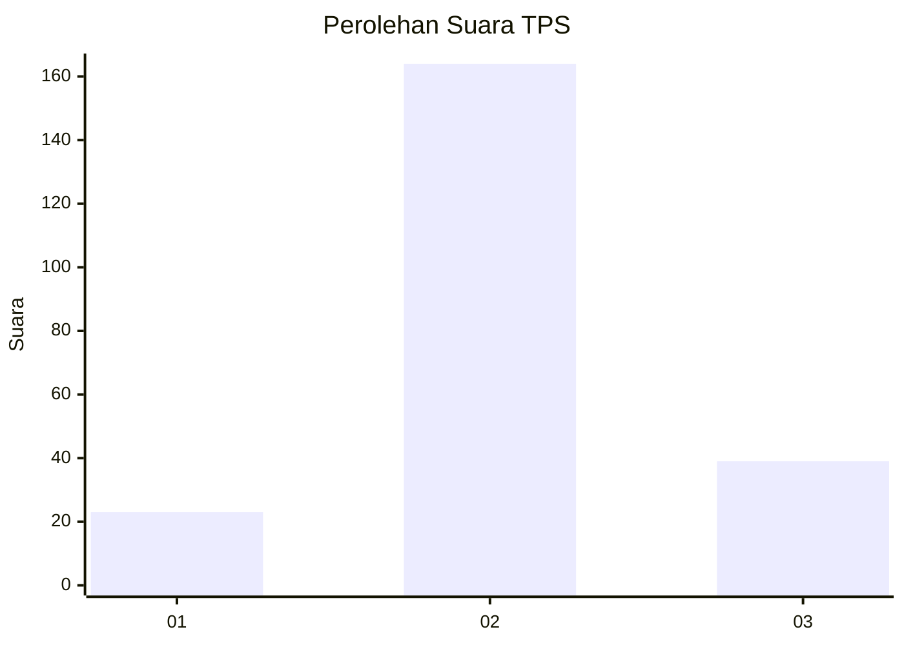
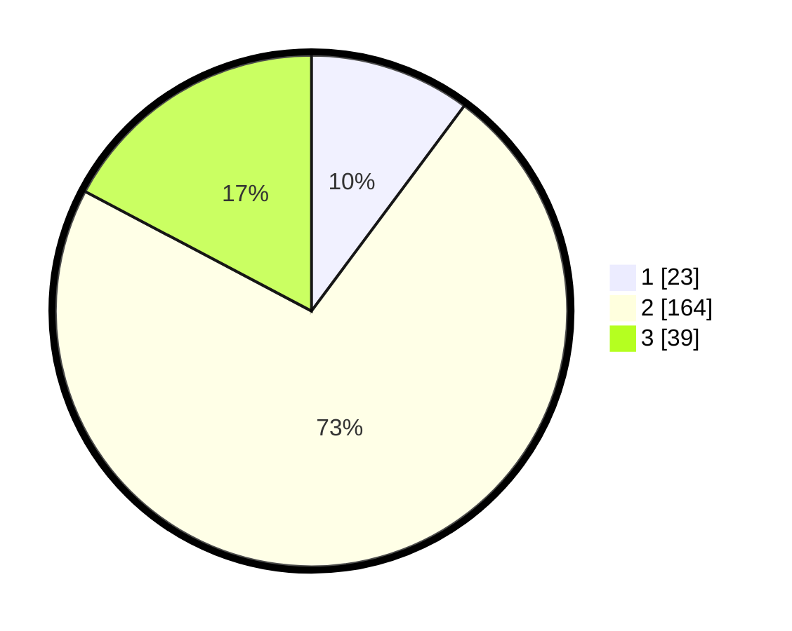

# Hasil

## Grafik

## Tabel

| No. | Nama Paslon    | Suara | Suara (raw) | Persentase |
|:--- |:-------------- | -----:| -----------:| ----------:|
| 1   | ANIES MUHAIMIN | 23    | [23][p-1]   | 10,18      |
| 2   | PRABOWO GIBRAN | 164   | [164][p-2]  | 72,57      |
| 3   | GANJAR MAHFUD  | 39    | [39][p-3]   | 17,26      |

[p-1]: https://github.com/gigit-pemilu/pemilu-2024/blob/main/pilpres/hitung-suara/sub/35-jawa-timur/sub/20-magetan/sub/02-parang/sub/1008-parang/sub/006-tps/sub/paslon-1.txt
[p-2]: https://github.com/gigit-pemilu/pemilu-2024/blob/main/pilpres/hitung-suara/sub/35-jawa-timur/sub/20-magetan/sub/02-parang/sub/1008-parang/sub/006-tps/sub/paslon-2.txt
[p-3]: https://github.com/gigit-pemilu/pemilu-2024/blob/main/pilpres/hitung-suara/sub/35-jawa-timur/sub/20-magetan/sub/02-parang/sub/1008-parang/sub/006-tps/sub/paslon-3.txt

## Foto C Plano

https://sirekap-obj-formc.kpu.go.id/7faf/pemilu/ppwp/35/20/02/10/08/3520021008006-20240224-164729--675d0726-85be-43ea-8cd0-773b57e691cb.jpg

https://sirekap-obj-formc.kpu.go.id/7faf/pemilu/ppwp/35/20/02/10/08/3520021008006-20240224-164735--dea1c321-560f-4087-8727-95d50e630a3d.jpg

https://sirekap-obj-formc.kpu.go.id/7faf/pemilu/ppwp/35/20/02/10/08/3520021008006-20240224-164743--322a1101-b2af-404c-91dc-31c38638916a.jpg

## Metadata

| Key        | Value               |
| ---------- | ------------------- |
| Time Stamp | 2024-02-25 15:00:00 |

