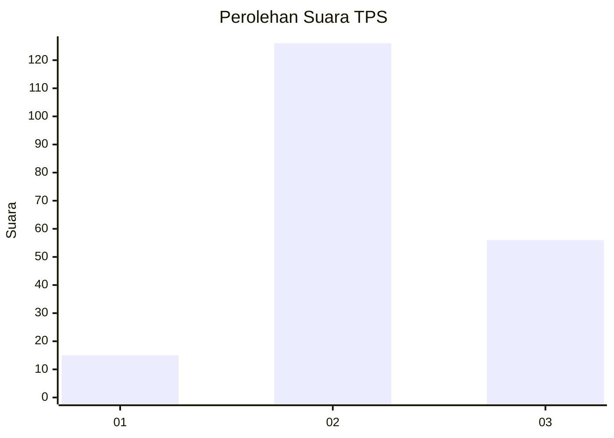
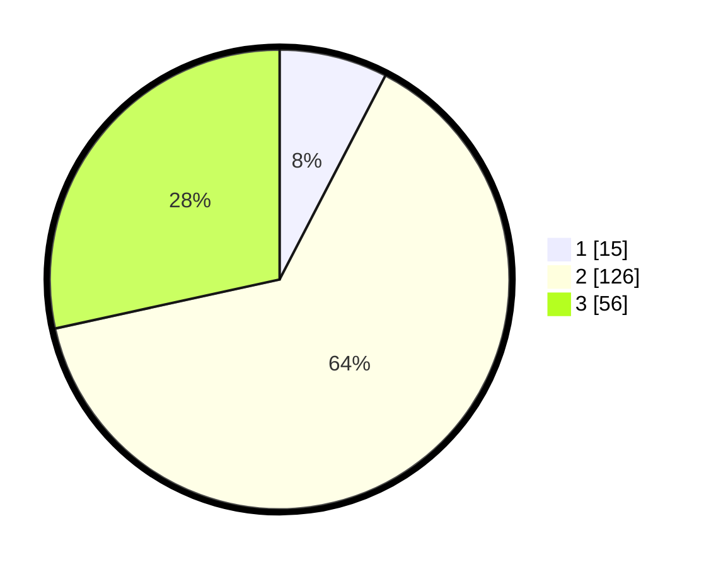

# Hasil

## Grafik

## Tabel

| No. | Nama Paslon    | Suara | Suara (raw) | Persentase |
|:--- |:-------------- | -----:| -----------:| ----------:|
| 1   | ANIES MUHAIMIN | 15    | [15][p-1]   | 7,61       |
| 2   | PRABOWO GIBRAN | 126   | [126][p-2]  | 63,96      |
| 3   | GANJAR MAHFUD  | 56    | [56][p-3]   | 28,43      |

[p-1]: https://github.com/gigit-pemilu/pemilu-2024/blob/main/pilpres/hitung-suara/sub/35-jawa-timur/sub/20-magetan/sub/02-parang/sub/2001-sayutan/sub/007-tps/sub/paslon-1.txt
[p-2]: https://github.com/gigit-pemilu/pemilu-2024/blob/main/pilpres/hitung-suara/sub/35-jawa-timur/sub/20-magetan/sub/02-parang/sub/2001-sayutan/sub/007-tps/sub/paslon-2.txt
[p-3]: https://github.com/gigit-pemilu/pemilu-2024/blob/main/pilpres/hitung-suara/sub/35-jawa-timur/sub/20-magetan/sub/02-parang/sub/2001-sayutan/sub/007-tps/sub/paslon-3.txt

## Foto C Plano

https://sirekap-obj-formc.kpu.go.id/b5cd/pemilu/ppwp/35/20/02/20/01/3520022001007-20240215-002855--aeed7307-9bcc-4c40-b1bb-816ddca362bc.jpg

https://sirekap-obj-formc.kpu.go.id/b5cd/pemilu/ppwp/35/20/02/20/01/3520022001007-20240215-003008--7c37f29b-d074-4fa6-839f-51ab627d27d8.jpg

https://sirekap-obj-formc.kpu.go.id/b5cd/pemilu/ppwp/35/20/02/20/01/3520022001007-20240215-003128--855efe05-4a4e-414c-8ff4-b5737bfd2678.jpg

## Metadata

| Key        | Value               |
| ---------- | ------------------- |
| Time Stamp | 2024-02-16 10:30:29 |

