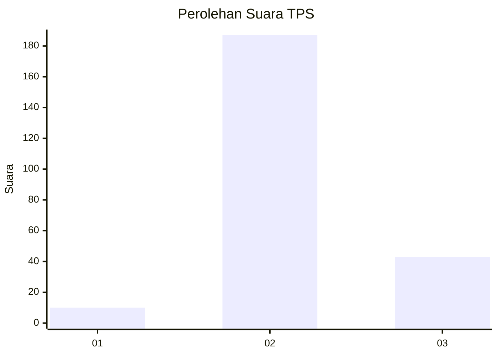

# Hasil

## Grafik

## Tabel

| No. | Nama Paslon    | Suara | Suara (raw) | Persentase |
|:--- |:-------------- | -----:| -----------:| ----------:|
| 1   | ANIES MUHAIMIN | 10    | [10][p-1]   | 4,17       |
| 2   | PRABOWO GIBRAN | 187   | [187][p-2]  | 77,92      |
| 3   | GANJAR MAHFUD  | 43    | [43][p-3]   | 17,92      |

[p-1]: https://github.com/gigit-pemilu/pemilu-2024/blob/main/pilpres/hitung-suara/sub/35-jawa-timur/sub/20-magetan/sub/02-parang/sub/2003-mategal/sub/002-tps/sub/paslon-1.txt
[p-2]: https://github.com/gigit-pemilu/pemilu-2024/blob/main/pilpres/hitung-suara/sub/35-jawa-timur/sub/20-magetan/sub/02-parang/sub/2003-mategal/sub/002-tps/sub/paslon-2.txt
[p-3]: https://github.com/gigit-pemilu/pemilu-2024/blob/main/pilpres/hitung-suara/sub/35-jawa-timur/sub/20-magetan/sub/02-parang/sub/2003-mategal/sub/002-tps/sub/paslon-3.txt

## Foto C Plano

https://sirekap-obj-formc.kpu.go.id/2c6c/pemilu/ppwp/35/20/02/20/03/3520022003002-20240224-174727--3854bed6-0d15-4793-9021-297d6b3644aa.jpg

https://sirekap-obj-formc.kpu.go.id/2c6c/pemilu/ppwp/35/20/02/20/03/3520022003002-20240224-174732--99c8f4bf-3c6c-4dcf-8d1d-f9eead95f358.jpg

https://sirekap-obj-formc.kpu.go.id/2c6c/pemilu/ppwp/35/20/02/20/03/3520022003002-20240224-174738--1a9c0f6d-eca3-4285-a5f2-e65c518302a3.jpg

## Metadata

| Key        | Value               |
| ---------- | ------------------- |
| Time Stamp | 2024-02-25 12:00:00 |

