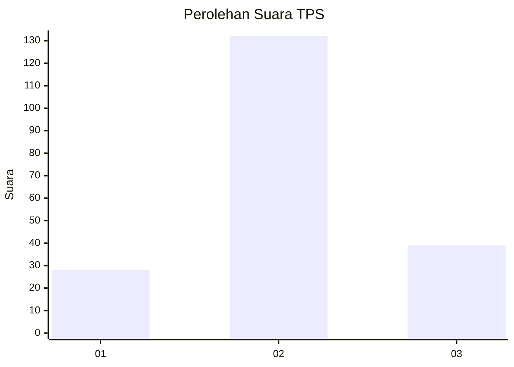
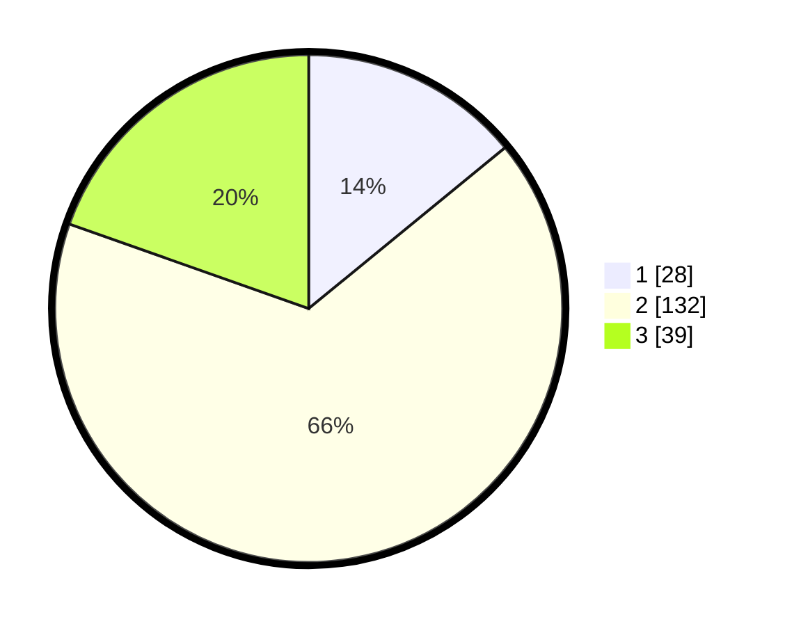

# Hasil

## Grafik

## Tabel

| No. | Nama Paslon    | Suara | Suara (raw) | Persentase |
|:--- |:-------------- | -----:| -----------:| ----------:|
| 1   | ANIES MUHAIMIN | 28    | [28][p-1]   | 14,07      |
| 2   | PRABOWO GIBRAN | 132   | [132][p-2]  | 66,33      |
| 3   | GANJAR MAHFUD  | 39    | [39][p-3]   | 19,60      |

[p-1]: https://github.com/gigit-pemilu/pemilu-2024/blob/main/pilpres/hitung-suara/sub/35-jawa-timur/sub/20-magetan/sub/02-parang/sub/2005-trosono/sub/005-tps/sub/paslon-1.txt
[p-2]: https://github.com/gigit-pemilu/pemilu-2024/blob/main/pilpres/hitung-suara/sub/35-jawa-timur/sub/20-magetan/sub/02-parang/sub/2005-trosono/sub/005-tps/sub/paslon-2.txt
[p-3]: https://github.com/gigit-pemilu/pemilu-2024/blob/main/pilpres/hitung-suara/sub/35-jawa-timur/sub/20-magetan/sub/02-parang/sub/2005-trosono/sub/005-tps/sub/paslon-3.txt

## Foto C Plano

https://sirekap-obj-formc.kpu.go.id/8276/pemilu/ppwp/35/20/02/20/05/3520022005005-20240224-183632--bcbf67ff-d425-43b8-b49c-4552e7d66d9f.jpg

https://sirekap-obj-formc.kpu.go.id/8276/pemilu/ppwp/35/20/02/20/05/3520022005005-20240224-183638--8e3be948-8a35-4e0a-82e5-eb316cf29243.jpg

https://sirekap-obj-formc.kpu.go.id/8276/pemilu/ppwp/35/20/02/20/05/3520022005005-20240224-183644--45b33b77-1fdd-4f61-aeb4-0399b97f062d.jpg

## Metadata

| Key        | Value               |
| ---------- | ------------------- |
| Time Stamp | 2024-02-25 13:00:00 |

