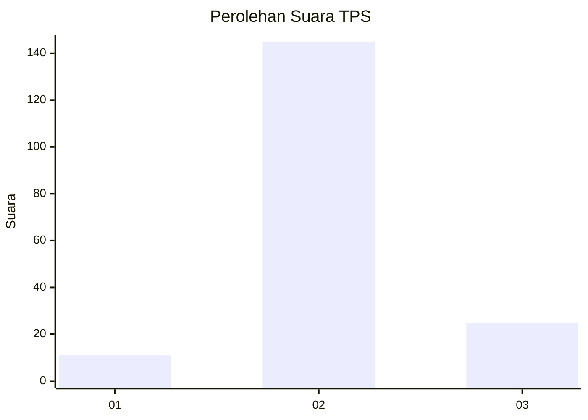
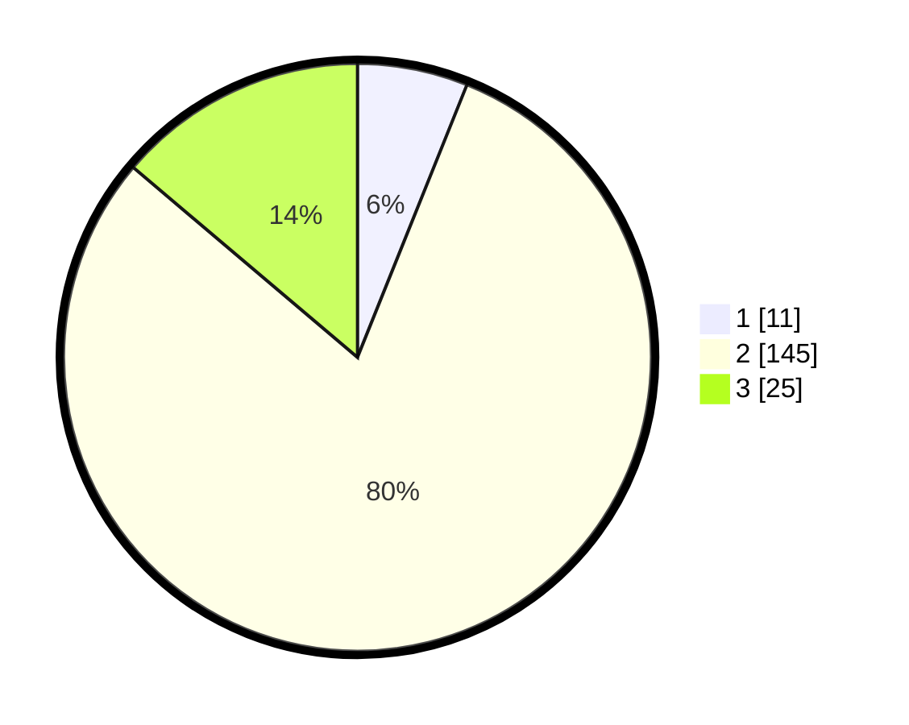

# Hasil

## Grafik

## Tabel

| No. | Nama Paslon    | Suara | Suara (raw) | Persentase |
|:--- |:-------------- | -----:| -----------:| ----------:|
| 1   | ANIES MUHAIMIN | 11    | [11][p-1]   | 6,08       |
| 2   | PRABOWO GIBRAN | 145   | [145][p-2]  | 80,11      |
| 3   | GANJAR MAHFUD  | 25    | [25][p-3]   | 13,81      |

[p-1]: https://github.com/gigit-pemilu/pemilu-2024/blob/main/pilpres/hitung-suara/sub/35-jawa-timur/sub/20-magetan/sub/02-parang/sub/2005-trosono/sub/010-tps/sub/paslon-1.txt
[p-2]: https://github.com/gigit-pemilu/pemilu-2024/blob/main/pilpres/hitung-suara/sub/35-jawa-timur/sub/20-magetan/sub/02-parang/sub/2005-trosono/sub/010-tps/sub/paslon-2.txt
[p-3]: https://github.com/gigit-pemilu/pemilu-2024/blob/main/pilpres/hitung-suara/sub/35-jawa-timur/sub/20-magetan/sub/02-parang/sub/2005-trosono/sub/010-tps/sub/paslon-3.txt

## Foto C Plano

https://sirekap-obj-formc.kpu.go.id/bcf2/pemilu/ppwp/35/20/02/20/05/3520022005010-20240224-183830--8fa7729f-ad1d-432e-bc68-f1f346d200e6.jpg

https://sirekap-obj-formc.kpu.go.id/bcf2/pemilu/ppwp/35/20/02/20/05/3520022005010-20240224-183837--beb5ebe6-b330-40de-a8be-c2ba2a49838c.jpg

https://sirekap-obj-formc.kpu.go.id/bcf2/pemilu/ppwp/35/20/02/20/05/3520022005010-20240224-183843--d0114209-b0b4-4074-8622-17fe31256fbd.jpg

## Metadata

| Key        | Value               |
| ---------- | ------------------- |
| Time Stamp | 2024-02-25 12:00:00 |

