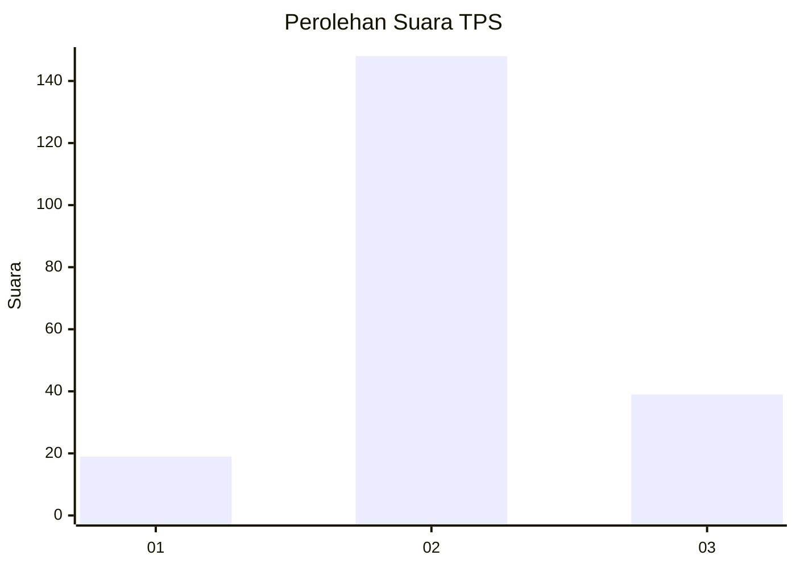
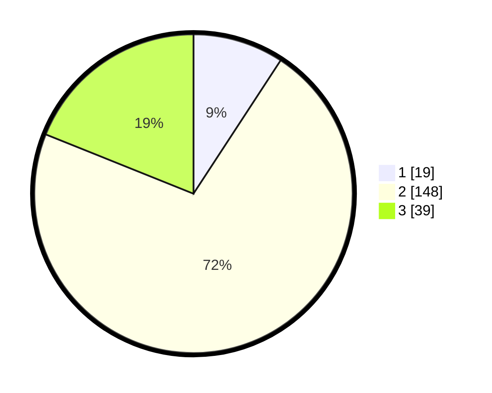

# Hasil

## Grafik

## Tabel

| No. | Nama Paslon    | Suara | Suara (raw) | Persentase |
|:--- |:-------------- | -----:| -----------:| ----------:|
| 1   | ANIES MUHAIMIN | 19    | [19][p-1]   | 9,22       |
| 2   | PRABOWO GIBRAN | 148   | [148][p-2]  | 71,84      |
| 3   | GANJAR MAHFUD  | 39    | [39][p-3]   | 18,93      |

[p-1]: https://github.com/gigit-pemilu/pemilu-2024/blob/main/pilpres/hitung-suara/sub/35-jawa-timur/sub/20-magetan/sub/02-parang/sub/2007-ngaglik/sub/002-tps/sub/paslon-1.txt
[p-2]: https://github.com/gigit-pemilu/pemilu-2024/blob/main/pilpres/hitung-suara/sub/35-jawa-timur/sub/20-magetan/sub/02-parang/sub/2007-ngaglik/sub/002-tps/sub/paslon-2.txt
[p-3]: https://github.com/gigit-pemilu/pemilu-2024/blob/main/pilpres/hitung-suara/sub/35-jawa-timur/sub/20-magetan/sub/02-parang/sub/2007-ngaglik/sub/002-tps/sub/paslon-3.txt

## Foto C Plano

https://sirekap-obj-formc.kpu.go.id/30fe/pemilu/ppwp/35/20/02/20/07/3520022007002-20240215-025243--70f6b571-04bc-4860-a92b-1ac58d1ec8a1.jpg

https://sirekap-obj-formc.kpu.go.id/30fe/pemilu/ppwp/35/20/02/20/07/3520022007002-20240215-025351--e3047bc6-5e3a-48c5-b602-ab97bea7c91f.jpg

https://sirekap-obj-formc.kpu.go.id/30fe/pemilu/ppwp/35/20/02/20/07/3520022007002-20240215-025211--57c23043-3300-4a5b-b21b-5cdefd41705a.jpg

## Metadata

| Key        | Value               |
| ---------- | ------------------- |
| Time Stamp | 2024-02-16 11:00:29 |

