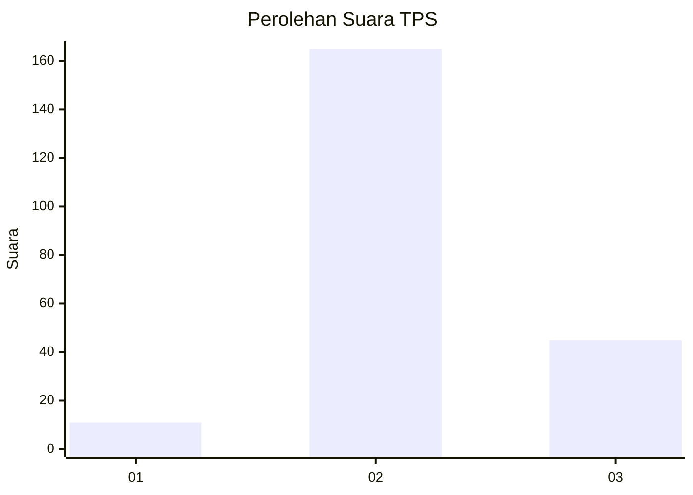

# Hasil

## Grafik

## Tabel

| No. | Nama Paslon    | Suara | Suara (raw) | Persentase |
|:--- |:-------------- | -----:| -----------:| ----------:|
| 1   | ANIES MUHAIMIN | 11    | [11][p-1]   | 4,98       |
| 2   | PRABOWO GIBRAN | 165   | [165][p-2]  | 74,66      |
| 3   | GANJAR MAHFUD  | 45    | [45][p-3]   | 20,36      |

[p-1]: https://github.com/gigit-pemilu/pemilu-2024/blob/main/pilpres/hitung-suara/sub/35-jawa-timur/sub/20-magetan/sub/02-parang/sub/2009-tamanarum/sub/005-tps/sub/paslon-1.txt
[p-2]: https://github.com/gigit-pemilu/pemilu-2024/blob/main/pilpres/hitung-suara/sub/35-jawa-timur/sub/20-magetan/sub/02-parang/sub/2009-tamanarum/sub/005-tps/sub/paslon-2.txt
[p-3]: https://github.com/gigit-pemilu/pemilu-2024/blob/main/pilpres/hitung-suara/sub/35-jawa-timur/sub/20-magetan/sub/02-parang/sub/2009-tamanarum/sub/005-tps/sub/paslon-3.txt

## Foto C Plano

https://sirekap-obj-formc.kpu.go.id/cfb6/pemilu/ppwp/35/20/02/20/09/3520022009005-20240214-223603--398ac8c3-d1e1-44fd-8ce0-cc255d5fa9b3.jpg

https://sirekap-obj-formc.kpu.go.id/cfb6/pemilu/ppwp/35/20/02/20/09/3520022009005-20240214-223725--b0ccad8d-bcba-4c4e-9dfc-4c57a4e4c6cf.jpg

https://sirekap-obj-formc.kpu.go.id/cfb6/pemilu/ppwp/35/20/02/20/09/3520022009005-20240214-223904--03c3bca4-ab7a-4401-9d08-c685ccf98e63.jpg

## Metadata

| Key        | Value               |
| ---------- | ------------------- |
| Time Stamp | 2024-02-22 13:00:00 |

