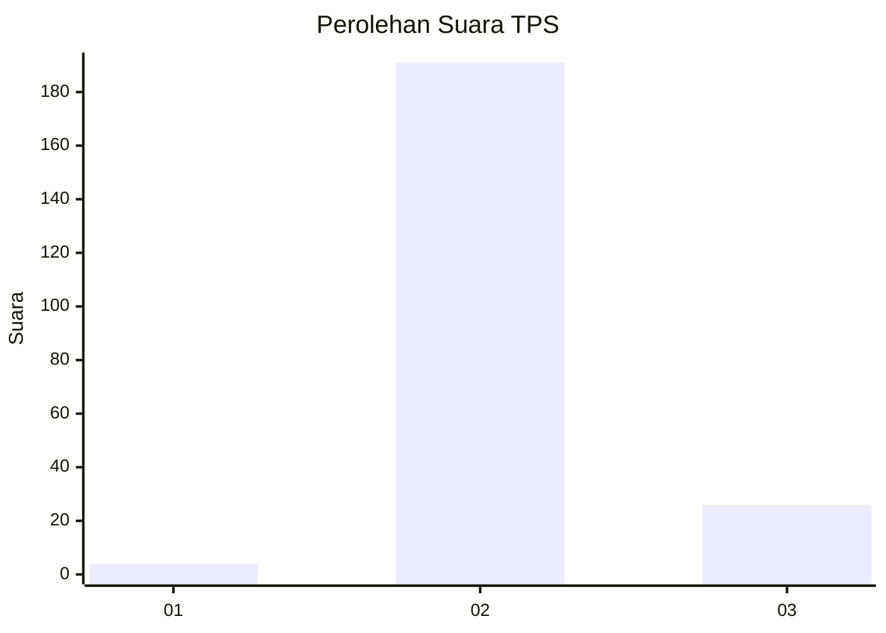
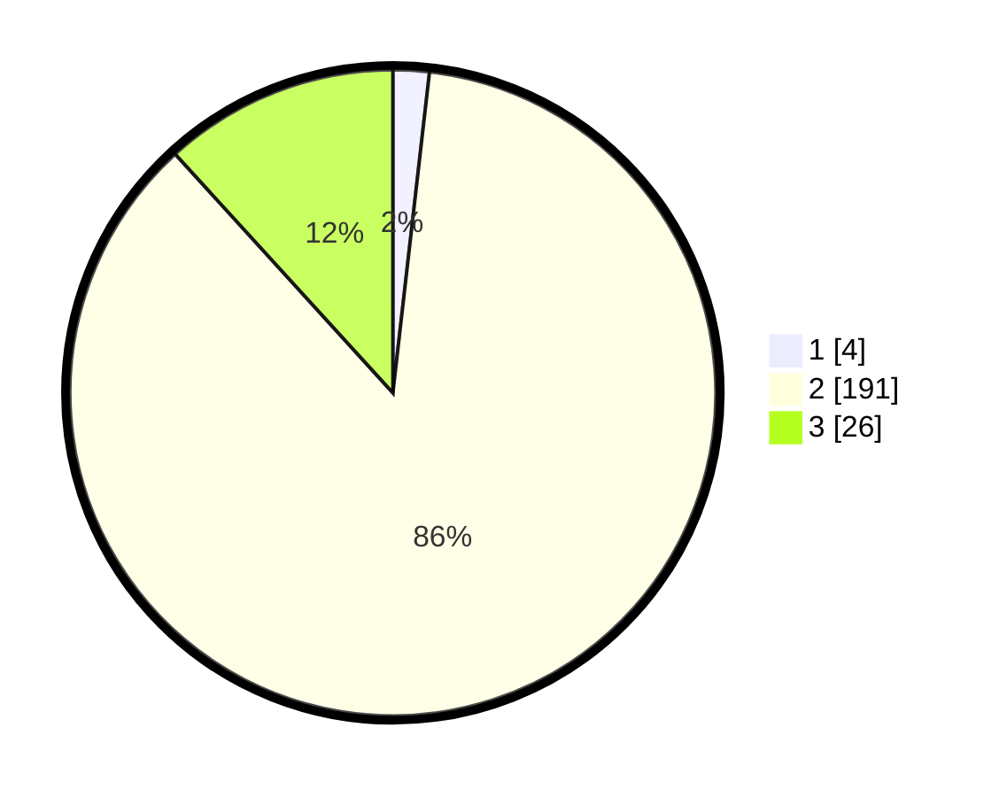

# Hasil

## Grafik

## Tabel

| No. | Nama Paslon    | Suara | Suara (raw) | Persentase |
|:--- |:-------------- | -----:| -----------:| ----------:|
| 1   | ANIES MUHAIMIN | 4     | [4][p-1]    | 1,81       |
| 2   | PRABOWO GIBRAN | 191   | [191][p-2]  | 86,43      |
| 3   | GANJAR MAHFUD  | 26    | [26][p-3]   | 11,76      |

[p-1]: https://github.com/gigit-pemilu/pemilu-2024-35-jawa-timur/blob/main/pilpres/hitung-suara/sub/35-jawa-timur/sub/20-magetan/sub/02-parang/sub/2012-joketro/sub/008-tps/sub/paslon-1.txt
[p-2]: https://github.com/gigit-pemilu/pemilu-2024-35-jawa-timur/blob/main/pilpres/hitung-suara/sub/35-jawa-timur/sub/20-magetan/sub/02-parang/sub/2012-joketro/sub/008-tps/sub/paslon-2.txt
[p-3]: https://github.com/gigit-pemilu/pemilu-2024-35-jawa-timur/blob/main/pilpres/hitung-suara/sub/35-jawa-timur/sub/20-magetan/sub/02-parang/sub/2012-joketro/sub/008-tps/sub/paslon-3.txt

## Foto C Plano

https://sirekap-obj-formc.kpu.go.id/ef18/pemilu/ppwp/35/20/02/20/12/3520022012008-20240214-233738--dc1bff22-b709-42df-814a-1cf51f608889.jpg

https://sirekap-obj-formc.kpu.go.id/ef18/pemilu/ppwp/35/20/02/20/12/3520022012008-20240214-234730--efad4713-c142-40b4-b6d6-ccaa2386e29b.jpg

https://sirekap-obj-formc.kpu.go.id/ef18/pemilu/ppwp/35/20/02/20/12/3520022012008-20240214-234841--3427ea16-6948-43c3-b577-93443462d2be.jpg

## Metadata

| Key        | Value               |
| ---------- | ------------------- |
| Time Stamp | 2024-02-22 11:00:00 |

