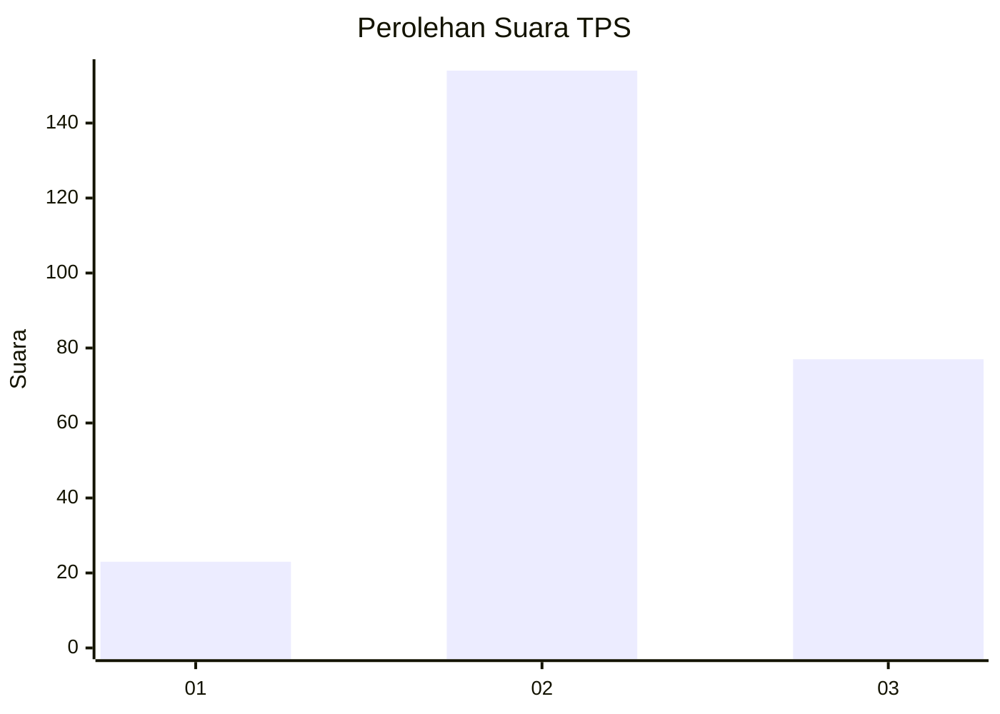
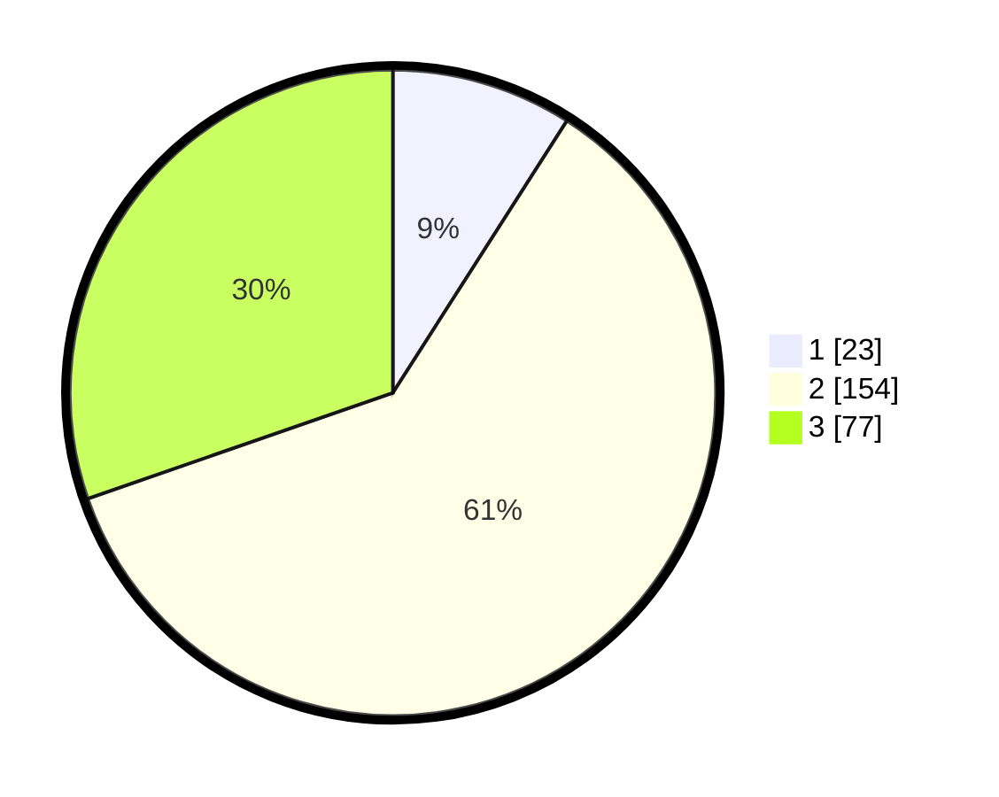

# Hasil

## Grafik

## Tabel

| No. | Nama Paslon    | Suara | Suara (raw) | Persentase |
|:--- |:-------------- | -----:| -----------:| ----------:|
| 1   | ANIES MUHAIMIN | 23    | [23][p-1]   | 9,06       |
| 2   | PRABOWO GIBRAN | 154   | [154][p-2]  | 60,63      |
| 3   | GANJAR MAHFUD  | 77    | [77][p-3]   | 30,31      |

[p-1]: https://github.com/gigit-pemilu/pemilu-2024/blob/main/pilpres/hitung-suara/sub/35-jawa-timur/sub/20-magetan/sub/03-lembeyan/sub/1002-lembeyan-kulon/sub/006-tps/sub/paslon-1.txt
[p-2]: https://github.com/gigit-pemilu/pemilu-2024/blob/main/pilpres/hitung-suara/sub/35-jawa-timur/sub/20-magetan/sub/03-lembeyan/sub/1002-lembeyan-kulon/sub/006-tps/sub/paslon-2.txt
[p-3]: https://github.com/gigit-pemilu/pemilu-2024/blob/main/pilpres/hitung-suara/sub/35-jawa-timur/sub/20-magetan/sub/03-lembeyan/sub/1002-lembeyan-kulon/sub/006-tps/sub/paslon-3.txt

## Foto C Plano

https://sirekap-obj-formc.kpu.go.id/5871/pemilu/ppwp/35/20/03/10/02/3520031002006-20240214-214507--12304699-a0a8-41fb-b7bb-1d2a093db6f0.jpg

https://sirekap-obj-formc.kpu.go.id/5871/pemilu/ppwp/35/20/03/10/02/3520031002006-20240214-214331--18ecd330-f645-4ff9-9656-6c62364a4db3.jpg

https://sirekap-obj-formc.kpu.go.id/5871/pemilu/ppwp/35/20/03/10/02/3520031002006-20240214-214646--24cf787f-8a9e-48fb-b0eb-48f7f3ebac18.jpg

## Metadata

| Key        | Value               |
| ---------- | ------------------- |
| Time Stamp | 2024-02-16 14:30:33 |

