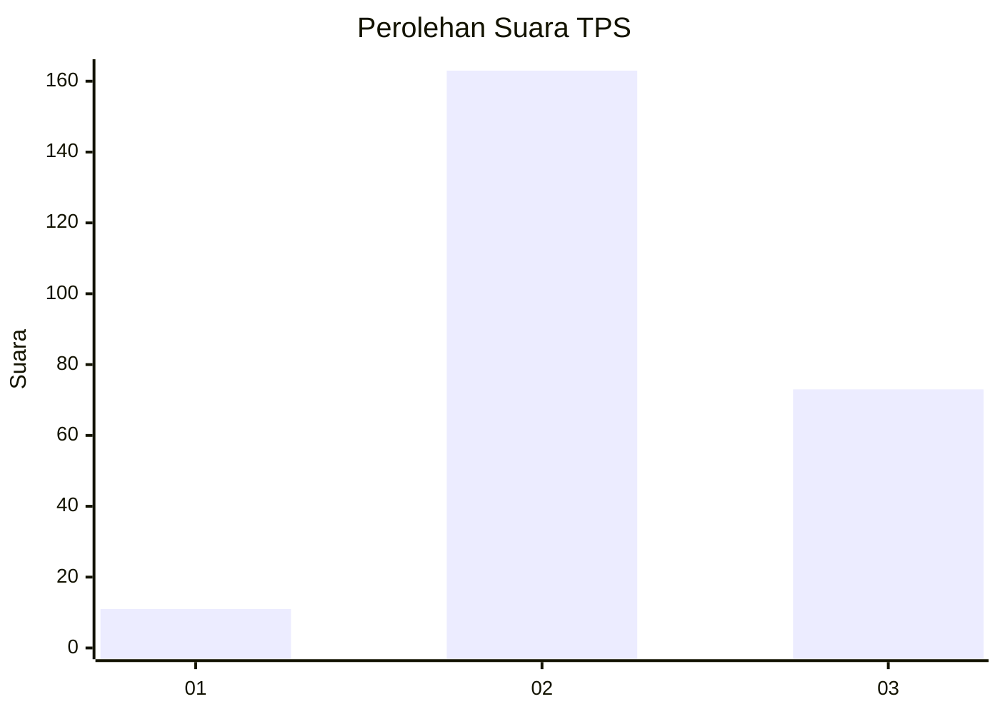

# Hasil

## Grafik

## Tabel

| No. | Nama Paslon    | Suara | Suara (raw) | Persentase |
|:--- |:-------------- | -----:| -----------:| ----------:|
| 1   | ANIES MUHAIMIN | 11    | [11][p-1]   | 4,45       |
| 2   | PRABOWO GIBRAN | 163   | [163][p-2]  | 65,99      |
| 3   | GANJAR MAHFUD  | 73    | [73][p-3]   | 29,55      |

[p-1]: https://github.com/gigit-pemilu/pemilu-2024-35-jawa-timur/blob/main/pilpres/hitung-suara/sub/35-jawa-timur/sub/20-magetan/sub/03-lembeyan/sub/2009-tapen/sub/001-tps/sub/paslon-1.txt
[p-2]: https://github.com/gigit-pemilu/pemilu-2024-35-jawa-timur/blob/main/pilpres/hitung-suara/sub/35-jawa-timur/sub/20-magetan/sub/03-lembeyan/sub/2009-tapen/sub/001-tps/sub/paslon-2.txt
[p-3]: https://github.com/gigit-pemilu/pemilu-2024-35-jawa-timur/blob/main/pilpres/hitung-suara/sub/35-jawa-timur/sub/20-magetan/sub/03-lembeyan/sub/2009-tapen/sub/001-tps/sub/paslon-3.txt

## Foto C Plano

https://sirekap-obj-formc.kpu.go.id/b478/pemilu/ppwp/35/20/03/20/09/3520032009001-20240214-212022--d603c27f-8ce6-4a01-a923-a6b5c4e4f2b2.jpg

https://sirekap-obj-formc.kpu.go.id/b478/pemilu/ppwp/35/20/03/20/09/3520032009001-20240215-044651--5eb4cbb0-c80a-4f75-9c9d-455e1c6c1eb6.jpg

https://sirekap-obj-formc.kpu.go.id/b478/pemilu/ppwp/35/20/03/20/09/3520032009001-20240214-210451--207977b5-f7bc-4003-9c8f-cb7e847bf53b.jpg

## Metadata

| Key        | Value               |
| ---------- | ------------------- |
| Time Stamp | 2024-02-15 17:00:25 |

