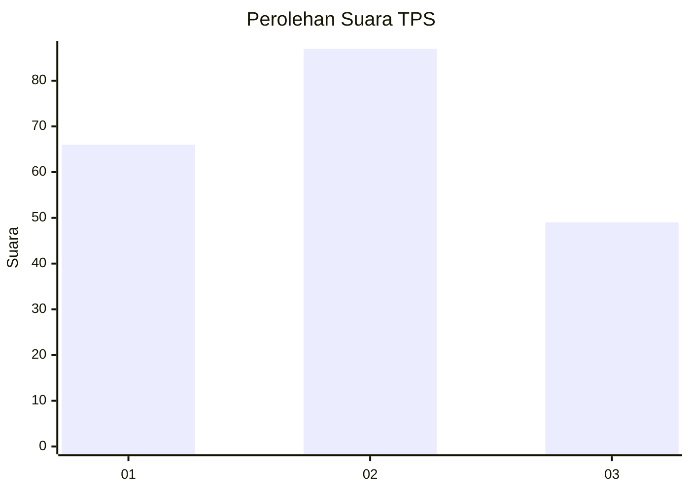
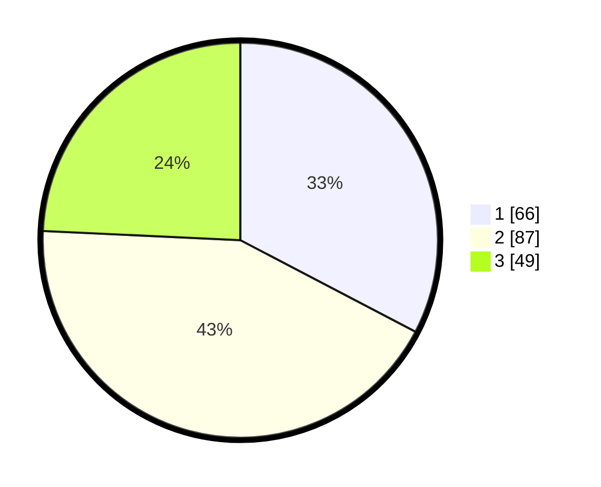

# Hasil

## Grafik

## Tabel

| No. | Nama Paslon    | Suara | Suara (raw) | Persentase |
|:--- |:-------------- | -----:| -----------:| ----------:|
| 1   | ANIES MUHAIMIN | 66    | [66][p-1]   | 32,67      |
| 2   | PRABOWO GIBRAN | 87    | [87][p-2]   | 43,07      |
| 3   | GANJAR MAHFUD  | 49    | [49][p-3]   | 24,26      |

[p-1]: https://github.com/gigit-pemilu/pemilu-2024/blob/main/pilpres/hitung-suara/sub/35-jawa-timur/sub/20-magetan/sub/04-takeran/sub/2016-kerik/sub/002-tps/sub/paslon-1.txt
[p-2]: https://github.com/gigit-pemilu/pemilu-2024/blob/main/pilpres/hitung-suara/sub/35-jawa-timur/sub/20-magetan/sub/04-takeran/sub/2016-kerik/sub/002-tps/sub/paslon-2.txt
[p-3]: https://github.com/gigit-pemilu/pemilu-2024/blob/main/pilpres/hitung-suara/sub/35-jawa-timur/sub/20-magetan/sub/04-takeran/sub/2016-kerik/sub/002-tps/sub/paslon-3.txt

## Foto C Plano

https://sirekap-obj-formc.kpu.go.id/a6c7/pemilu/ppwp/35/20/04/20/16/3520042016002-20240214-141510--ac1fb2e5-d833-4c1a-a58a-c5fee1a15a2c.jpg

https://sirekap-obj-formc.kpu.go.id/a6c7/pemilu/ppwp/35/20/04/20/16/3520042016002-20240214-141242--772c3552-d494-4543-ae8f-a591bd3217ee.jpg

https://sirekap-obj-formc.kpu.go.id/a6c7/pemilu/ppwp/35/20/04/20/16/3520042016002-20240214-141146--7e3384d5-1e43-49d3-a512-167e4d03a19c.jpg

## Metadata

| Key        | Value               |
| ---------- | ------------------- |
| Time Stamp | 2024-02-15 00:46:45 |

