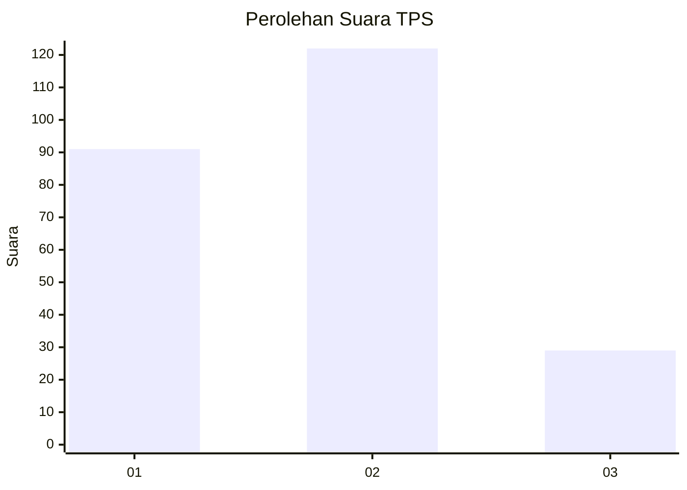
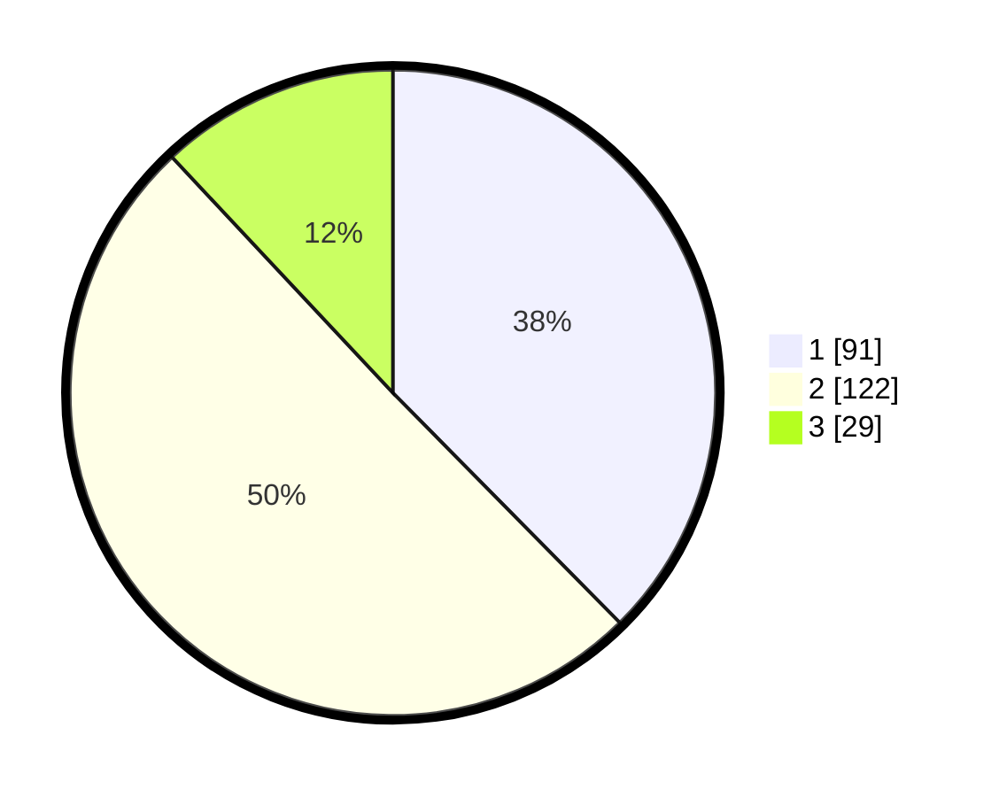

# Hasil

## Grafik

## Tabel

| No. | Nama Paslon    | Suara | Suara (raw) | Persentase |
|:--- |:-------------- | -----:| -----------:| ----------:|
| 1   | ANIES MUHAIMIN | 91    | [91][p-1]   | 37,60      |
| 2   | PRABOWO GIBRAN | 122   | [122][p-2]  | 50,41      |
| 3   | GANJAR MAHFUD  | 29    | [29][p-3]   | 11,98      |

[p-1]: https://github.com/gigit-pemilu/pemilu-2024/blob/main/pilpres/hitung-suara/sub/35-jawa-timur/sub/20-magetan/sub/04-takeran/sub/2020-madigondo/sub/013-tps/sub/paslon-1.txt
[p-2]: https://github.com/gigit-pemilu/pemilu-2024/blob/main/pilpres/hitung-suara/sub/35-jawa-timur/sub/20-magetan/sub/04-takeran/sub/2020-madigondo/sub/013-tps/sub/paslon-2.txt
[p-3]: https://github.com/gigit-pemilu/pemilu-2024/blob/main/pilpres/hitung-suara/sub/35-jawa-timur/sub/20-magetan/sub/04-takeran/sub/2020-madigondo/sub/013-tps/sub/paslon-3.txt

## Foto C Plano

https://sirekap-obj-formc.kpu.go.id/32d8/pemilu/ppwp/35/20/04/20/20/3520042020013-20240215-001810--f97175c0-f40e-4440-90c5-5d084f1ff6f5.jpg

https://sirekap-obj-formc.kpu.go.id/32d8/pemilu/ppwp/35/20/04/20/20/3520042020013-20240215-002003--1c273f70-bcdc-4a89-976e-6f9d9240d773.jpg

https://sirekap-obj-formc.kpu.go.id/32d8/pemilu/ppwp/35/20/04/20/20/3520042020013-20240215-002129--7b8ee4d4-22b9-4eb7-92ce-af648d71d06e.jpg

## Metadata

| Key        | Value               |
| ---------- | ------------------- |
| Time Stamp | 2024-02-16 16:25:10 |

