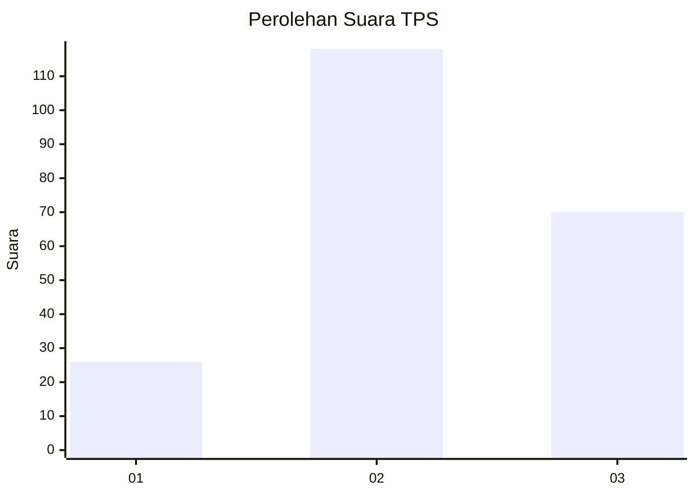
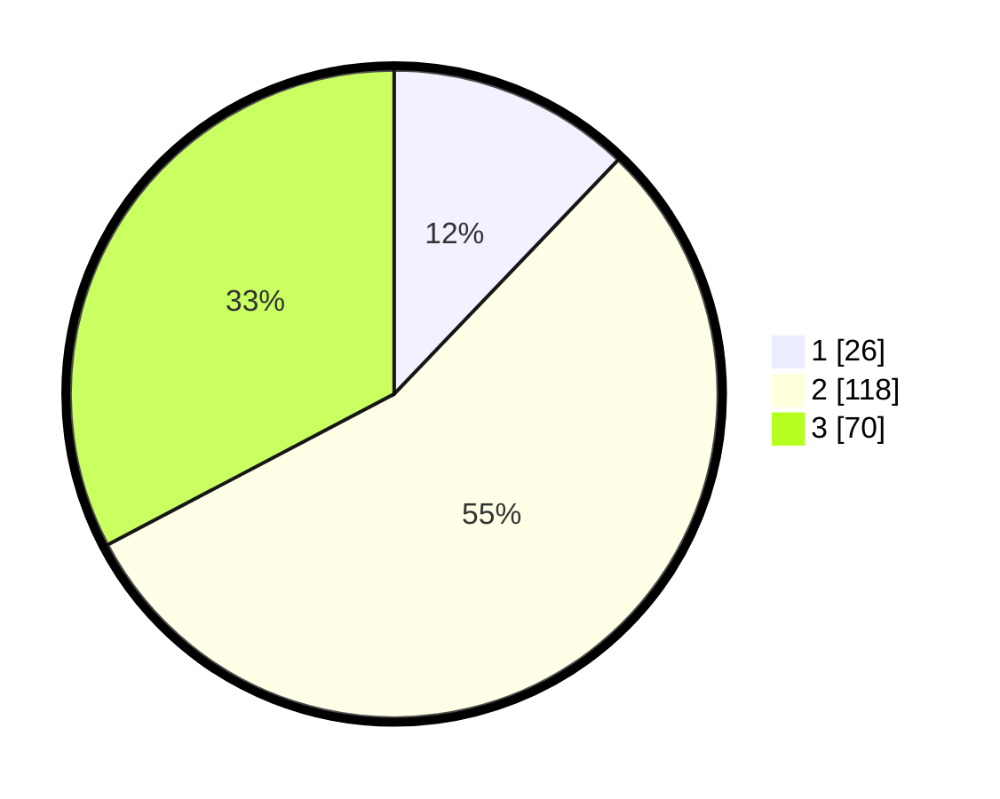

# Hasil

## Grafik

## Tabel

| No. | Nama Paslon    | Suara | Suara (raw) | Persentase |
|:--- |:-------------- | -----:| -----------:| ----------:|
| 1   | ANIES MUHAIMIN | 26    | [26][p-1]   | 12,15      |
| 2   | PRABOWO GIBRAN | 118   | [118][p-2]  | 55,14      |
| 3   | GANJAR MAHFUD  | 70    | [70][p-3]   | 32,71      |

[p-1]: https://github.com/gigit-pemilu/pemilu-2024-35-jawa-timur/blob/main/pilpres/hitung-suara/sub/35-jawa-timur/sub/20-magetan/sub/05-kawedanan/sub/1010-kawedanan/sub/002-tps/sub/paslon-1.txt
[p-2]: https://github.com/gigit-pemilu/pemilu-2024-35-jawa-timur/blob/main/pilpres/hitung-suara/sub/35-jawa-timur/sub/20-magetan/sub/05-kawedanan/sub/1010-kawedanan/sub/002-tps/sub/paslon-2.txt
[p-3]: https://github.com/gigit-pemilu/pemilu-2024-35-jawa-timur/blob/main/pilpres/hitung-suara/sub/35-jawa-timur/sub/20-magetan/sub/05-kawedanan/sub/1010-kawedanan/sub/002-tps/sub/paslon-3.txt

## Foto C Plano

https://sirekap-obj-formc.kpu.go.id/9c44/pemilu/ppwp/35/20/05/10/10/3520051010002-20240216-220725--f71c4bb0-a91b-4188-acac-604443a98118.jpg

https://sirekap-obj-formc.kpu.go.id/9c44/pemilu/ppwp/35/20/05/10/10/3520051010002-20240216-220819--dd75274c-0f90-4bdd-9630-2e676ceda43c.jpg

https://sirekap-obj-formc.kpu.go.id/9c44/pemilu/ppwp/35/20/05/10/10/3520051010002-20240216-224356--48054ff7-1039-4351-9b09-9289d8a44d84.jpg

## Metadata

| Key        | Value               |
| ---------- | ------------------- |
| Time Stamp | 2024-02-24 22:31:28 |

