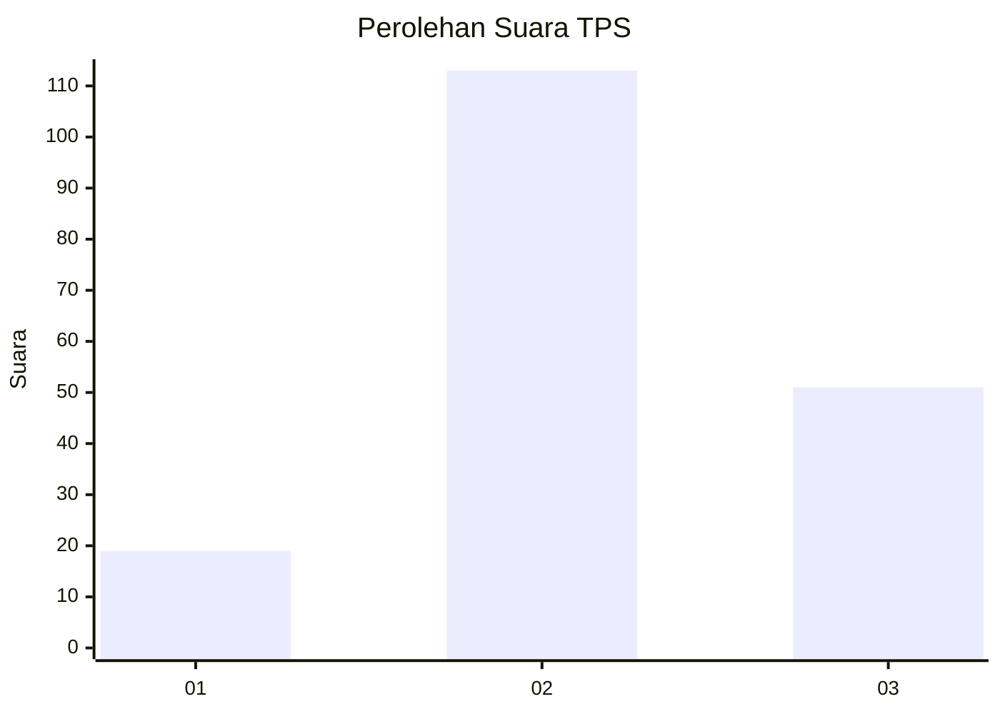
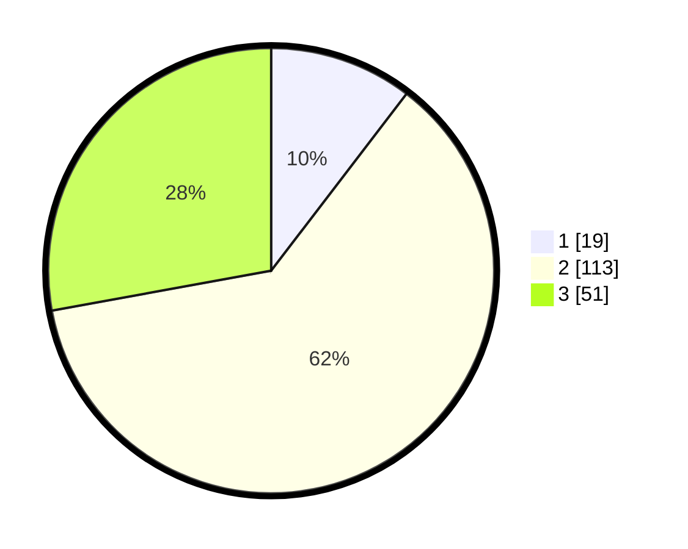

# Hasil

## Grafik

## Tabel

| No. | Nama Paslon    | Suara | Suara (raw) | Persentase |
|:--- |:-------------- | -----:| -----------:| ----------:|
| 1   | ANIES MUHAIMIN | 19    | [19][p-1]   | 10,38      |
| 2   | PRABOWO GIBRAN | 113   | [113][p-2]  | 61,75      |
| 3   | GANJAR MAHFUD  | 51    | [51][p-3]   | 27,87      |

[p-1]: https://github.com/gigit-pemilu/pemilu-2024-35-jawa-timur/blob/main/pilpres/hitung-suara/sub/35-jawa-timur/sub/20-magetan/sub/05-kawedanan/sub/1010-kawedanan/sub/003-tps/sub/paslon-1.txt
[p-2]: https://github.com/gigit-pemilu/pemilu-2024-35-jawa-timur/blob/main/pilpres/hitung-suara/sub/35-jawa-timur/sub/20-magetan/sub/05-kawedanan/sub/1010-kawedanan/sub/003-tps/sub/paslon-2.txt
[p-3]: https://github.com/gigit-pemilu/pemilu-2024-35-jawa-timur/blob/main/pilpres/hitung-suara/sub/35-jawa-timur/sub/20-magetan/sub/05-kawedanan/sub/1010-kawedanan/sub/003-tps/sub/paslon-3.txt

## Foto C Plano

https://sirekap-obj-formc.kpu.go.id/e5c0/pemilu/ppwp/35/20/05/10/10/3520051010003-20240214-190447--8fe0b84d-1efc-44f3-9bb6-0017df846735.jpg

https://sirekap-obj-formc.kpu.go.id/e5c0/pemilu/ppwp/35/20/05/10/10/3520051010003-20240216-211757--35507cb4-12e2-46ac-9386-338feb396656.jpg

https://sirekap-obj-formc.kpu.go.id/e5c0/pemilu/ppwp/35/20/05/10/10/3520051010003-20240216-211921--b44dd12c-b4b0-4d05-ab86-9255b3986df1.jpg

## Metadata

| Key        | Value               |
| ---------- | ------------------- |
| Time Stamp | 2024-02-22 12:00:00 |

