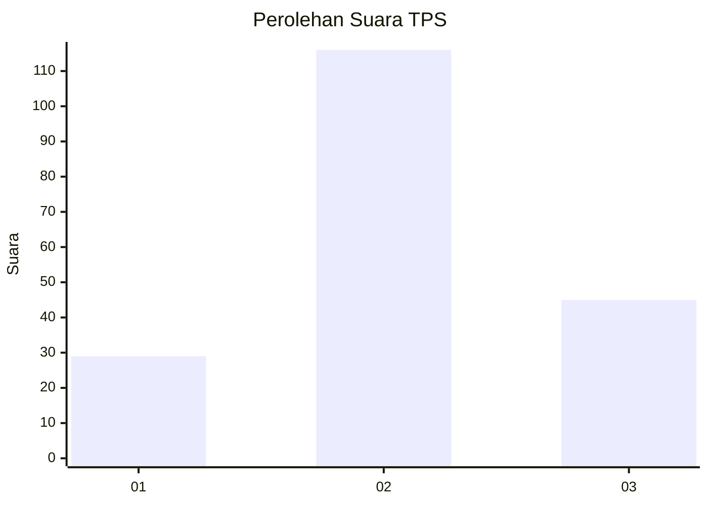
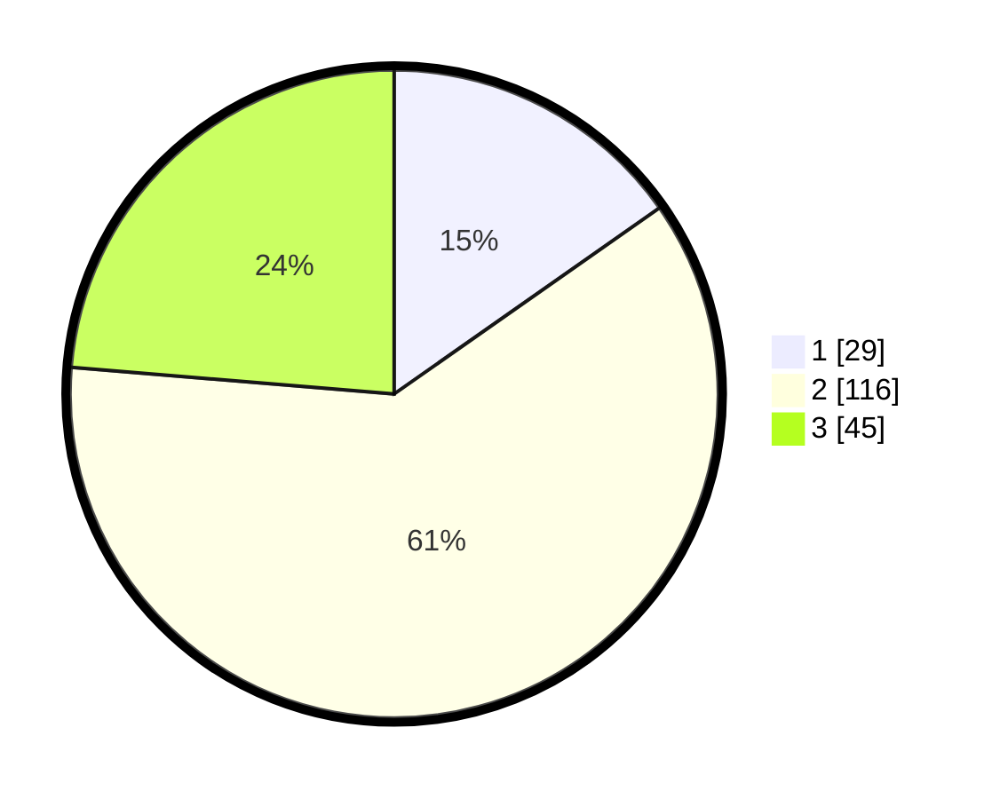

# Hasil

## Grafik

## Tabel

| No. | Nama Paslon    | Suara | Suara (raw) | Persentase |
|:--- |:-------------- | -----:| -----------:| ----------:|
| 1   | ANIES MUHAIMIN | 29    | [29][p-1]   | 15,26      |
| 2   | PRABOWO GIBRAN | 116   | [116][p-2]  | 61,05      |
| 3   | GANJAR MAHFUD  | 45    | [45][p-3]   | 23,68      |

[p-1]: https://github.com/gigit-pemilu/pemilu-2024-35-jawa-timur/blob/main/pilpres/hitung-suara/sub/35-jawa-timur/sub/20-magetan/sub/05-kawedanan/sub/1011-rejosari/sub/001-tps/sub/paslon-1.txt
[p-2]: https://github.com/gigit-pemilu/pemilu-2024-35-jawa-timur/blob/main/pilpres/hitung-suara/sub/35-jawa-timur/sub/20-magetan/sub/05-kawedanan/sub/1011-rejosari/sub/001-tps/sub/paslon-2.txt
[p-3]: https://github.com/gigit-pemilu/pemilu-2024-35-jawa-timur/blob/main/pilpres/hitung-suara/sub/35-jawa-timur/sub/20-magetan/sub/05-kawedanan/sub/1011-rejosari/sub/001-tps/sub/paslon-3.txt

## Foto C Plano

https://sirekap-obj-formc.kpu.go.id/1894/pemilu/ppwp/35/20/05/10/11/3520051011001-20240215-021630--79e687f4-a08e-4d81-a4d9-9110c370583e.jpg

https://sirekap-obj-formc.kpu.go.id/1894/pemilu/ppwp/35/20/05/10/11/3520051011001-20240215-021931--f14d4616-d130-488e-835f-e052338e7580.jpg

https://sirekap-obj-formc.kpu.go.id/1894/pemilu/ppwp/35/20/05/10/11/3520051011001-20240215-022033--763ca8ec-8938-4120-8ddf-5f7481a62b48.jpg

## Metadata

| Key        | Value               |
| ---------- | ------------------- |
| Time Stamp | 2024-02-16 16:25:10 |

