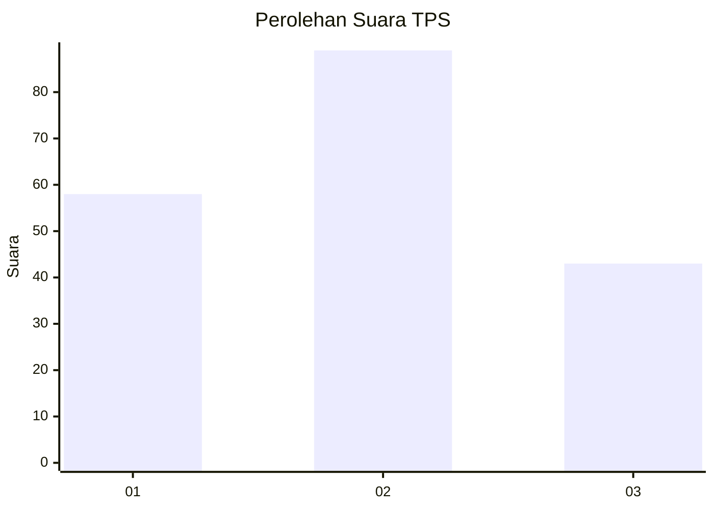
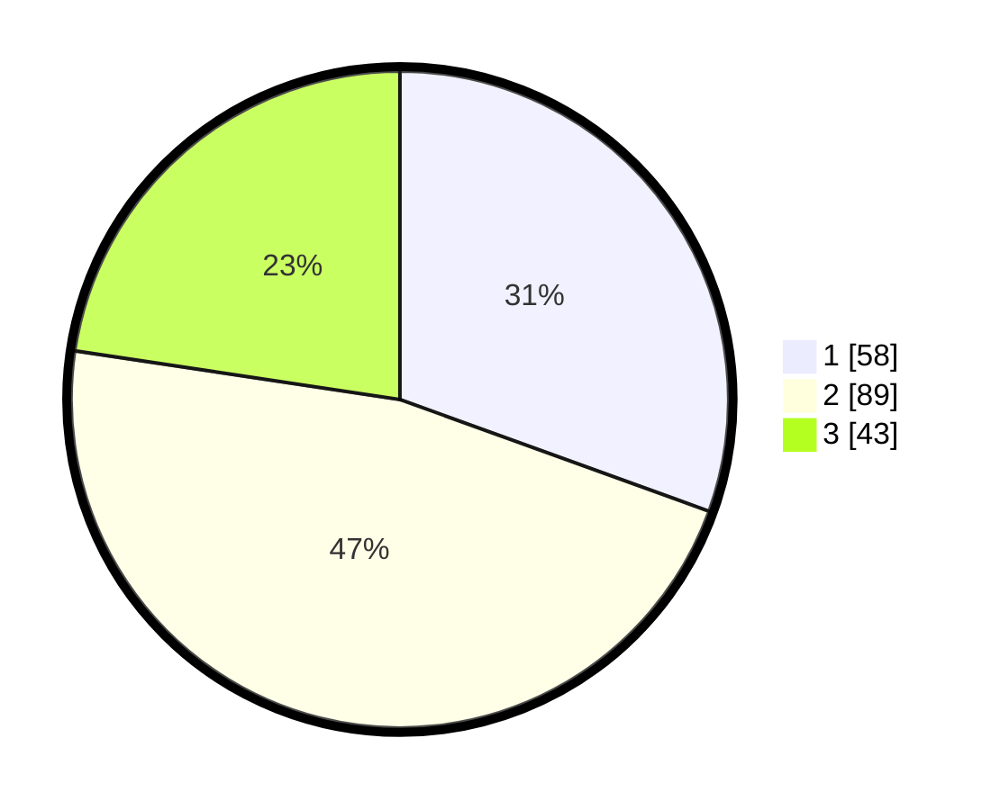

# Hasil

## Grafik

## Tabel

| No. | Nama Paslon    | Suara | Suara (raw) | Persentase |
|:--- |:-------------- | -----:| -----------:| ----------:|
| 1   | ANIES MUHAIMIN | 58    | [58][p-1]   | 30,53      |
| 2   | PRABOWO GIBRAN | 89    | [89][p-2]   | 46,84      |
| 3   | GANJAR MAHFUD  | 43    | [43][p-3]   | 22,63      |

[p-1]: https://github.com/gigit-pemilu/pemilu-2024/blob/main/pilpres/hitung-suara/sub/35-jawa-timur/sub/20-magetan/sub/05-kawedanan/sub/1011-rejosari/sub/002-tps/sub/paslon-1.txt
[p-2]: https://github.com/gigit-pemilu/pemilu-2024/blob/main/pilpres/hitung-suara/sub/35-jawa-timur/sub/20-magetan/sub/05-kawedanan/sub/1011-rejosari/sub/002-tps/sub/paslon-2.txt
[p-3]: https://github.com/gigit-pemilu/pemilu-2024/blob/main/pilpres/hitung-suara/sub/35-jawa-timur/sub/20-magetan/sub/05-kawedanan/sub/1011-rejosari/sub/002-tps/sub/paslon-3.txt

## Foto C Plano

https://sirekap-obj-formc.kpu.go.id/4216/pemilu/ppwp/35/20/05/10/11/3520051011002-20240215-003949--71d067ff-57c0-420f-9fb7-ff194d854c7a.jpg

https://sirekap-obj-formc.kpu.go.id/4216/pemilu/ppwp/35/20/05/10/11/3520051011002-20240215-004023--65cca473-ea35-4281-a388-0faa25b6fb06.jpg

https://sirekap-obj-formc.kpu.go.id/4216/pemilu/ppwp/35/20/05/10/11/3520051011002-20240215-004059--baf27178-f26f-4996-bce5-8888f63d40da.jpg

## Metadata

| Key        | Value               |
| ---------- | ------------------- |
| Time Stamp | 2024-02-16 16:25:10 |

