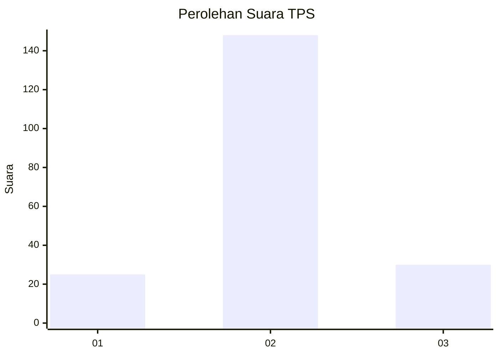
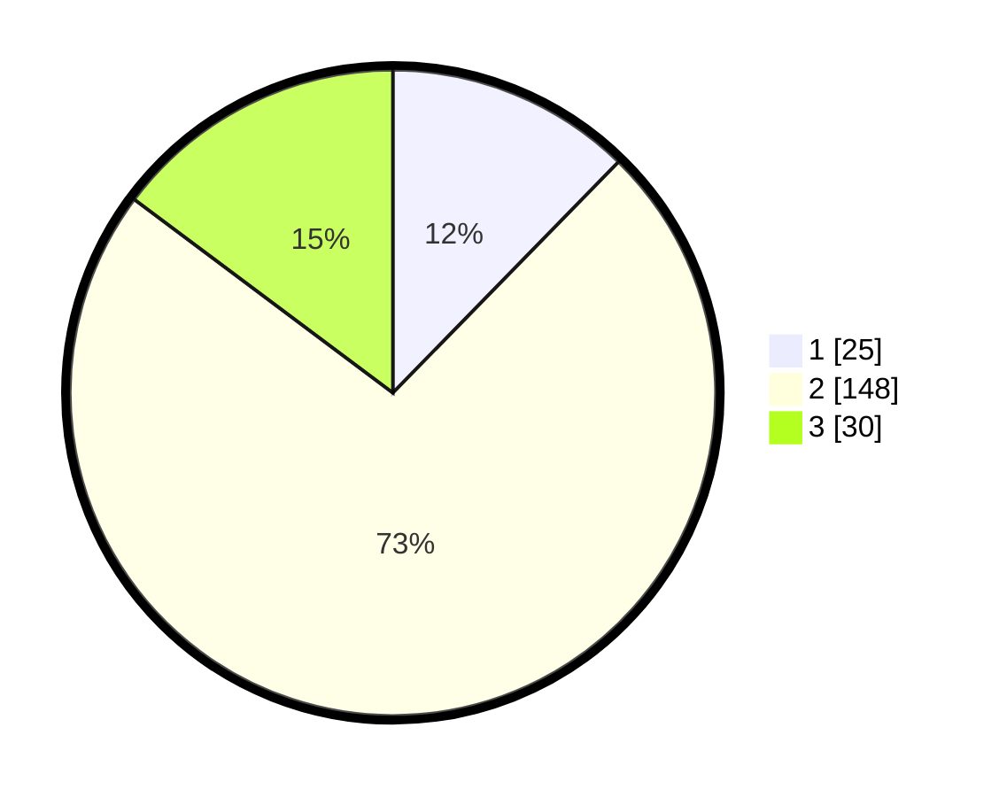

# Hasil

## Grafik

## Tabel

| No. | Nama Paslon    | Suara | Suara (raw) | Persentase |
|:--- |:-------------- | -----:| -----------:| ----------:|
| 1   | ANIES MUHAIMIN | 25    | [25][p-1]   | 12,32      |
| 2   | PRABOWO GIBRAN | 148   | [148][p-2]  | 72,91      |
| 3   | GANJAR MAHFUD  | 30    | [30][p-3]   | 14,78      |

[p-1]: https://github.com/gigit-pemilu/pemilu-2024-35-jawa-timur/blob/main/pilpres/hitung-suara/sub/35-jawa-timur/sub/20-magetan/sub/06-magetan/sub/1002-mangkujayan/sub/003-tps/sub/paslon-1.txt
[p-2]: https://github.com/gigit-pemilu/pemilu-2024-35-jawa-timur/blob/main/pilpres/hitung-suara/sub/35-jawa-timur/sub/20-magetan/sub/06-magetan/sub/1002-mangkujayan/sub/003-tps/sub/paslon-2.txt
[p-3]: https://github.com/gigit-pemilu/pemilu-2024-35-jawa-timur/blob/main/pilpres/hitung-suara/sub/35-jawa-timur/sub/20-magetan/sub/06-magetan/sub/1002-mangkujayan/sub/003-tps/sub/paslon-3.txt

## Foto C Plano

https://sirekap-obj-formc.kpu.go.id/6ab1/pemilu/ppwp/35/20/06/10/02/3520061002003-20240215-011741--9dbfbd22-3651-403b-907a-cb374ee81d2d.jpg

https://sirekap-obj-formc.kpu.go.id/6ab1/pemilu/ppwp/35/20/06/10/02/3520061002003-20240215-012850--49a61977-5a13-4319-b809-3dc592e3e661.jpg

https://sirekap-obj-formc.kpu.go.id/6ab1/pemilu/ppwp/35/20/06/10/02/3520061002003-20240215-013208--3036c747-64a0-4a17-8b2d-213bfbc12d7f.jpg

## Metadata

| Key        | Value               |
| ---------- | ------------------- |
| Time Stamp | 2024-02-16 16:25:10 |

