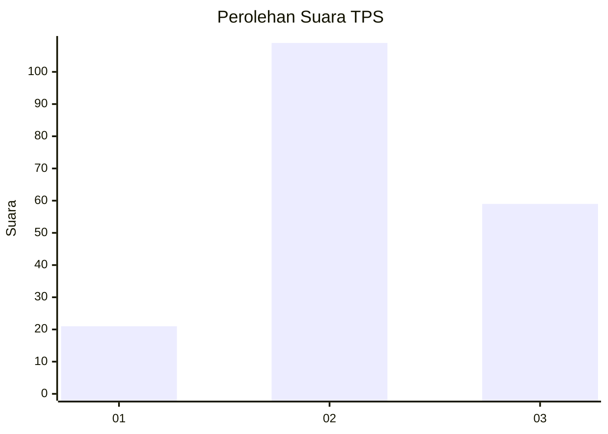
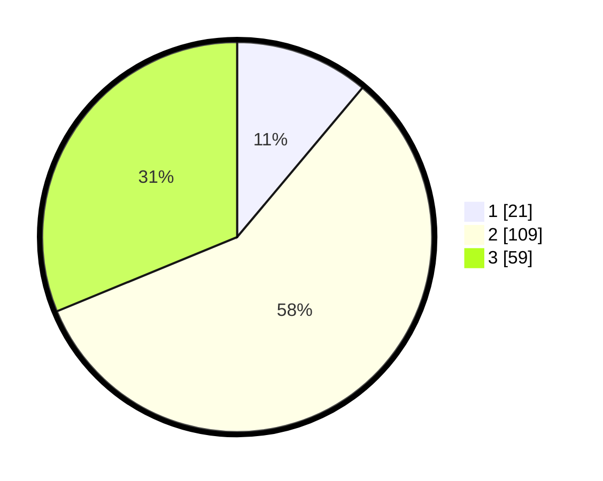

# Hasil

## Grafik

## Tabel

| No. | Nama Paslon    | Suara | Suara (raw) | Persentase |
|:--- |:-------------- | -----:| -----------:| ----------:|
| 1   | ANIES MUHAIMIN | 21    | [21][p-1]   | 11,11      |
| 2   | PRABOWO GIBRAN | 109   | [109][p-2]  | 57,67      |
| 3   | GANJAR MAHFUD  | 59    | [59][p-3]   | 31,22      |

[p-1]: https://github.com/gigit-pemilu/pemilu-2024/blob/main/pilpres/hitung-suara/sub/35-jawa-timur/sub/20-magetan/sub/06-magetan/sub/1002-mangkujayan/sub/004-tps/sub/paslon-1.txt
[p-2]: https://github.com/gigit-pemilu/pemilu-2024/blob/main/pilpres/hitung-suara/sub/35-jawa-timur/sub/20-magetan/sub/06-magetan/sub/1002-mangkujayan/sub/004-tps/sub/paslon-2.txt
[p-3]: https://github.com/gigit-pemilu/pemilu-2024/blob/main/pilpres/hitung-suara/sub/35-jawa-timur/sub/20-magetan/sub/06-magetan/sub/1002-mangkujayan/sub/004-tps/sub/paslon-3.txt

## Foto C Plano

https://sirekap-obj-formc.kpu.go.id/2cc4/pemilu/ppwp/35/20/06/10/02/3520061002004-20240215-000315--a527d097-6947-46bc-a1a4-701e2d9ea8b8.jpg

https://sirekap-obj-formc.kpu.go.id/2cc4/pemilu/ppwp/35/20/06/10/02/3520061002004-20240215-000444--6185e799-d02f-46c1-a8ce-ad1c18031071.jpg

https://sirekap-obj-formc.kpu.go.id/2cc4/pemilu/ppwp/35/20/06/10/02/3520061002004-20240215-000600--5fc557d7-e8e5-48d2-aef8-a28e6bf824ac.jpg

## Metadata

| Key        | Value               |
| ---------- | ------------------- |
| Time Stamp | 2024-02-22 12:00:00 |

