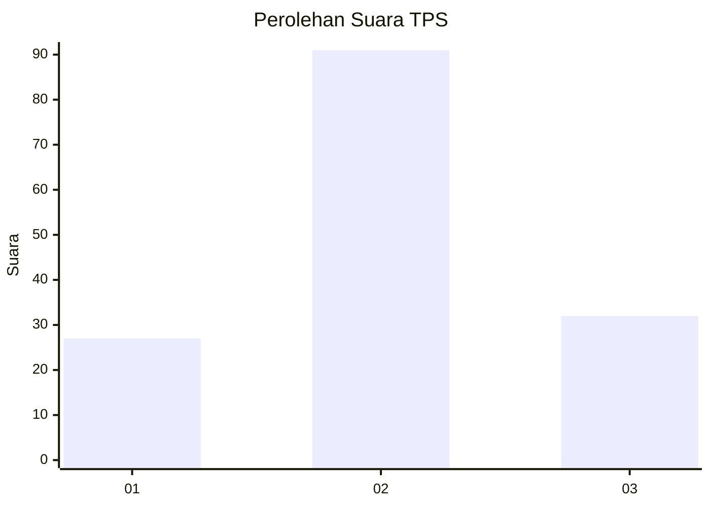
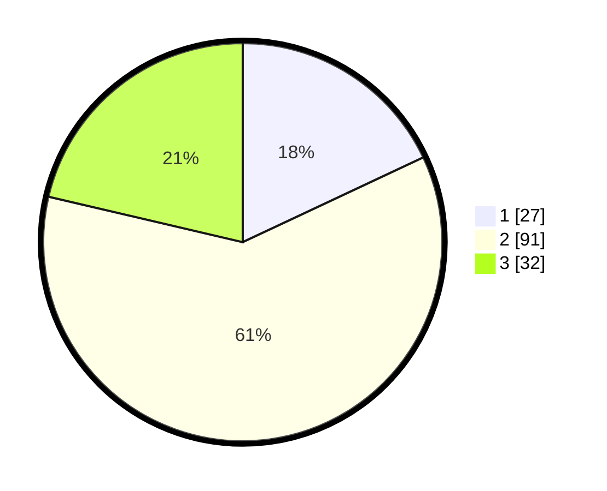

# Hasil

## Grafik

## Tabel

| No. | Nama Paslon    | Suara | Suara (raw) | Persentase |
|:--- |:-------------- | -----:| -----------:| ----------:|
| 1   | ANIES MUHAIMIN | 27    | [27][p-1]   | 18,00      |
| 2   | PRABOWO GIBRAN | 91    | [91][p-2]   | 60,67      |
| 3   | GANJAR MAHFUD  | 32    | [32][p-3]   | 21,33      |

[p-1]: https://github.com/gigit-pemilu/pemilu-2024-35-jawa-timur/blob/main/pilpres/hitung-suara/sub/35-jawa-timur/sub/20-magetan/sub/06-magetan/sub/1002-mangkujayan/sub/005-tps/sub/paslon-1.txt
[p-2]: https://github.com/gigit-pemilu/pemilu-2024-35-jawa-timur/blob/main/pilpres/hitung-suara/sub/35-jawa-timur/sub/20-magetan/sub/06-magetan/sub/1002-mangkujayan/sub/005-tps/sub/paslon-2.txt
[p-3]: https://github.com/gigit-pemilu/pemilu-2024-35-jawa-timur/blob/main/pilpres/hitung-suara/sub/35-jawa-timur/sub/20-magetan/sub/06-magetan/sub/1002-mangkujayan/sub/005-tps/sub/paslon-3.txt

## Foto C Plano

https://sirekap-obj-formc.kpu.go.id/8fad/pemilu/ppwp/35/20/06/10/02/3520061002005-20240215-002435--d35d32ec-2e49-4831-8568-2b1afd44f0b1.jpg

https://sirekap-obj-formc.kpu.go.id/8fad/pemilu/ppwp/35/20/06/10/02/3520061002005-20240215-002814--8cc77808-5b89-4dd7-b6f9-185b17091539.jpg

https://sirekap-obj-formc.kpu.go.id/8fad/pemilu/ppwp/35/20/06/10/02/3520061002005-20240215-002947--688df264-15a1-4ae7-ae67-4360b16b4817.jpg

## Metadata

| Key        | Value               |
| ---------- | ------------------- |
| Time Stamp | 2024-02-16 16:25:10 |

