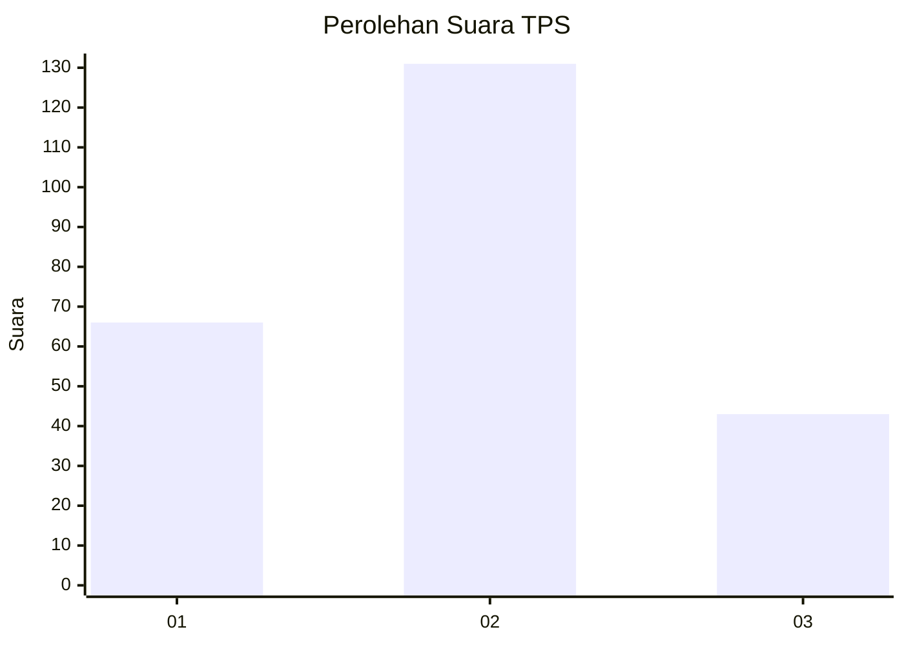
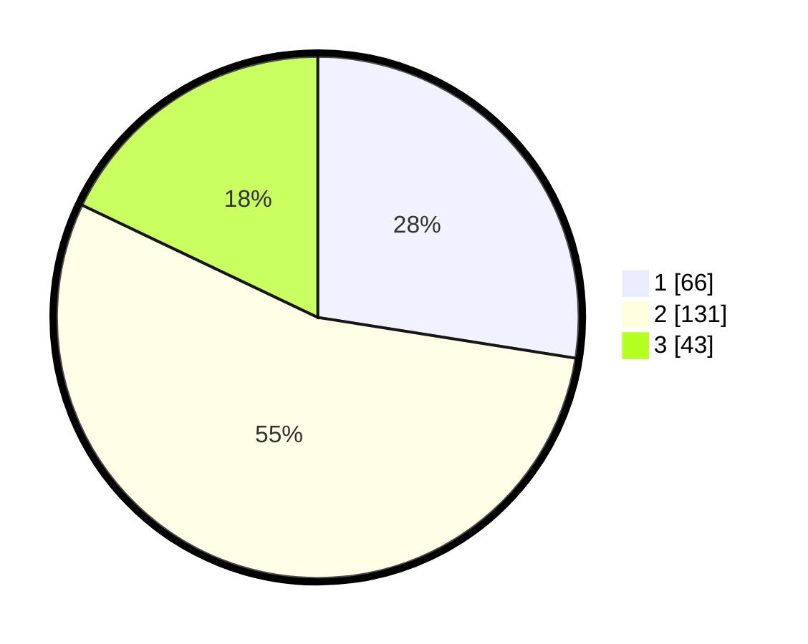

# Hasil

## Grafik

## Tabel

| No. | Nama Paslon    | Suara | Suara (raw) | Persentase |
|:--- |:-------------- | -----:| -----------:| ----------:|
| 1   | ANIES MUHAIMIN | 66    | [66][p-1]   | 27,50      |
| 2   | PRABOWO GIBRAN | 131   | [131][p-2]  | 54,58      |
| 3   | GANJAR MAHFUD  | 43    | [43][p-3]   | 17,92      |

[p-1]: https://github.com/gigit-pemilu/pemilu-2024/blob/main/pilpres/hitung-suara/sub/35-jawa-timur/sub/20-magetan/sub/06-magetan/sub/1003-bulukerto/sub/001-tps/sub/paslon-1.txt
[p-2]: https://github.com/gigit-pemilu/pemilu-2024/blob/main/pilpres/hitung-suara/sub/35-jawa-timur/sub/20-magetan/sub/06-magetan/sub/1003-bulukerto/sub/001-tps/sub/paslon-2.txt
[p-3]: https://github.com/gigit-pemilu/pemilu-2024/blob/main/pilpres/hitung-suara/sub/35-jawa-timur/sub/20-magetan/sub/06-magetan/sub/1003-bulukerto/sub/001-tps/sub/paslon-3.txt

## Foto C Plano

https://sirekap-obj-formc.kpu.go.id/27f5/pemilu/ppwp/35/20/06/10/03/3520061003001-20240214-224239--29a83515-97c2-4223-9783-3eb487e07a36.jpg

https://sirekap-obj-formc.kpu.go.id/27f5/pemilu/ppwp/35/20/06/10/03/3520061003001-20240215-022421--dadf9889-3c1a-4c76-a8da-f1317de48943.jpg

https://sirekap-obj-formc.kpu.go.id/27f5/pemilu/ppwp/35/20/06/10/03/3520061003001-20240214-224324--fd9d9c29-b41f-4d0f-86ff-e3a71a28265f.jpg

## Metadata

| Key        | Value               |
| ---------- | ------------------- |
| Time Stamp | 2024-02-15 09:00:24 |

