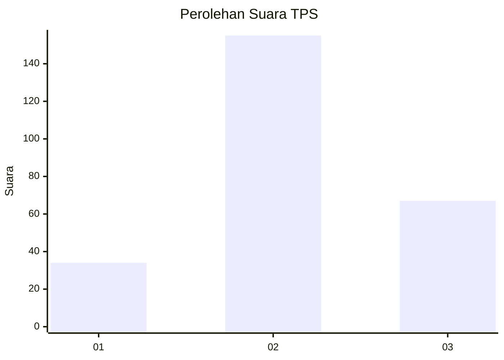
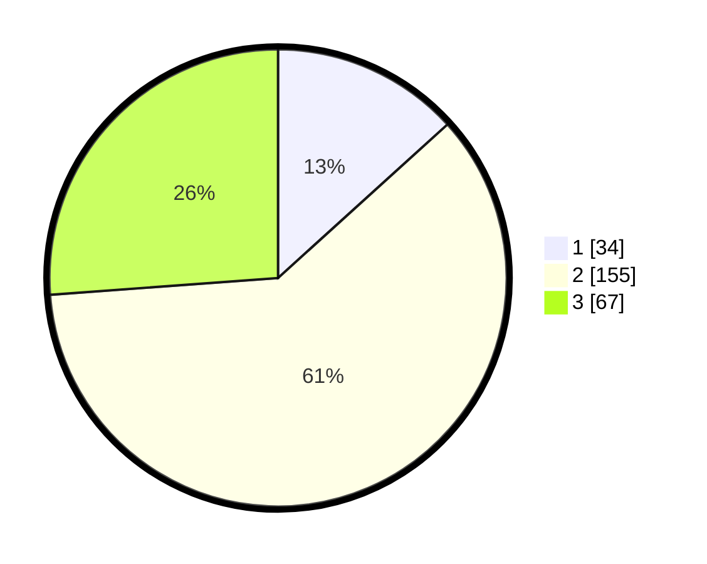

# Hasil

## Grafik

## Tabel

| No. | Nama Paslon    | Suara | Suara (raw) | Persentase |
|:--- |:-------------- | -----:| -----------:| ----------:|
| 1   | ANIES MUHAIMIN | 34    | [34][p-1]   | 13,28      |
| 2   | PRABOWO GIBRAN | 155   | [155][p-2]  | 60,55      |
| 3   | GANJAR MAHFUD  | 67    | [67][p-3]   | 26,17      |

[p-1]: https://github.com/gigit-pemilu/pemilu-2024/blob/main/pilpres/hitung-suara/sub/35-jawa-timur/sub/20-magetan/sub/06-magetan/sub/1013-sukowinangun/sub/010-tps/sub/paslon-1.txt
[p-2]: https://github.com/gigit-pemilu/pemilu-2024/blob/main/pilpres/hitung-suara/sub/35-jawa-timur/sub/20-magetan/sub/06-magetan/sub/1013-sukowinangun/sub/010-tps/sub/paslon-2.txt
[p-3]: https://github.com/gigit-pemilu/pemilu-2024/blob/main/pilpres/hitung-suara/sub/35-jawa-timur/sub/20-magetan/sub/06-magetan/sub/1013-sukowinangun/sub/010-tps/sub/paslon-3.txt

## Foto C Plano

https://sirekap-obj-formc.kpu.go.id/3ca1/pemilu/ppwp/35/20/06/10/13/3520061013010-20240215-020054--d0dd2ad8-6801-4c42-80c9-9fd29e33236e.jpg

https://sirekap-obj-formc.kpu.go.id/3ca1/pemilu/ppwp/35/20/06/10/13/3520061013010-20240215-020155--34e122ac-24c3-4a74-8a4c-49929dee5d44.jpg

https://sirekap-obj-formc.kpu.go.id/3ca1/pemilu/ppwp/35/20/06/10/13/3520061013010-20240215-020221--4c337d78-3c83-4365-89fe-c7f0d1ad02d6.jpg

## Metadata

| Key        | Value               |
| ---------- | ------------------- |
| Time Stamp | 2024-02-16 16:25:10 |

