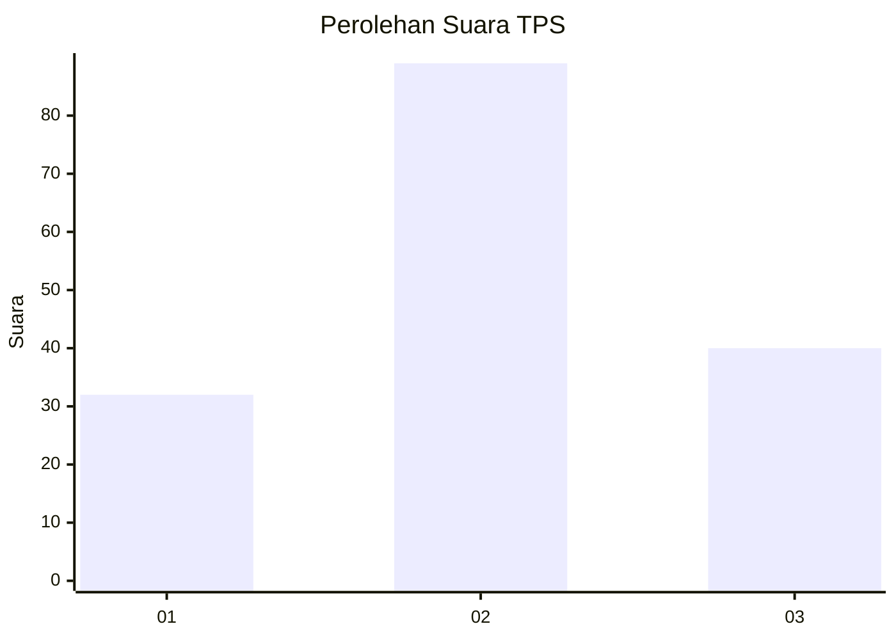
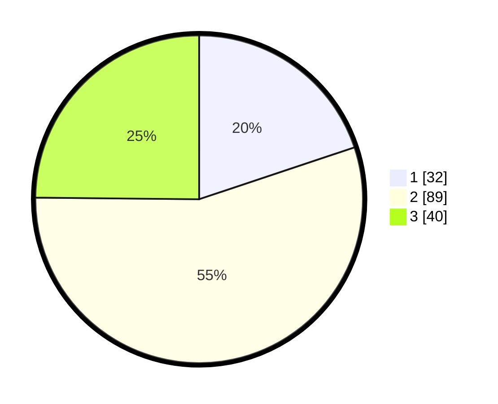

# Hasil

## Grafik

## Tabel

| No. | Nama Paslon    | Suara | Suara (raw) | Persentase |
|:--- |:-------------- | -----:| -----------:| ----------:|
| 1   | ANIES MUHAIMIN | 32    | [32][p-1]   | 19,88      |
| 2   | PRABOWO GIBRAN | 89    | [89][p-2]   | 55,28      |
| 3   | GANJAR MAHFUD  | 40    | [40][p-3]   | 24,84      |

[p-1]: https://github.com/gigit-pemilu/pemilu-2024-35-jawa-timur/blob/main/pilpres/hitung-suara/sub/35-jawa-timur/sub/20-magetan/sub/06-magetan/sub/1014-kebonagung/sub/001-tps/sub/paslon-1.txt
[p-2]: https://github.com/gigit-pemilu/pemilu-2024-35-jawa-timur/blob/main/pilpres/hitung-suara/sub/35-jawa-timur/sub/20-magetan/sub/06-magetan/sub/1014-kebonagung/sub/001-tps/sub/paslon-2.txt
[p-3]: https://github.com/gigit-pemilu/pemilu-2024-35-jawa-timur/blob/main/pilpres/hitung-suara/sub/35-jawa-timur/sub/20-magetan/sub/06-magetan/sub/1014-kebonagung/sub/001-tps/sub/paslon-3.txt

## Foto C Plano

https://sirekap-obj-formc.kpu.go.id/8595/pemilu/ppwp/35/20/06/10/14/3520061014001-20240216-112047--1dbf3b96-99c8-4879-98eb-c96a7b1e53e8.jpg

https://sirekap-obj-formc.kpu.go.id/8595/pemilu/ppwp/35/20/06/10/14/3520061014001-20240216-112256--b8c684b4-565c-47d5-8850-ab28cb3dc243.jpg

https://sirekap-obj-formc.kpu.go.id/8595/pemilu/ppwp/35/20/06/10/14/3520061014001-20240216-110602--14fc98f0-63f5-49da-a553-e954fc5553b2.jpg

## Metadata

| Key        | Value               |
| ---------- | ------------------- |
| Time Stamp | 2024-02-22 12:00:00 |

