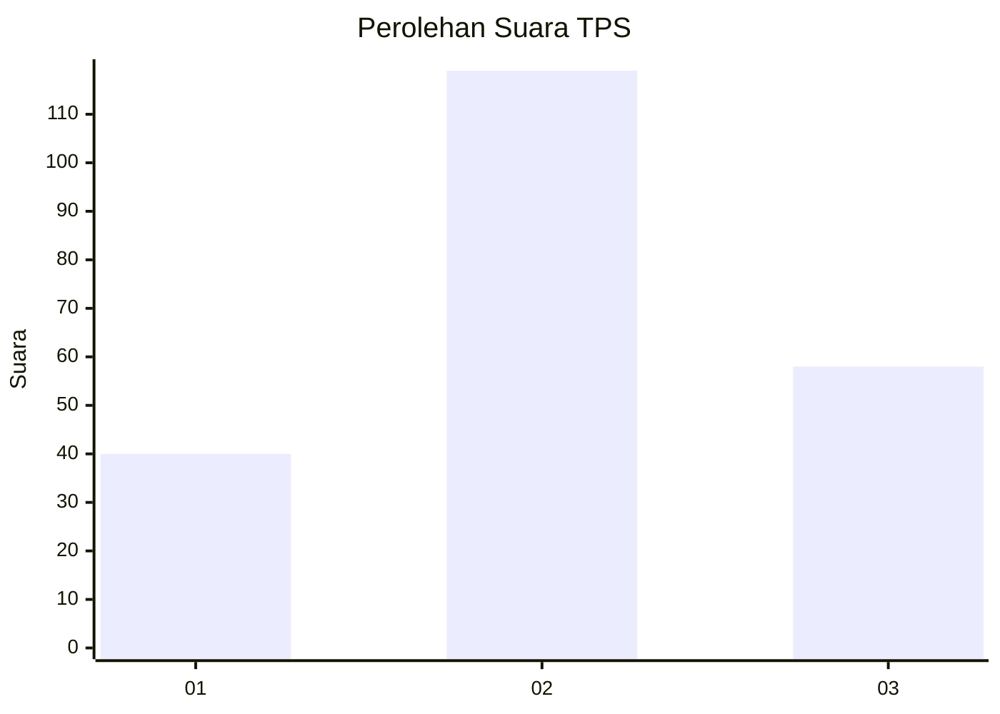
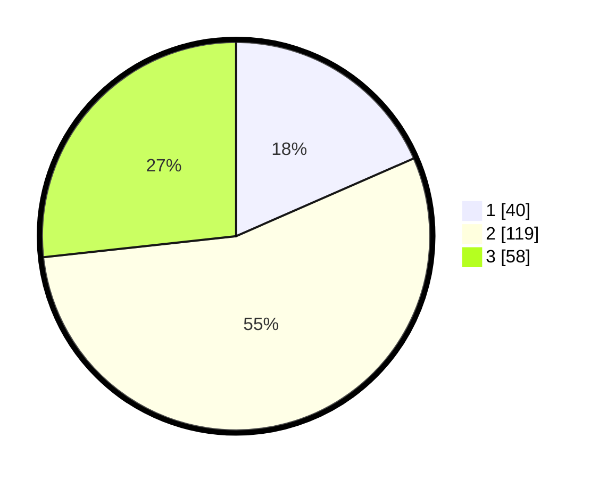

# Hasil

## Grafik

## Tabel

| No. | Nama Paslon    | Suara | Suara (raw) | Persentase |
|:--- |:-------------- | -----:| -----------:| ----------:|
| 1   | ANIES MUHAIMIN | 40    | [40][p-1]   | 18,43      |
| 2   | PRABOWO GIBRAN | 119   | [119][p-2]  | 54,84      |
| 3   | GANJAR MAHFUD  | 58    | [58][p-3]   | 26,73      |

[p-1]: https://github.com/gigit-pemilu/pemilu-2024/blob/main/pilpres/hitung-suara/sub/35-jawa-timur/sub/20-magetan/sub/06-magetan/sub/1014-kebonagung/sub/004-tps/sub/paslon-1.txt
[p-2]: https://github.com/gigit-pemilu/pemilu-2024/blob/main/pilpres/hitung-suara/sub/35-jawa-timur/sub/20-magetan/sub/06-magetan/sub/1014-kebonagung/sub/004-tps/sub/paslon-2.txt
[p-3]: https://github.com/gigit-pemilu/pemilu-2024/blob/main/pilpres/hitung-suara/sub/35-jawa-timur/sub/20-magetan/sub/06-magetan/sub/1014-kebonagung/sub/004-tps/sub/paslon-3.txt

## Foto C Plano

https://sirekap-obj-formc.kpu.go.id/4feb/pemilu/ppwp/35/20/06/10/14/3520061014004-20240216-124144--ef2a5f72-8843-4b5b-b958-abc186ab6928.jpg

https://sirekap-obj-formc.kpu.go.id/4feb/pemilu/ppwp/35/20/06/10/14/3520061014004-20240216-124155--86a221a3-8d19-418a-9ab9-51d3bc607912.jpg

https://sirekap-obj-formc.kpu.go.id/4feb/pemilu/ppwp/35/20/06/10/14/3520061014004-20240216-124204--8eb3d1ca-6785-4d27-ba74-eac7b59a08e4.jpg

## Metadata

| Key        | Value               |
| ---------- | ------------------- |
| Time Stamp | 2024-02-16 16:25:10 |

