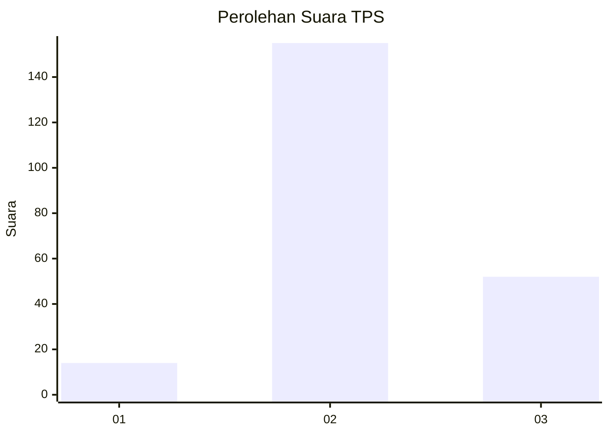
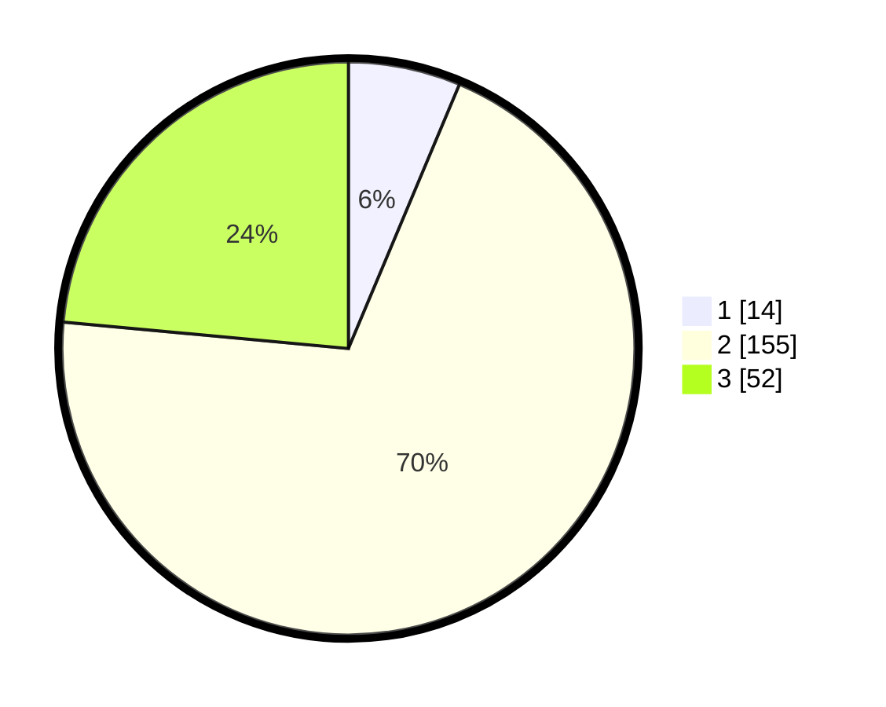

# Hasil

## Grafik

## Tabel

| No. | Nama Paslon    | Suara | Suara (raw) | Persentase |
|:--- |:-------------- | -----:| -----------:| ----------:|
| 1   | ANIES MUHAIMIN | 14    | [14][p-1]   | 6,33       |
| 2   | PRABOWO GIBRAN | 155   | [155][p-2]  | 70,14      |
| 3   | GANJAR MAHFUD  | 52    | [52][p-3]   | 23,53      |

[p-1]: https://github.com/gigit-pemilu/pemilu-2024/blob/main/pilpres/hitung-suara/sub/35-jawa-timur/sub/20-magetan/sub/06-magetan/sub/2005-ringinagung/sub/003-tps/sub/paslon-1.txt
[p-2]: https://github.com/gigit-pemilu/pemilu-2024/blob/main/pilpres/hitung-suara/sub/35-jawa-timur/sub/20-magetan/sub/06-magetan/sub/2005-ringinagung/sub/003-tps/sub/paslon-2.txt
[p-3]: https://github.com/gigit-pemilu/pemilu-2024/blob/main/pilpres/hitung-suara/sub/35-jawa-timur/sub/20-magetan/sub/06-magetan/sub/2005-ringinagung/sub/003-tps/sub/paslon-3.txt

## Foto C Plano

https://sirekap-obj-formc.kpu.go.id/8055/pemilu/ppwp/35/20/06/20/05/3520062005003-20240214-223431--aabd2474-a4f6-46fb-9033-17f37b6d3221.jpg

https://sirekap-obj-formc.kpu.go.id/8055/pemilu/ppwp/35/20/06/20/05/3520062005003-20240214-223706--317bc3e1-e6c6-4df3-bc62-85e4673611ba.jpg

https://sirekap-obj-formc.kpu.go.id/8055/pemilu/ppwp/35/20/06/20/05/3520062005003-20240214-223854--39130db2-2b0c-44fc-aefb-e3e1a3b58acd.jpg

## Metadata

| Key        | Value               |
| ---------- | ------------------- |
| Time Stamp | 2024-02-16 16:25:10 |

