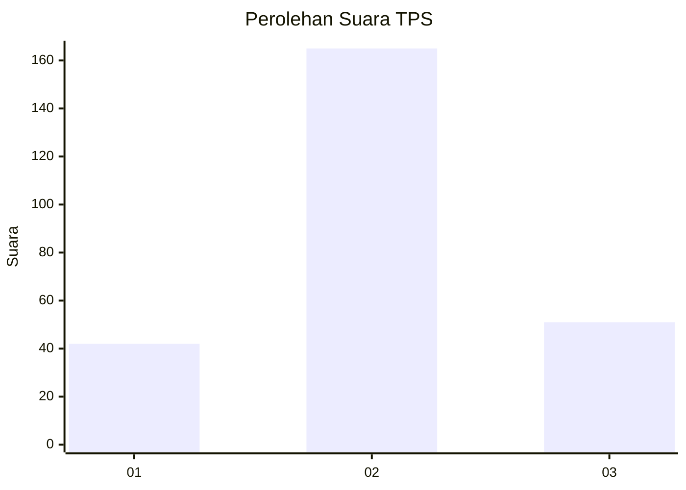
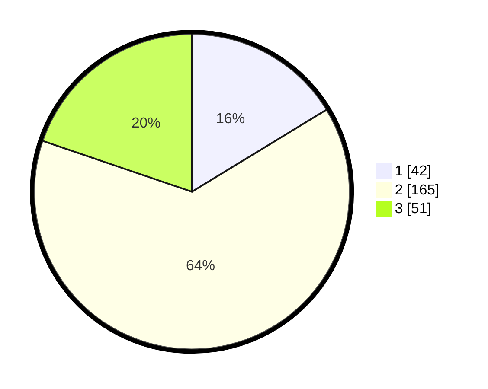

# Hasil

## Grafik

## Tabel

| No. | Nama Paslon    | Suara | Suara (raw) | Persentase |
|:--- |:-------------- | -----:| -----------:| ----------:|
| 1   | ANIES MUHAIMIN | 42    | [42][p-1]   | 16,28      |
| 2   | PRABOWO GIBRAN | 165   | [165][p-2]  | 63,95      |
| 3   | GANJAR MAHFUD  | 51    | [51][p-3]   | 19,77      |

[p-1]: https://github.com/gigit-pemilu/pemilu-2024/blob/main/pilpres/hitung-suara/sub/35-jawa-timur/sub/20-magetan/sub/06-magetan/sub/2005-ringinagung/sub/007-tps/sub/paslon-1.txt
[p-2]: https://github.com/gigit-pemilu/pemilu-2024/blob/main/pilpres/hitung-suara/sub/35-jawa-timur/sub/20-magetan/sub/06-magetan/sub/2005-ringinagung/sub/007-tps/sub/paslon-2.txt
[p-3]: https://github.com/gigit-pemilu/pemilu-2024/blob/main/pilpres/hitung-suara/sub/35-jawa-timur/sub/20-magetan/sub/06-magetan/sub/2005-ringinagung/sub/007-tps/sub/paslon-3.txt

## Foto C Plano

https://sirekap-obj-formc.kpu.go.id/aa4e/pemilu/ppwp/35/20/06/20/05/3520062005007-20240214-215057--e8307262-3875-4163-bd33-10aed2673434.jpg

https://sirekap-obj-formc.kpu.go.id/aa4e/pemilu/ppwp/35/20/06/20/05/3520062005007-20240214-215152--40b6070a-f1bf-45d3-96ee-6e995c1b5dc9.jpg

https://sirekap-obj-formc.kpu.go.id/aa4e/pemilu/ppwp/35/20/06/20/05/3520062005007-20240214-215421--cc8d100d-84e8-468e-9de8-c0c627a60c51.jpg

## Metadata

| Key        | Value               |
| ---------- | ------------------- |
| Time Stamp | 2024-02-22 12:00:00 |

