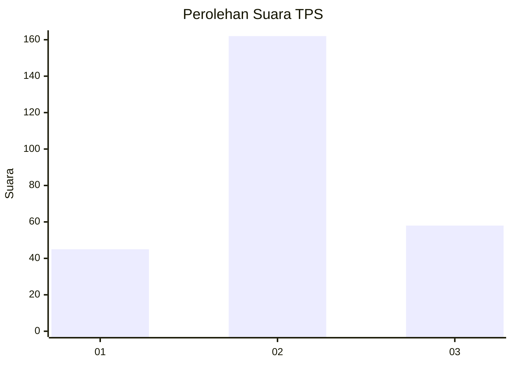
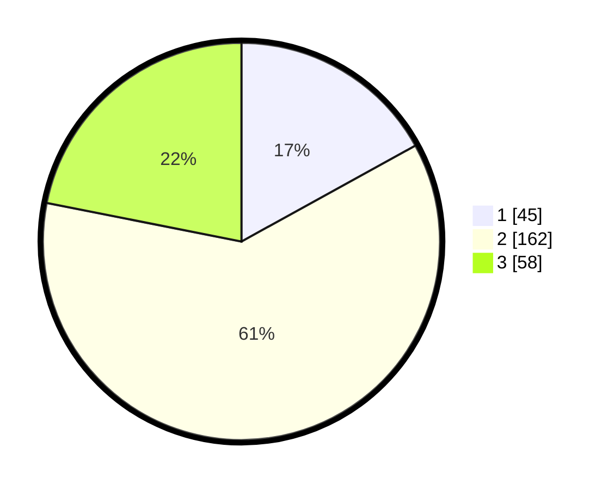

# Hasil

## Grafik

## Tabel

| No. | Nama Paslon    | Suara | Suara (raw) | Persentase |
|:--- |:-------------- | -----:| -----------:| ----------:|
| 1   | ANIES MUHAIMIN | 45    | [45][p-1]   | 16,98      |
| 2   | PRABOWO GIBRAN | 162   | [162][p-2]  | 61,13      |
| 3   | GANJAR MAHFUD  | 58    | [58][p-3]   | 21,89      |

[p-1]: https://github.com/gigit-pemilu/pemilu-2024-35-jawa-timur/blob/main/pilpres/hitung-suara/sub/35-jawa-timur/sub/20-magetan/sub/06-magetan/sub/2005-ringinagung/sub/008-tps/sub/paslon-1.txt
[p-2]: https://github.com/gigit-pemilu/pemilu-2024-35-jawa-timur/blob/main/pilpres/hitung-suara/sub/35-jawa-timur/sub/20-magetan/sub/06-magetan/sub/2005-ringinagung/sub/008-tps/sub/paslon-2.txt
[p-3]: https://github.com/gigit-pemilu/pemilu-2024-35-jawa-timur/blob/main/pilpres/hitung-suara/sub/35-jawa-timur/sub/20-magetan/sub/06-magetan/sub/2005-ringinagung/sub/008-tps/sub/paslon-3.txt

## Foto C Plano

https://sirekap-obj-formc.kpu.go.id/8e05/pemilu/ppwp/35/20/06/20/05/3520062005008-20240214-224057--a9cf666a-15b1-47c2-9042-594375ad7c1d.jpg

https://sirekap-obj-formc.kpu.go.id/8e05/pemilu/ppwp/35/20/06/20/05/3520062005008-20240214-224557--b56b0c9f-606b-468c-98fa-a650298f17f8.jpg

https://sirekap-obj-formc.kpu.go.id/8e05/pemilu/ppwp/35/20/06/20/05/3520062005008-20240214-224708--6ebf22cb-fe80-465c-8079-2912495af519.jpg

## Metadata

| Key        | Value               |
| ---------- | ------------------- |
| Time Stamp | 2024-02-16 16:25:10 |

