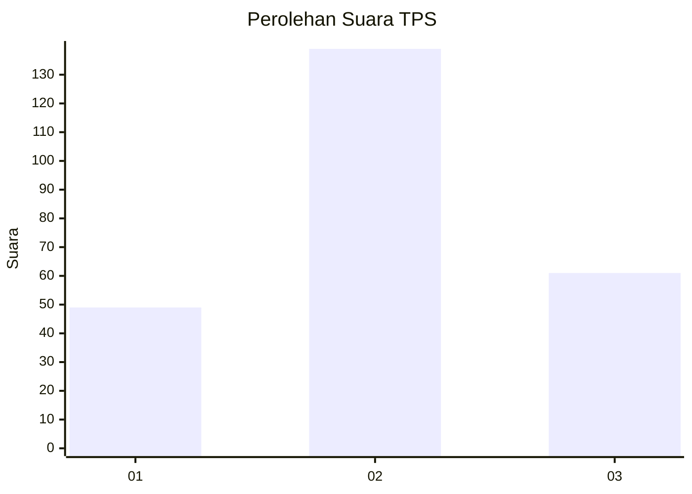
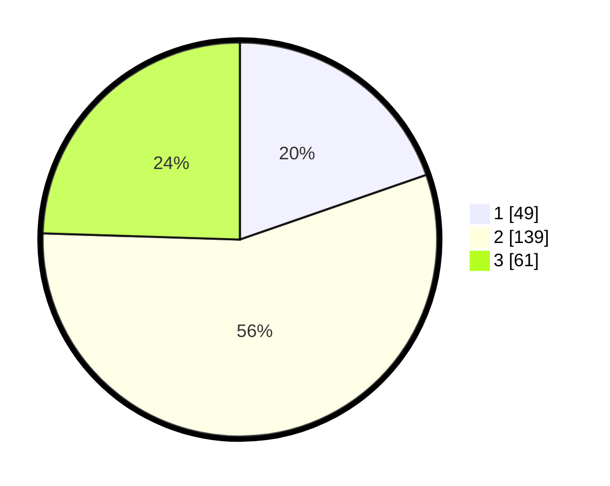

# Hasil

## Grafik

## Tabel

| No. | Nama Paslon    | Suara | Suara (raw) | Persentase |
|:--- |:-------------- | -----:| -----------:| ----------:|
| 1   | ANIES MUHAIMIN | 49    | [49][p-1]   | 19,68      |
| 2   | PRABOWO GIBRAN | 139   | [139][p-2]  | 55,82      |
| 3   | GANJAR MAHFUD  | 61    | [61][p-3]   | 24,50      |

[p-1]: https://github.com/gigit-pemilu/pemilu-2024-35-jawa-timur/blob/main/pilpres/hitung-suara/sub/35-jawa-timur/sub/20-magetan/sub/06-magetan/sub/2016-baron/sub/003-tps/sub/paslon-1.txt
[p-2]: https://github.com/gigit-pemilu/pemilu-2024-35-jawa-timur/blob/main/pilpres/hitung-suara/sub/35-jawa-timur/sub/20-magetan/sub/06-magetan/sub/2016-baron/sub/003-tps/sub/paslon-2.txt
[p-3]: https://github.com/gigit-pemilu/pemilu-2024-35-jawa-timur/blob/main/pilpres/hitung-suara/sub/35-jawa-timur/sub/20-magetan/sub/06-magetan/sub/2016-baron/sub/003-tps/sub/paslon-3.txt

## Foto C Plano

https://sirekap-obj-formc.kpu.go.id/d621/pemilu/ppwp/35/20/06/20/16/3520062016003-20240215-030254--0178be30-a3fa-4fc6-8a95-1c8b8591717d.jpg

https://sirekap-obj-formc.kpu.go.id/d621/pemilu/ppwp/35/20/06/20/16/3520062016003-20240214-221004--716f42c9-d094-437e-b5af-1fcbeba5b4e8.jpg

https://sirekap-obj-formc.kpu.go.id/d621/pemilu/ppwp/35/20/06/20/16/3520062016003-20240215-030454--5a3d6abb-e303-4b40-bc5a-10ec4d745f1c.jpg

## Metadata

| Key        | Value               |
| ---------- | ------------------- |
| Time Stamp | 2024-02-16 16:25:10 |

