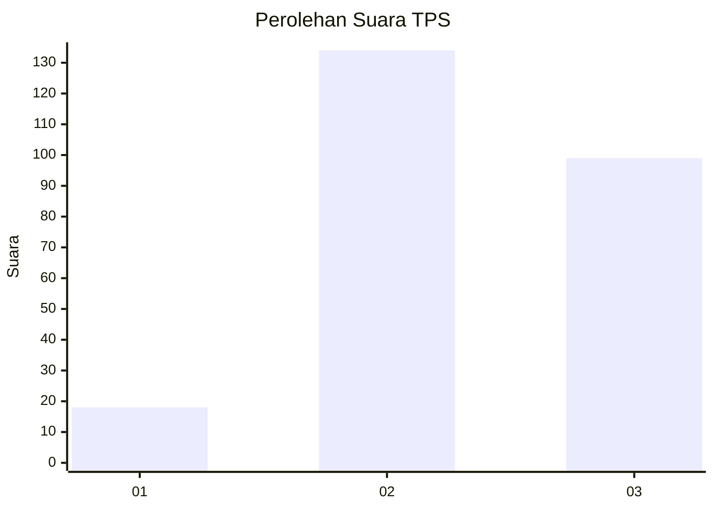
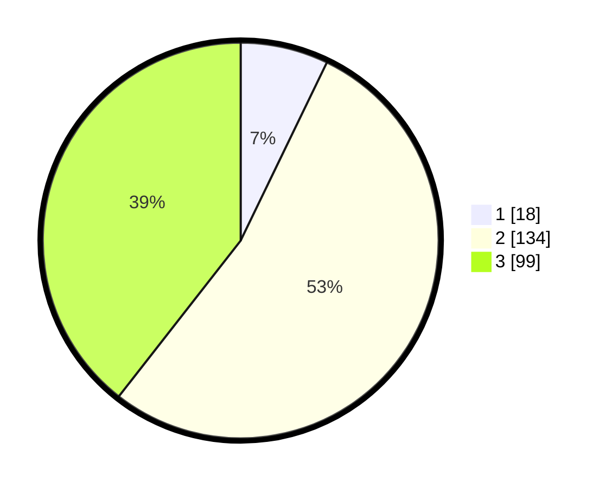

# Hasil

## Grafik

## Tabel

| No. | Nama Paslon    | Suara | Suara (raw) | Persentase |
|:--- |:-------------- | -----:| -----------:| ----------:|
| 1   | ANIES MUHAIMIN | 18    | [18][p-1]   | 7,17       |
| 2   | PRABOWO GIBRAN | 134   | [134][p-2]  | 53,39      |
| 3   | GANJAR MAHFUD  | 99    | [99][p-3]   | 39,44      |

[p-1]: https://github.com/gigit-pemilu/pemilu-2024-35-jawa-timur/blob/main/pilpres/hitung-suara/sub/35-jawa-timur/sub/20-magetan/sub/07-plaosan/sub/1011-plaosan/sub/009-tps/sub/paslon-1.txt
[p-2]: https://github.com/gigit-pemilu/pemilu-2024-35-jawa-timur/blob/main/pilpres/hitung-suara/sub/35-jawa-timur/sub/20-magetan/sub/07-plaosan/sub/1011-plaosan/sub/009-tps/sub/paslon-2.txt
[p-3]: https://github.com/gigit-pemilu/pemilu-2024-35-jawa-timur/blob/main/pilpres/hitung-suara/sub/35-jawa-timur/sub/20-magetan/sub/07-plaosan/sub/1011-plaosan/sub/009-tps/sub/paslon-3.txt

## Foto C Plano

https://sirekap-obj-formc.kpu.go.id/4d02/pemilu/ppwp/35/20/07/10/11/3520071011009-20240214-215838--39d90578-689d-4920-86a8-05e12dc22493.jpg

https://sirekap-obj-formc.kpu.go.id/4d02/pemilu/ppwp/35/20/07/10/11/3520071011009-20240214-220027--74b8ee2e-30c8-4860-8fe5-260af77f2a1f.jpg

https://sirekap-obj-formc.kpu.go.id/4d02/pemilu/ppwp/35/20/07/10/11/3520071011009-20240214-220243--23006564-eff4-41b7-b1b9-4dcf75ed859b.jpg

## Metadata

| Key        | Value               |
| ---------- | ------------------- |
| Time Stamp | 2024-02-22 12:00:00 |

