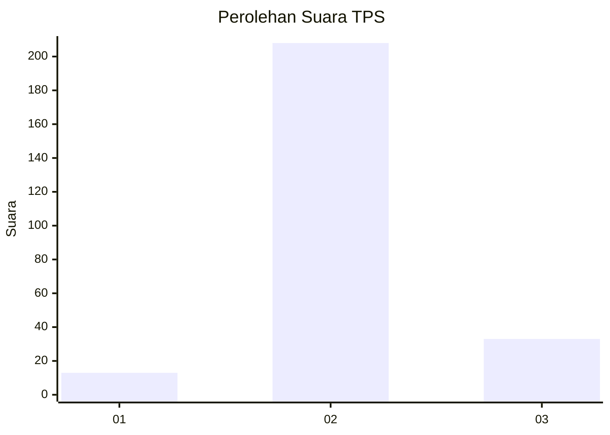
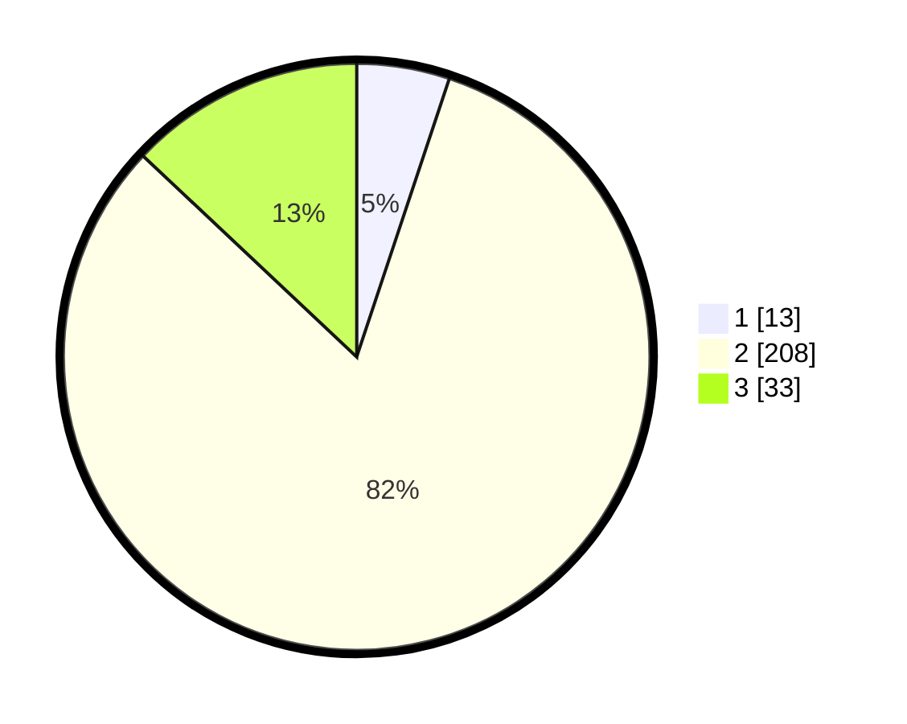

# Hasil

## Grafik

## Tabel

| No. | Nama Paslon    | Suara | Suara (raw) | Persentase |
|:--- |:-------------- | -----:| -----------:| ----------:|
| 1   | ANIES MUHAIMIN | 13    | [13][p-1]   | 5,12       |
| 2   | PRABOWO GIBRAN | 208   | [208][p-2]  | 81,89      |
| 3   | GANJAR MAHFUD  | 33    | [33][p-3]   | 12,99      |

[p-1]: https://github.com/gigit-pemilu/pemilu-2024-35-jawa-timur/blob/main/pilpres/hitung-suara/sub/35-jawa-timur/sub/20-magetan/sub/07-plaosan/sub/1011-plaosan/sub/017-tps/sub/paslon-1.txt
[p-2]: https://github.com/gigit-pemilu/pemilu-2024-35-jawa-timur/blob/main/pilpres/hitung-suara/sub/35-jawa-timur/sub/20-magetan/sub/07-plaosan/sub/1011-plaosan/sub/017-tps/sub/paslon-2.txt
[p-3]: https://github.com/gigit-pemilu/pemilu-2024-35-jawa-timur/blob/main/pilpres/hitung-suara/sub/35-jawa-timur/sub/20-magetan/sub/07-plaosan/sub/1011-plaosan/sub/017-tps/sub/paslon-3.txt

## Foto C Plano

https://sirekap-obj-formc.kpu.go.id/a8dc/pemilu/ppwp/35/20/07/10/11/3520071011017-20240215-002408--06ae3755-669f-42f9-afe9-643c5a8cd002.jpg

https://sirekap-obj-formc.kpu.go.id/a8dc/pemilu/ppwp/35/20/07/10/11/3520071011017-20240215-002559--5d8dd2e4-03ac-4ec3-8f84-aa1e13d664b3.jpg

https://sirekap-obj-formc.kpu.go.id/a8dc/pemilu/ppwp/35/20/07/10/11/3520071011017-20240215-002731--96735fe0-9713-42f1-826c-58728a66b5ad.jpg

## Metadata

| Key        | Value               |
| ---------- | ------------------- |
| Time Stamp | 2024-02-16 16:25:10 |

