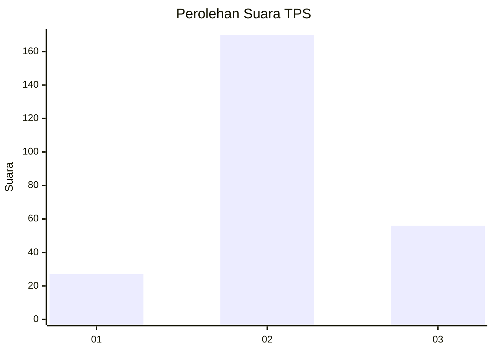
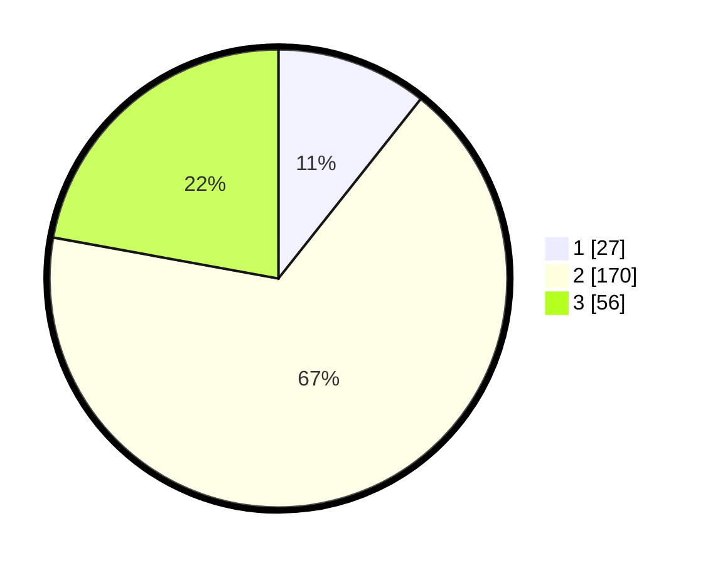

# Hasil

## Grafik

## Tabel

| No. | Nama Paslon    | Suara | Suara (raw) | Persentase |
|:--- |:-------------- | -----:| -----------:| ----------:|
| 1   | ANIES MUHAIMIN | 27    | [27][p-1]   | 10,67      |
| 2   | PRABOWO GIBRAN | 170   | [170][p-2]  | 67,19      |
| 3   | GANJAR MAHFUD  | 56    | [56][p-3]   | 22,13      |

[p-1]: https://github.com/gigit-pemilu/pemilu-2024/blob/main/pilpres/hitung-suara/sub/35-jawa-timur/sub/20-magetan/sub/07-plaosan/sub/2001-ngancar/sub/006-tps/sub/paslon-1.txt
[p-2]: https://github.com/gigit-pemilu/pemilu-2024/blob/main/pilpres/hitung-suara/sub/35-jawa-timur/sub/20-magetan/sub/07-plaosan/sub/2001-ngancar/sub/006-tps/sub/paslon-2.txt
[p-3]: https://github.com/gigit-pemilu/pemilu-2024/blob/main/pilpres/hitung-suara/sub/35-jawa-timur/sub/20-magetan/sub/07-plaosan/sub/2001-ngancar/sub/006-tps/sub/paslon-3.txt

## Foto C Plano

https://sirekap-obj-formc.kpu.go.id/0c9a/pemilu/ppwp/35/20/07/20/01/3520072001006-20240214-213905--becd4ab8-9859-4eaf-b8ae-ba94a125fbce.jpg

https://sirekap-obj-formc.kpu.go.id/0c9a/pemilu/ppwp/35/20/07/20/01/3520072001006-20240215-004412--abbc3423-da2a-4508-ac76-ad94b474681c.jpg

https://sirekap-obj-formc.kpu.go.id/0c9a/pemilu/ppwp/35/20/07/20/01/3520072001006-20240214-212656--92daafd5-8fc0-4bce-b299-d4f12a17ce60.jpg

## Metadata

| Key        | Value               |
| ---------- | ------------------- |
| Time Stamp | 2024-02-16 16:25:10 |

