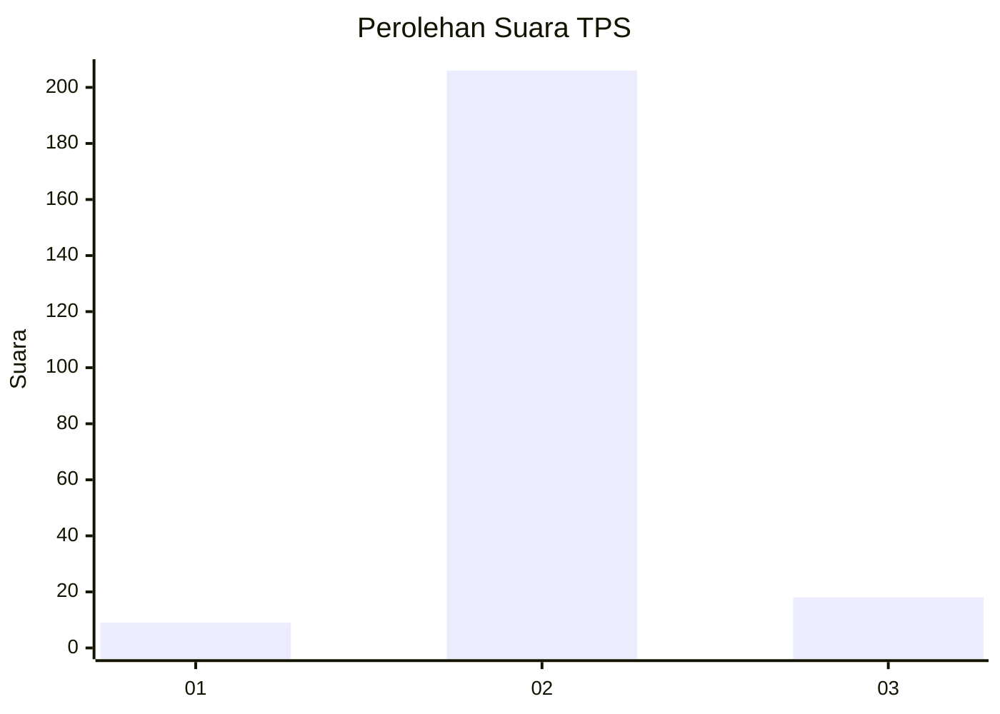
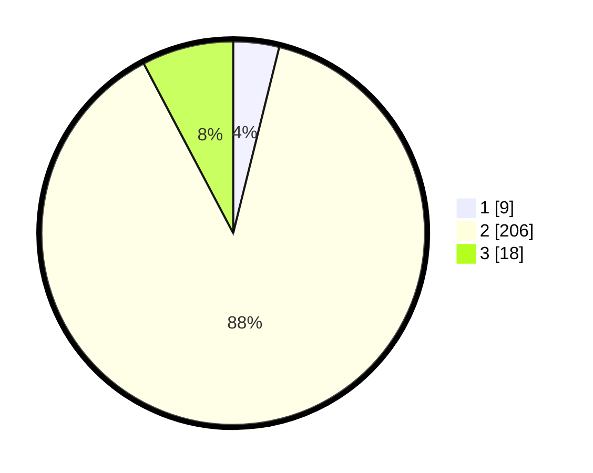

# Hasil

## Grafik

## Tabel

| No. | Nama Paslon    | Suara | Suara (raw) | Persentase |
|:--- |:-------------- | -----:| -----------:| ----------:|
| 1   | ANIES MUHAIMIN | 9     | [9][p-1]    | 3,86       |
| 2   | PRABOWO GIBRAN | 206   | [206][p-2]  | 88,41      |
| 3   | GANJAR MAHFUD  | 18    | [18][p-3]   | 7,73       |

[p-1]: https://github.com/gigit-pemilu/pemilu-2024/blob/main/pilpres/hitung-suara/sub/35-jawa-timur/sub/20-magetan/sub/07-plaosan/sub/2003-puntukdoro/sub/011-tps/sub/paslon-1.txt
[p-2]: https://github.com/gigit-pemilu/pemilu-2024/blob/main/pilpres/hitung-suara/sub/35-jawa-timur/sub/20-magetan/sub/07-plaosan/sub/2003-puntukdoro/sub/011-tps/sub/paslon-2.txt
[p-3]: https://github.com/gigit-pemilu/pemilu-2024/blob/main/pilpres/hitung-suara/sub/35-jawa-timur/sub/20-magetan/sub/07-plaosan/sub/2003-puntukdoro/sub/011-tps/sub/paslon-3.txt

## Foto C Plano

https://sirekap-obj-formc.kpu.go.id/76d7/pemilu/ppwp/35/20/07/20/03/3520072003011-20240221-195443--4dd98e8e-9ace-4a13-a1bb-4e6e935f0b87.jpg

https://sirekap-obj-formc.kpu.go.id/76d7/pemilu/ppwp/35/20/07/20/03/3520072003011-20240221-195613--a45f23e7-bd25-4c70-b0d0-a4732d4482a5.jpg

https://sirekap-obj-formc.kpu.go.id/76d7/pemilu/ppwp/35/20/07/20/03/3520072003011-20240221-195739--f06fcd57-68f6-4513-81a1-89942830e069.jpg

## Metadata

| Key        | Value               |
| ---------- | ------------------- |
| Time Stamp | 2024-02-22 12:00:00 |

