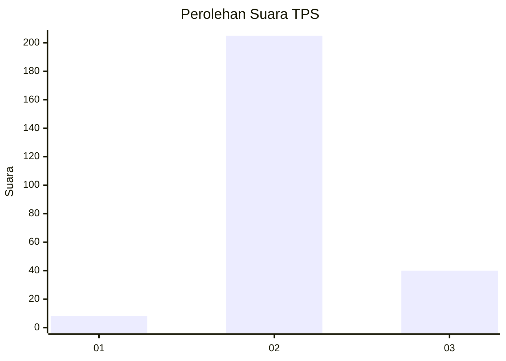
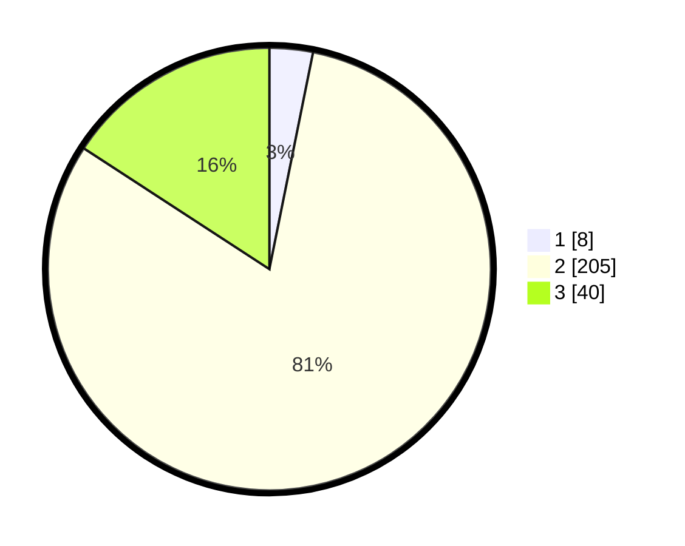

# Hasil

## Grafik

## Tabel

| No. | Nama Paslon    | Suara | Suara (raw) | Persentase |
|:--- |:-------------- | -----:| -----------:| ----------:|
| 1   | ANIES MUHAIMIN | 8     | [8][p-1]    | 3,16       |
| 2   | PRABOWO GIBRAN | 205   | [205][p-2]  | 81,03      |
| 3   | GANJAR MAHFUD  | 40    | [40][p-3]   | 15,81      |

[p-1]: https://github.com/gigit-pemilu/pemilu-2024/blob/main/pilpres/hitung-suara/sub/35-jawa-timur/sub/20-magetan/sub/07-plaosan/sub/2004-bulugunung/sub/007-tps/sub/paslon-1.txt
[p-2]: https://github.com/gigit-pemilu/pemilu-2024/blob/main/pilpres/hitung-suara/sub/35-jawa-timur/sub/20-magetan/sub/07-plaosan/sub/2004-bulugunung/sub/007-tps/sub/paslon-2.txt
[p-3]: https://github.com/gigit-pemilu/pemilu-2024/blob/main/pilpres/hitung-suara/sub/35-jawa-timur/sub/20-magetan/sub/07-plaosan/sub/2004-bulugunung/sub/007-tps/sub/paslon-3.txt

## Foto C Plano

https://sirekap-obj-formc.kpu.go.id/6d9c/pemilu/ppwp/35/20/07/20/04/3520072004007-20240214-211050--9643baea-a8cd-4427-a91e-49659a1ba300.jpg

https://sirekap-obj-formc.kpu.go.id/6d9c/pemilu/ppwp/35/20/07/20/04/3520072004007-20240214-211212--38e491d1-97bb-4c54-9028-9fe02e06d76b.jpg

https://sirekap-obj-formc.kpu.go.id/6d9c/pemilu/ppwp/35/20/07/20/04/3520072004007-20240214-211301--6f88c0e2-c946-4094-967e-e6e9a6603640.jpg

## Metadata

| Key        | Value               |
| ---------- | ------------------- |
| Time Stamp | 2024-02-16 21:01:00 |

