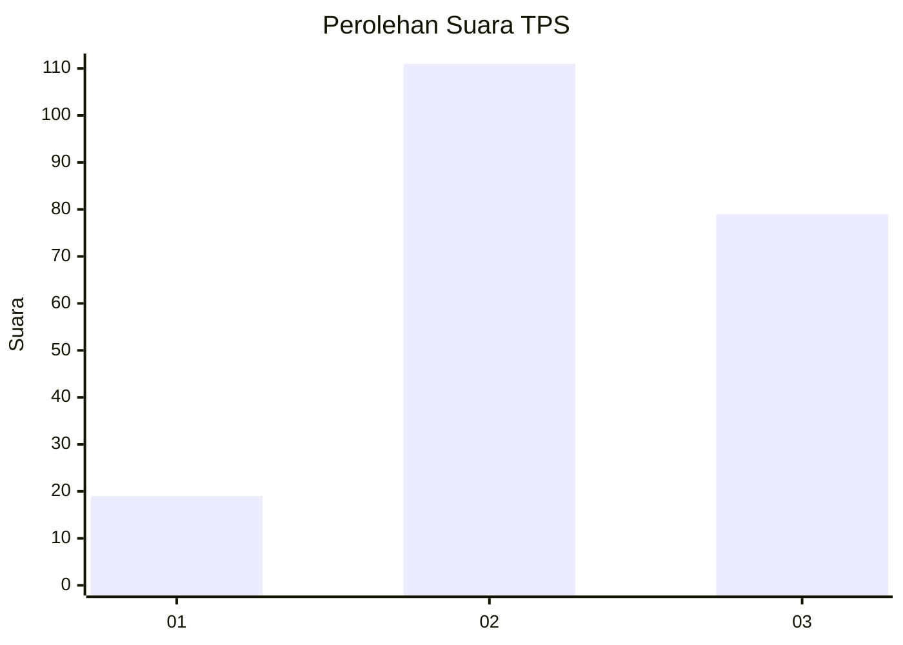
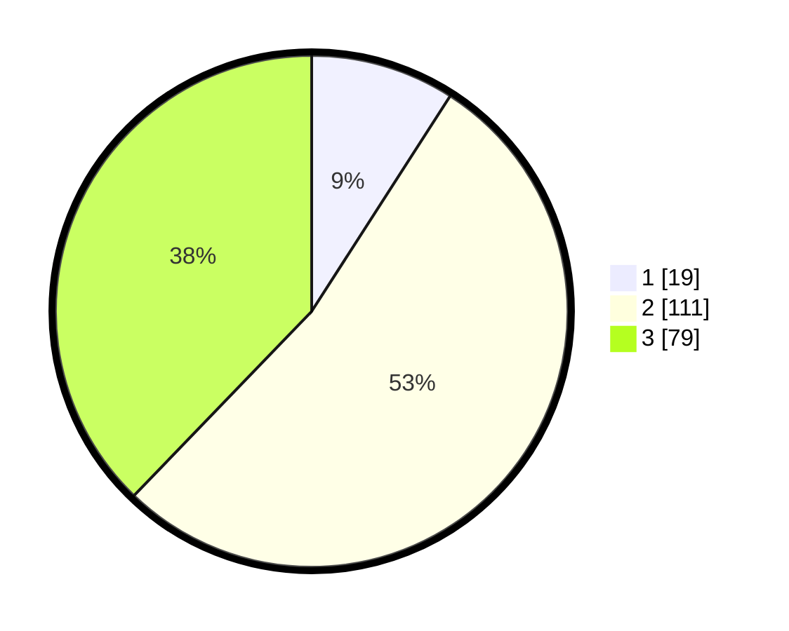

# Hasil

## Grafik

## Tabel

| No. | Nama Paslon    | Suara | Suara (raw) | Persentase |
|:--- |:-------------- | -----:| -----------:| ----------:|
| 1   | ANIES MUHAIMIN | 19    | [19][p-1]   | 9,09       |
| 2   | PRABOWO GIBRAN | 111   | [111][p-2]  | 53,11      |
| 3   | GANJAR MAHFUD  | 79    | [79][p-3]   | 37,80      |

[p-1]: https://github.com/gigit-pemilu/pemilu-2024/blob/main/pilpres/hitung-suara/sub/35-jawa-timur/sub/20-magetan/sub/07-plaosan/sub/2005-bogoarum/sub/002-tps/sub/paslon-1.txt
[p-2]: https://github.com/gigit-pemilu/pemilu-2024/blob/main/pilpres/hitung-suara/sub/35-jawa-timur/sub/20-magetan/sub/07-plaosan/sub/2005-bogoarum/sub/002-tps/sub/paslon-2.txt
[p-3]: https://github.com/gigit-pemilu/pemilu-2024/blob/main/pilpres/hitung-suara/sub/35-jawa-timur/sub/20-magetan/sub/07-plaosan/sub/2005-bogoarum/sub/002-tps/sub/paslon-3.txt

## Foto C Plano

https://sirekap-obj-formc.kpu.go.id/ab9b/pemilu/ppwp/35/20/07/20/05/3520072005002-20240215-190317--c5704903-c01d-4be4-bd19-fe4d72d4f194.jpg

https://sirekap-obj-formc.kpu.go.id/ab9b/pemilu/ppwp/35/20/07/20/05/3520072005002-20240215-190655--45a82670-95f3-4b9c-8096-1bd4ee5d960a.jpg

https://sirekap-obj-formc.kpu.go.id/ab9b/pemilu/ppwp/35/20/07/20/05/3520072005002-20240215-190943--7daf2c3d-69cd-4927-8cc5-27a1cea36b0f.jpg

## Metadata

| Key        | Value               |
| ---------- | ------------------- |
| Time Stamp | 2024-02-16 21:01:00 |

