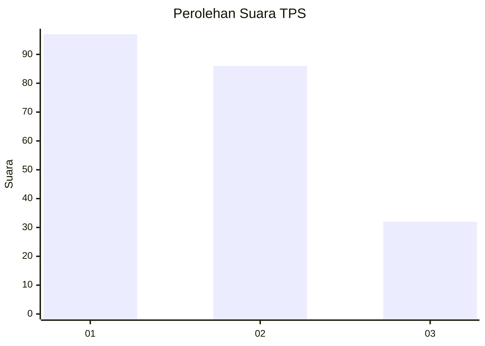
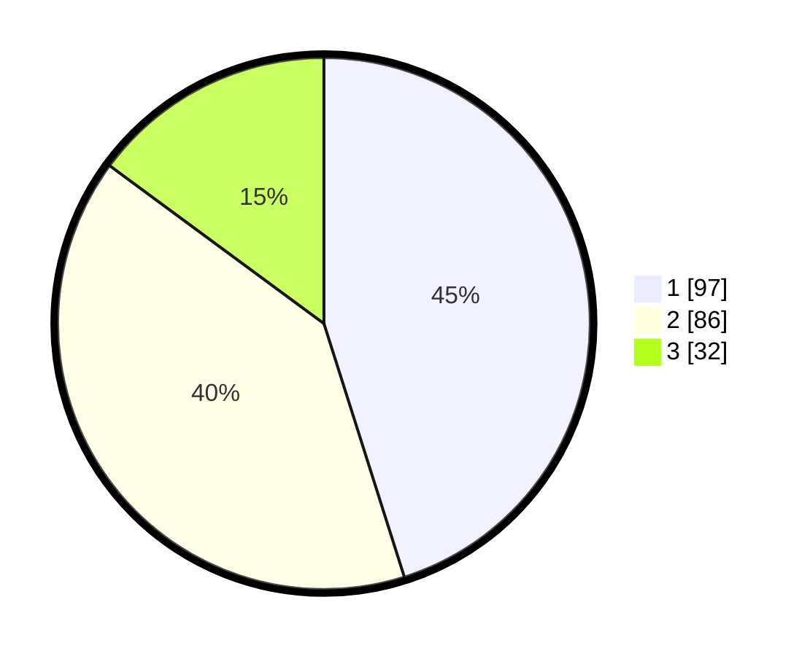

# Hasil

## Grafik

## Tabel

| No. | Nama Paslon    | Suara | Suara (raw) | Persentase |
|:--- |:-------------- | -----:| -----------:| ----------:|
| 1   | ANIES MUHAIMIN | 97    | [97][p-1]   | 45,12      |
| 2   | PRABOWO GIBRAN | 86    | [86][p-2]   | 40,00      |
| 3   | GANJAR MAHFUD  | 32    | [32][p-3]   | 14,88      |

[p-1]: https://github.com/gigit-pemilu/pemilu-2024-35-jawa-timur/blob/main/pilpres/hitung-suara/sub/35-jawa-timur/sub/20-magetan/sub/07-plaosan/sub/2005-bogoarum/sub/004-tps/sub/paslon-1.txt
[p-2]: https://github.com/gigit-pemilu/pemilu-2024-35-jawa-timur/blob/main/pilpres/hitung-suara/sub/35-jawa-timur/sub/20-magetan/sub/07-plaosan/sub/2005-bogoarum/sub/004-tps/sub/paslon-2.txt
[p-3]: https://github.com/gigit-pemilu/pemilu-2024-35-jawa-timur/blob/main/pilpres/hitung-suara/sub/35-jawa-timur/sub/20-magetan/sub/07-plaosan/sub/2005-bogoarum/sub/004-tps/sub/paslon-3.txt

## Foto C Plano

https://sirekap-obj-formc.kpu.go.id/56a4/pemilu/ppwp/35/20/07/20/05/3520072005004-20240214-221631--7062d30c-479a-49c3-8e70-0291892182ae.jpg

https://sirekap-obj-formc.kpu.go.id/56a4/pemilu/ppwp/35/20/07/20/05/3520072005004-20240214-222035--de44f0e2-b578-4e3e-8af4-67809691a3ed.jpg

https://sirekap-obj-formc.kpu.go.id/56a4/pemilu/ppwp/35/20/07/20/05/3520072005004-20240214-222443--06f0cac7-a9fb-431b-85d9-c5763e9cafa6.jpg

## Metadata

| Key        | Value               |
| ---------- | ------------------- |
| Time Stamp | 2024-02-16 21:01:00 |

